```
typora-copy-images-to: images
```


# 一、课程介绍

本课程为《Vite学习指南》课程，Vite是vue的作者尤雨溪在开发vue3.0的时候推出的基于原生的ES module的构建工具，尤大神也在后来vue3.0宣传中，对新作品Vite赞不绝口，并表示自己再也回不去Webpack了，如今Vite因为它的跨前端框架的能力以及极其优越的性能，被大家称之为下一代的前端构建工具。

如果你想在未来几年有更好的发展空间，那Vite绝对是你提升技术的不二之选。

本课程将帮大家系统的学习Vite，全面提升你对前端构建的认知，为进阶前端架构师奠基。

那通过本课程你会得到什么呢？

* 你以快速入门Vite
* 掌握Vite在Vue/React开发中的常用功能
* 掌握Vite开发的高级技巧
* 能够搭建基于Vite的架构的项目应用

课程以官方文档作为第一手资料，结合大量的实战案例，让你用5个小时的时间快速掌握Vite。

学习本课程你需要熟悉前端的基础，像HTML CSS 和JavaScript，尤其要了解ES，需要了解Vue，React等前端框架，需要对项目构建有一定的认知，还需要了解一些Nodejs的基础知识。

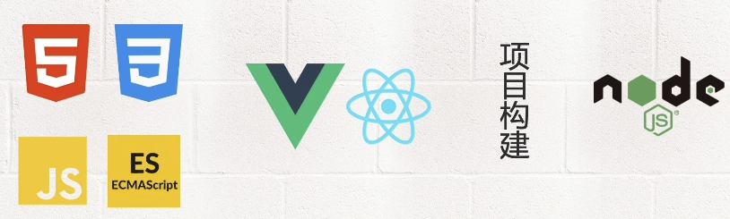

那本课程都适合哪些人群呢？

* 想要学习前端工程化，在新项目中投入使用Vite构建工具的朋友
* Webpack转战到Vite的小伙伴
* 前端架构师们，可以充实自己的工具箱

当然如果你没有项目相关开发经验，也可以从本课程中受益，让你开阔眼界，将你学到的前端知识融会贯通，应用到你的实战中。 

本课程也是千锋HTML5大前端和腾讯云的合作课程，全网首发，腾讯云（云+社区）也会同步上线

# 二、为什么选Vite

## 2.1 什么是Vite

Vite（法语意为 "快速的"，发音 `/vit/`，发音同 "veet"）是一种新型前端构建工具，能够显著提升前端开发体验。它主要由两部分组成：

- 一个开发服务器，它基于 [原生 ES 模块](https://developer.mozilla.org/en-US/docs/Web/JavaScript/Guide/Modules) 提供了 [丰富的内建功能](https://vitejs.cn/guide/features.html)，如速度快到惊人的 [模块热更新（HMR）](https://vitejs.cn/guide/features.html#hot-module-replacement)。
- 一套构建指令，它使用 [Rollup](https://rollupjs.org/) 打包你的代码，并且它是预配置的，可输出用于生产环境的高度优化过的静态资源。

Vite 意在提供开箱即用的配置，同时它的 [插件 API](https://vitejs.cn/guide/api-plugin.html) 和 [JavaScript API](https://vitejs.cn/guide/api-javascript.html) 带来了高度的可扩展性，并有完整的类型支持。

## 2.2 为什么选Vite

### 2.2.1 现实问题

在浏览器支持 ES 模块之前，JavaScript 并没有提供的原生机制让开发者以模块化的方式进行开发。这也正是我们对 “打包” 这个概念熟悉的原因：使用工具抓取、处理并将我们的源码模块串联成可以在浏览器中运行的文件。

时过境迁，我们见证了诸如 [webpack](https://webpack.js.org/)、[Rollup](https://rollupjs.org/) 和 [Parcel](https://parceljs.org/) 等工具的变迁，它们极大地改善了前端开发者的开发体验。

然而，当我们开始构建越来越大型的应用时，需要处理的 JavaScript 代码量也呈指数级增长。包含数千个模块的大型项目相当普遍。我们开始遇到性能瓶颈 —— 使用 JavaScript 开发的工具通常需要很长时间（甚至是几分钟！）才能启动开发服务器，即使使用 HMR，文件修改后的效果也需要几秒钟才能在浏览器中反映出来。如此循环往复，迟钝的反馈会极大地影响开发者的开发效率和幸福感。

Vite 旨在利用生态系统中的新进展解决上述问题：浏览器开始原生支持 ES 模块，且越来越多 JavaScript 工具使用编译型语言编写。

**1、缓慢的服务器启动**

当冷启动开发服务器时，基于打包器的方式启动必须优先抓取并构建你的整个应用，然后才能提供服务。

Vite 通过在一开始将应用中的模块区分为 **依赖** 和 **源码** 两类，改进了开发服务器启动时间。

- **依赖** 大多为在开发时不会变动的纯 JavaScript。一些较大的依赖（例如有上百个模块的组件库）处理的代价也很高。依赖也通常会存在多种模块化格式（例如 ESM 或者 CommonJS）。

  Vite 将会使用 [esbuild](https://esbuild.github.io/) [预构建依赖](https://vitejs.cn/guide/dep-pre-bundling.html)。Esbuild 使用 Go 编写，并且比以 JavaScript 编写的打包器预构建依赖快 10-100 倍。

- **源码** 通常包含一些并非直接是 JavaScript 的文件，需要转换（例如 JSX，CSS 或者 Vue/React 组件），时常会被编辑。同时，并不是所有的源码都需要同时被加载（例如基于路由拆分的代码模块）。

  Vite 以 [原生 ESM](https://developer.mozilla.org/en-US/docs/Web/JavaScript/Guide/Modules) 方式提供源码。这实际上是让浏览器接管了打包程序的部分工作：Vite 只需要在浏览器请求源码时进行转换并按需提供源码。根据情景动态导入代码，即只在当前屏幕上实际使用时才会被处理。


**2、缓慢的更新**

基于打包器启动时，重建整个包的效率很低。原因显而易见：因为这样更新速度会随着应用体积增长而直线下降。

一些打包器的开发服务器将构建内容存入内存，比如Webpack就是这样处理的,这样它们只需要在文件更改时使模块图的一部分失活[[1\]](https://vitejs.cn/guide/why.html#footnote-1)，但它也仍需要整个重新构建并重载页面。这样代价很高，并且重新加载页面会消除应用的当前状态，所以打包器支持了动态模块热重载（也就是我们熟知的HMR）：允许一个模块 “热替换” 它自己，而不会影响页面其余部分。这大大改进了开发体验，比如webpack-dev-server， 就提供了HMR这样的功能 —— 然而在实践中我们发现，即使采用了 HMR 模式，其热更新速度也会随着应用规模的增长而显著下降。

那我们来看看vite是如何实现快速的服务启动以及快速的更新的，vite是利用生态系统中的新进展来解决上述问题的，也就是浏览器开始原生的支持ES模块，并且越来越多的javascript的工具使用编译型的语言来编写。关于快速的服务器启动，官网也给了一张示意图。


Vite通过在一开始就将应用中的模块，区分为依赖和源码两类，改进了开发服务器的启动时间。Vite将会使用ESBuild来构建依赖，ESBuild使用GO语言来编写，并且比javascript编写的打包器预构建的依赖快10-100倍。

另外Vite以原生的ESM方式提供源码，这实际上是让浏览器接管了打包程序的部分工作，Vite只需要在请求浏览器源码的时候进行转换并按需提供源码，更具场景动态的导入代码，也就是只在当前屏幕上实际使用时，才会被处理。

在快速更新方面，Vite的HMR 是在原生 ESM 上执行的。当编辑一个文件时，Vite 只需要精确地使已编辑的模块与其最近的 HMR 边界之间的链失活[[1\]](https://vitejs.cn/guide/why.html#footnote-1)（大多数时候只是模块本身），使得无论应用大小如何，HMR 始终能保持快速更新。

Vite 同时利用 HTTP 头来加速整个页面的重新加载（再次让浏览器为我们做更多事情）：源码模块的请求会根据 `304 Not Modified` 进行协商缓存，而依赖模块请求则会通过 `Cache-Control: max-age=31536000,immutable` 进行强缓存，因此一旦被缓存它们将不需要再次请求。

一旦你体验到 Vite 的神速，你是否愿意再忍受像曾经那样使用打包器开发就要打上一个大大的问号了。

### 2.2.2 为什么生产环境仍需打包

尽管原生 ESM 现在得到了广泛支持，但由于嵌套导入会导致额外的网络往返，在生产环境中发布未打包的 ESM 仍然效率低下（即使使用 HTTP/2）。为了在生产环境中获得最佳的加载性能，最好还是将代码进行 tree-shaking、懒加载和 chunk 分割（以获得更好的缓存）。

要确保开发服务器和生产环境构建之间的最优输出和行为一致并不容易。所以 Vite 附带了一套 [构建优化](https://vitejs.cn/guide/features.html#build-optimizations) 的 [构建命令](https://vitejs.cn/guide/build.html)，开箱即用。

**为何不用 ESBuild 打包？**

虽然 `esbuild` 快得惊人，并且已经是一个在构建库方面比较出色的工具，但一些针对构建 *应用* 的重要功能仍然还在持续开发中 —— 特别是代码分割和 CSS 处理方面。就目前来说，Rollup 在应用打包方面更加成熟和灵活。尽管如此，当未来这些功能稳定后，我们也不排除使用 `esbuild` 作为生产构建器的可能。

### 2.2.3 Vite 与竞品

1. **Snowpack**

[Snowpack](https://www.snowpack.dev/) 也是一个与 Vite 十分类似的非构建式原生 ESM 开发服务器。除了不同的实现细节外，这两个项目在技术上比传统工具有很多共同优势。Vite 的依赖预构建也受到了 Snowpack v1（现在是 [`esinstall`](https://github.com/snowpackjs/snowpack/tree/main/esinstall)）的启发。这两个项目之间的一些主要区别是：

**生产构建**

Snowpack 的默认构建输出是未打包的：它将每个文件转换为单独的构建模块，然后将这些模块提供给执行实际绑定的不同“优化器”。这么做的好处是，你可以选择不同终端打包器，以适应不同需求（例如 webpack, Rollup，甚至是 ESbuild），缺点是体验有些支离破碎 —— 例如，`esbuild` 优化器仍然是不稳定的，Rollup 优化器也不是官方维护，而不同的优化器又有不同的输出和配置。

为了提供更流畅的体验，Vite 选择了与单个打包器（Rollup）进行更深入的集成。Vite 还支持一套 [通用插件 API](https://vitejs.cn/guide/api-plugin.html) 扩展了 Rollup 的插件接口，开发和构建两种模式都适用。

由于构建过程的集成度更高，Vite 支持目前在 Snowpack 构建优化器中不可用的多种功能：

- [多页面应用支持](https://vitejs.cn/guide/build.html#multi-page-app)
- [库模式](https://vitejs.cn/guide/build.html#library-mode)
- [自动分割 CSS 代码](https://vitejs.cn/guide/features.html#css-code-splitting)
- [预优化的异步 chunk 加载](https://vitejs.cn/guide/features.html#async-chunk-loading-optimization)
- [对动态导入自动 polyfill](https://vitejs.cn/guide/features.html#dynamic-import-polyfill)
- 官方 [兼容模式插件](https://github.com/vitejs/vite/tree/main/packages/plugin-legacy) 打包为现代/传统两种产物，并根据浏览器支持自动交付正确的版本。

**更快的依赖预构建**

Vite 使用 [esbuild](https://esbuild.github.io/) 而不是 Rollup 来进行依赖预构建。这为开发服务器冷启动和依赖项失活的重新构建方面带来了显著的性能改进。

**Monorepo 支持**

Vite 能够支持 monorepo，我们已经有用户成功地将 Vite 与基于 Yarn, Yarn 2 和 PNPM 的 monorepo 一起使用。

**CSS 预处理器支持**

Vite 为 Sass and Less 提供了更精细化的支持，包括改进 `@import` 解析（可使用别名与 npm 依赖）和 [提供 `url()` 内联引入与变基](https://vitejs.cn/guide/features.html#import-inlining-and-rebasing)。

**Vue 第一优先级支持**

Vite 最初是作为 [Vue.js](https://vuejs.org/) 开发工具的未来基础而创建的。尽管 Vite 2.0 版本完全不依赖于任何框架，但官方 Vue 插件仍然对 Vue 的单文件组件格式提供了第一优先级的支持，涵盖了所有高级特性，如模板资源引用解析、`<script setup>`，`<style module>`，自定义块等等。除此之外，Vite 还对 Vue 单文件组件提供了细粒度的 HMR。举个例子，更新一个单文件组件的 `<template>` 或 `<style>` 会执行不重置其状态的热更新。

2. **WMR**

Preact 团队的 [WMR](https://github.com/preactjs/wmr) 提供了类似的特性集，而 Vite 2.0 对 Rollup 插件接口的支持正是受到了它的启发。

WMR 主要是为了 [Preact](https://preactjs.com/) 项目而设计，并为其提供了集成度更高的功能，比如预渲染。就使用范围而言，它更加贴合于 Preact 框架，与 Preact 本身一样强调紧凑的大小。如果你正在使用 Preact，那么 WMR 可能会提供更好的体验。

3. **web/dev-server**

[@web/dev-server](https://modern-web.dev/docs/dev-server/overview/)（曾经是 `es-dev-server`）是一个伟大的项目，基于 koa 的 Vite 1.0 开发服务器就是受到了它的启发。

`@web/dev-server` 适用范围不是很广。它并未提供官方的框架集成，并且需要为生产构建手动设置 Rollup 配置。

总的来说，与 `@web/dev-server` 相比，Vite 是一个更注重自身/更高层面的工具，旨在提供开箱即用的工作流。话虽如此，但 `@web` 这个项目群包含了许多其他的优秀工具，也可以使 Vite 用户受益。


到目前为止我们基本上了解了为什么选用Vite，那接下来我们就愉快的使用它吧。

# 三、搭建开发环境

## 3.1 下载安装和初始化VSCode

**1、访问网站**

https://code.visualstudio.com/

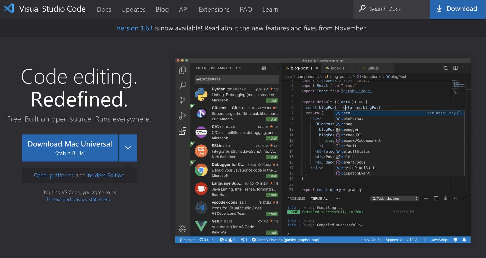

**2、选择平台版本**

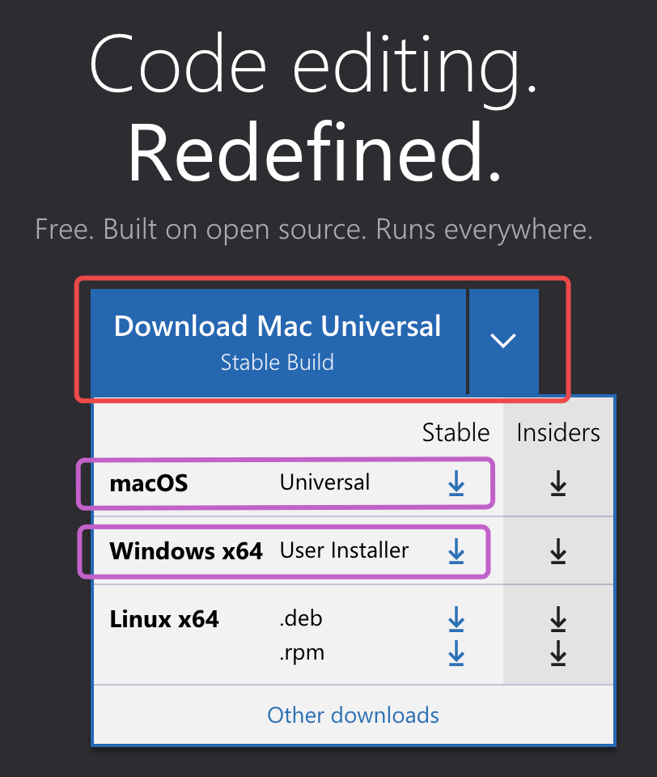

选择符合自己操作系统的安装包下载完毕，根据安装向导安装。限于篇幅，不再赘述。

**3、安装一个VSCode插件**

* Chinese Simplified

- Live Server

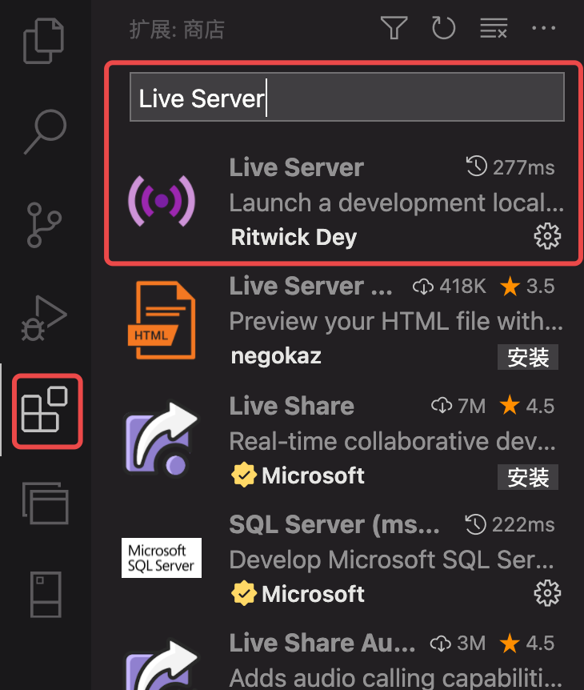

**4、安装主题 Monokai**

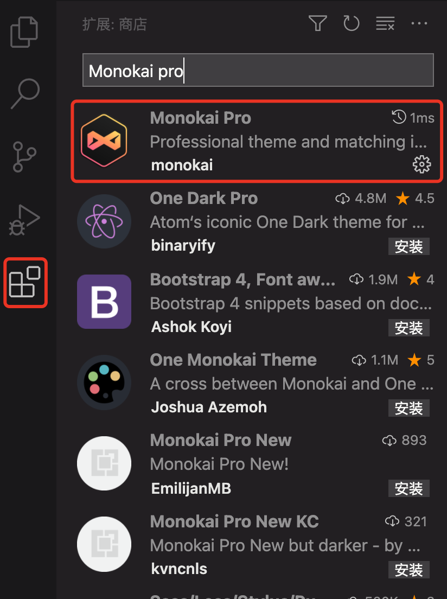

**5、安装推荐字体 Fira Code**

访问 [Google Font](https://fonts.google.com/specimen/Fira+Code) 网站下载 `Fira Code` 字体。下载完成后安装到自己的电脑里，以Mac为例：

触按键盘`command + 空格` 搜索*字体册*

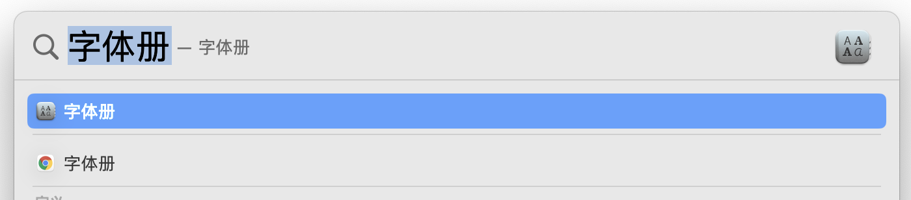

打开：

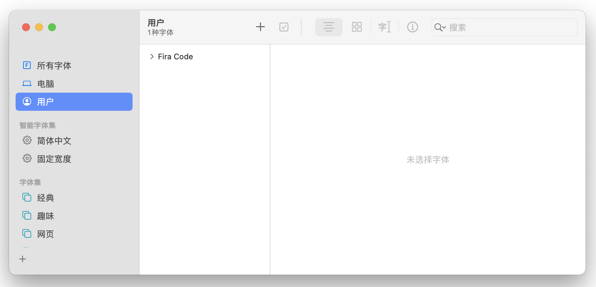

选择*用户*，点击*加号+*, 打开选择窗口，选择已经下载的 *Fira Code*字体：

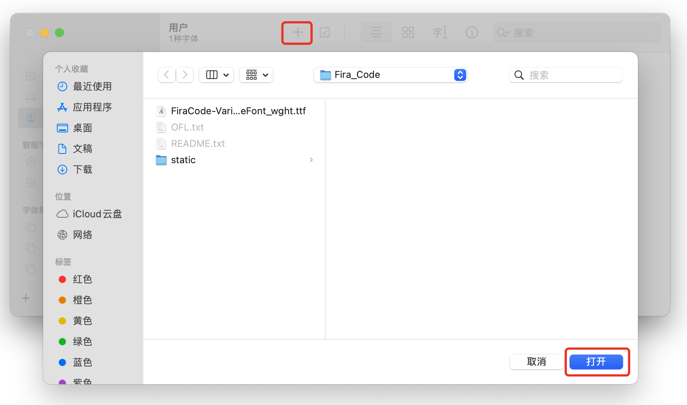

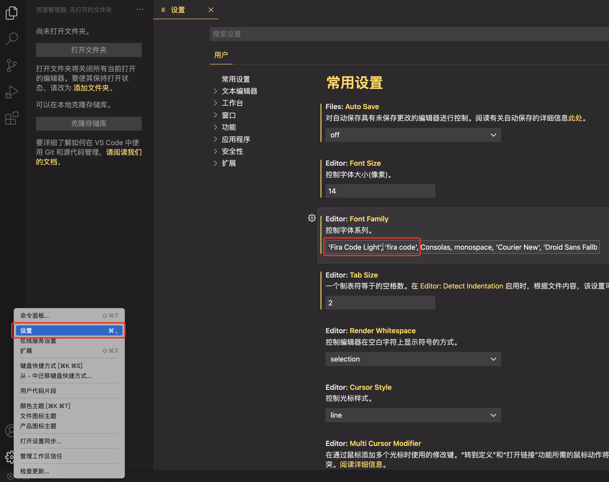

## 3.2 安装Node.js

**1、访问网站**

https://nodejs.org/en/

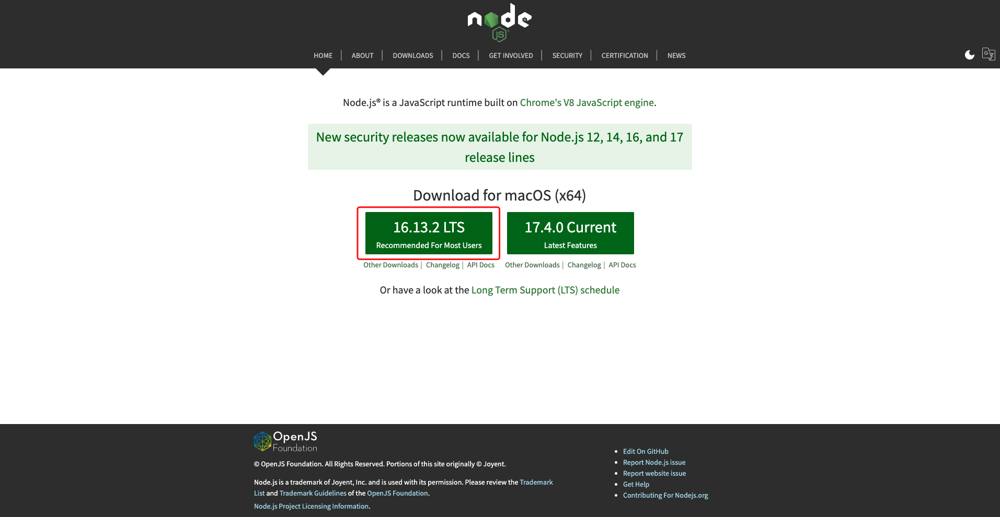

Node.js 官网默认监测你的电脑操作系统，给出相应版本，建议安装`LTS`版本。点击按钮下载安装包，根据安装向导安装即可。

**2、安装Yarn**

打开Vscode，输入 `Ctrl`+`~`, 打开集成终端工具，在命令行里输入命令：

```shell
$ npm install yarn -g
```

全局安装 `yarn`，这是 facebook 出品的快速、可靠、安全的 Node.js 包管理工具，用来代替 npm。

安装好 `yarn`后，设置国内源镜像：

```shell
$ yarn config set registry https://registry.npm.taobao.org
```

**3、安装pnpm**

pnpm，目前 GitHub 已经有 star 9.8k，现在已经相对成熟且稳定了。它由 npm/yarn 衍生而来，但却解决了 npm/yarn 内部潜在的 bug，并且极大了地优化了性能，扩展了使用场景。下面是为什么使用pnpm的思维导图:

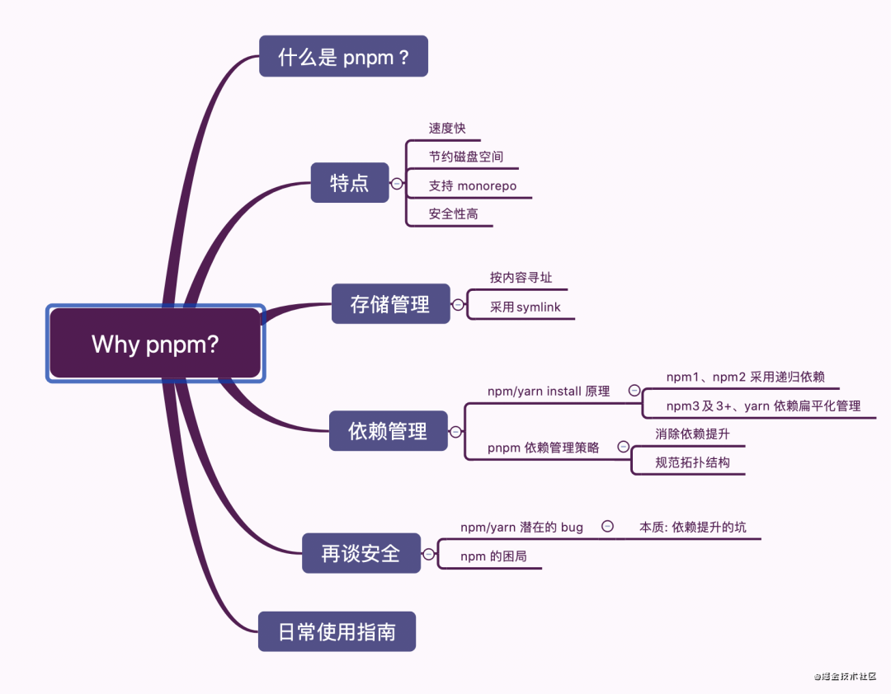

打开Vscode，输入 `Ctrl`+`~`, 打开集成终端工具，在命令行里输入命令：

```shell
$ npm install pnpm -g
```


# 四、搭建第一个Vite项目

>**兼容性注意**
>
>Vite 需要 [Node.js](https://nodejs.org/en/) 版本 >= 12.0.0。

## 4.1、使用 PNPM创建项目

```shell
$ pnpm create vite
```

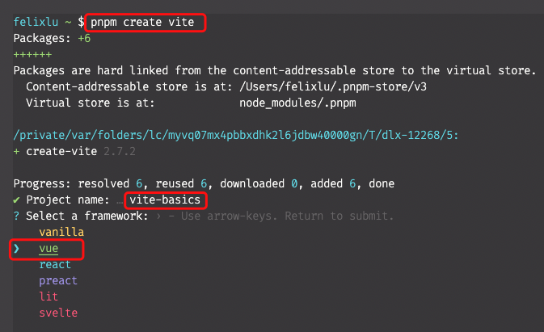

## 4.2、项目目录解读

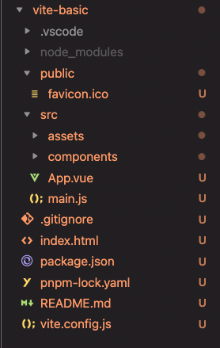

**1.gitignore**

git项目忽略传到我们git仓库里的一些配置，这里会有一些缺省的配置

**2.package.json**

这里出了定义我们最基本的name版本，以及所谓的生产的依赖和开发的依赖，还定义了三个所谓的npm的脚本

生产以来装的vue版本好为3.2.25

在开发以来里面，它去安装了我们vitejs的一个plugin-vue，也就是基于vue的一个插件，然后又装了vite是2.7.2

scripts这里的npm脚本，一个是dev，其事实上就是运行的vite这个命令，当然我们也可以通过build，来去构建一个基于vite的一个项目，我们可以打包我们的项目放到生产环境里，打完包以后呢，我们可以通过preview来去浏览我们打包好的静态资源

那关于这个package.json，大家如果熟悉nodejs的同学，应该不陌生

```
// package.json
{
  "scripts": {
    "dev": "vite", // 启动开发服务器，别名：`vite dev`，`vite serve`
    "build": "vite build", // 为生产环境构建产物
    "preview": "vite preview" // 本地预览生产构建产物
  }
}
```


**3.pnpm-lock.yaml**

如果大家知道npm的lock以及yarn的lock，应该也不陌生，这就是我们的pnpm所依赖的一些关系，这个yaml文件大家不要手动修改他

**4.README.md**

这个不用说，就是我们当前项目的所谓的帮助文档

**5.vite.config.js**

这个文件很重要，是我们vite项目的一个最基本的配置文件，刚才我们在package.json里边我们看到，在本地的vite环境里边，已经安装好了Vite以及Vite的Vue插件，那我们就可以通过，从Vite里边解构出defineConfig这样的一个函数，以及Vue这样的一个对象,然后我们就可以暴露一个defineConfig来定义一个配置，里边定义一个对象，定义一个plugins，来去定一个数组，里边可以把我们的插件放进去，这里我们运行了一下vue的这个对象，所以我们这个插件就可以用了

```js
import { defineConfig } from 'vite'
import vue from '@vitejs/plugin-vue'

// https://vitejs.dev/config/
export default defineConfig({
  plugins: [vue()]
})

```

**6、`index.html`与项目根目录**

如果你通过webpack去构建vue项目的时候，我们有个vue-cli，你应该知道，我们的index.html不是放在我们项目的根目录下面的，它是放在public这个目录下面的，而现在呢，这个index.html被放在了我们项目的根目录上，这就说明我们vite是基于index.html作为我们的入口文件的。那我们再仔细观察一下index.html这个文件。

```html
<!DOCTYPE html>
<html lang="en">
  <head>
    <meta charset="UTF-8" />
    <link rel="icon" href="/favicon.ico" />
    <meta name="viewport" content="width=device-width, initial-scale=1.0" />
    <title>Vite App</title>
  </head>
  <body>
    <div id="app"></div>
    <script type="module" src="/src/main.js"></script>
  </body>
</html>

```

除了我们最简单的一个link加载我们public这个静态资源目录下的这个href的icon图标以外，大家发现在body下面又一个script标签，这个标签呢，它去引入了一个js文件，其实如果按照正常的我们去理解，引用js文件没有问题，但是当我们真正的去查看一下src/main.js,使用了所谓的 es module ，也就是es的模块import语法，这个语法如果直接在浏览器上使用的话呢，会有问题，我们可以做个实验，把index.html里面script的标签的type去掉，作为一个最一般的js的引用，浏览器查看项目，打开控制台console，你会发现这里提示我们有语法错误，我们不能通过import语法来导入我们的模块，这里有一个提示说 outside a module，也就是不要在module的外侧，其事实上就是告诉我们，我们得需要去符合浏览器的这个es模块定义方法，这个呢是属于我们原生js以及浏览器或者是es的一个基本知识，我们可以在script里头加一个 type module，如果这个知识点大家之前不知道，那你就可以把它做作一个新的知识点get到就可以了。也就是说你想要去通过所谓的es6的或者是es其他本本的import这种方式去导入一个模块，那么你得需要在引入这个js文件的时候，或者是引入js入口文件的时候，你得需要加一个type module，当然了也可以在这个script里头写import，去加载一个模块，也是没有问题的。

这是我们所谓的vite去加载模块的一个非常重要的依赖的一个点，保存代码，发现浏览器迅速更新，不知比webpack快了多少倍。


接下来浏览一下vite的这个目录，在src下面，这里有一个main.js ,也就是vue实例化的一个页面，如果你用过vue，或者vue3的 话，对这个语法应该不陌生，这个实例化的所谓的vue，已经载入了一个组件叫App.vue。

src/App.vue这是一个最普通的vue的单文件组件，关于vue单文件组件的知识，可以去[vue3](https://v3.cn.vuejs.org/guide/single-file-component.html)官网上看一眼

src/components文件夹下有一个HelloWorld.vue，是一个vue的组件，因为在App.vue里，我们通过import载入过这个组件，但是大家仔细看一下我们scripts标签里的这句话，它使用的也是import的方式去载入的，也就是我们可以放心的去使用es module去完成我们模块的管理了

```vue
# App.vue
<script setup>
// This starter template is using Vue 3 <script setup> SFCs
// Check out https://v3.vuejs.org/api/sfc-script-setup.html#sfc-script-setup
import HelloWorld from './components/HelloWorld.vue'
</script>
```

src/assets是通过vite去管理的静态资源目录

public目录这个大家应该都了解，这里边我们去创建的一些基本的文件，比方说我们通过一个index-2.html,我们去构建一个html文件,构建一个html模块，放到public里下的文件，我们在浏览器上或者在server里，我们可以直接访问 http://localhost:3000/index-2.html,  放到src里的文件不具备这样的能力

```html
<!DOCTYPE html>
<html lang="en">
<head>
  <meta charset="UTF-8">
  <meta name="viewport" content="width=device-width, initial-scale=1.0">
  <title>Document</title>
</head>
<body>
  test.html
</body>
</html>
```

> 你可能已经注意到，在一个 Vite 项目中，`index.html` 在项目最外层而不是在 `public` 文件夹内。这是有意而为之的：在开发期间 Vite 是一个服务器，而 `index.html` 是该 Vite 项目的入口文件。
>
> Vite 将 `index.html` 视为源码和模块图的一部分。Vite 解析 `<script type="module" src="...">` ，这个标签指向你的 JavaScript 源码。甚至内联引入 JavaScript 的 `<script type="module">` 和引用 CSS 的 `<link href>` 也能利用 Vite 特有的功能被解析。另外，`index.html` 中的 URL 将被自动转换，因此不再需要 `%PUBLIC_URL%` 占位符了。
>
> 与静态 HTTP 服务器类似，Vite 也有 “根目录” 的概念，即服务文件的位置，在接下来的文档中你将看到它会以 `<root>` 代称。源码中的绝对 URL 路径将以项目的 “根” 作为基础来解析，因此你可以像在普通的静态文件服务器上一样编写代码（并且功能更强大！）。Vite 还能够处理依赖关系，解析处于根目录外的文件位置，这使得它即使在基于 *Monorepo*（在版本控制系统的单个代码库里包含了许多项目的代码。这些项目虽然有可能是相关的，但通常在逻辑上是独立的，并由不同的团队维护。） 的方案中也十分有用。
>
> Vite 也支持多个 `.html` 作入口点的 *多页面应用模式*，这个知识我们将在后面介绍。
>
> `vite` 以当前工作目录作为根目录启动开发服务器。你也可以通过 `vite serve some/sub/dir` 来指定一个替代的根目录。
>

# 五、NPM 依赖解析和预构建

原生 ES 导入不支持下面这样的裸模块导入：

```js
import { someMethod } from 'my-dep'
```

上面的代码会在浏览器中抛出一个错误。Vite 将会检测到所有被加载的源文件中的此类裸模块导入，并执行以下操作:

1. *预构建*它们可以提高页面加载速度，并将 CommonJS / UMD 转换为 ESM 格式。预构建这一步由 [esbuild](http://esbuild.github.io/) 执行，这使得 Vite 的冷启动时间比任何基于 JavaScript 的打包器都要快得多。
2. 重写导入为合法的 URL，例如 `/node_modules/.vite/my-dep.js?v=f3sf2ebd` 以便浏览器能够正确导入它们。

## 5.1 依赖预构建

当你首次启动 `vite` 时，你可能会注意到打印出了以下信息：

```
Pre-bundling dependencies:(预构建依赖)
  vue
(this will be run only when your dependencies or config have changed)（这将只会在你的依赖或配置文件发生变化时执行）
```

### 5.1.1 原因 

这就是 Vite 执行的所谓的“依赖预构建”。这个过程有两个目的:

1. **CommonJS 和 UMD 兼容性:** 开发阶段中，Vite 的开发服务器将所有代码视为原生 ES 模块。因此，Vite 必须先将作为 CommonJS 或 UMD 发布的依赖项转换为 ESM。

当转换 CommonJS 依赖时，Vite 会执行智能导入分析，这样即使导出是动态分配的（如 vue），按名导入也会符合预期效果：

```js
// 符合预期
import { createApp } from 'vue'
```

2.   **性能：** Vite 将有许多内部模块的 ESM 依赖关系转换为单个模块，以提高后续页面加载性能。

   一些包将它们的 ES 模块构建作为许多单独的文件相互导入。例如，[`lodash-es` 有超过 600 个内置模块](https://unpkg.com/browse/lodash-es/)！当我们执行 `import { debounce } from 'lodash-es'` 时，浏览器同时发出 600 多个 HTTP 请求！尽管服务器在处理这些请求时没有问题，但大量的请求会在浏览器端造成网络拥塞，导致页面的加载速度相当慢。

   通过预构建 `lodash-es` 成为一个模块，我们就只需要一个 HTTP 请求了！

### 5.2.1 自动依赖搜索

如果没有找到相应的缓存，Vite 将抓取你的源码，并自动寻找引入的依赖项（即 "bare import"，表示期望从 `node_modules` 解析），并将这些依赖项作为预构建包的入口点。预构建通过 `esbuild` 执行，所以它通常非常快。

在服务器已经启动之后，如果遇到一个新的依赖关系导入，而这个依赖关系还没有在缓存中，Vite 将重新运行依赖构建进程并重新加载页面。

### 5.2.2 自定义行为

默认的依赖项发现为启发式可能并不总是可取的。在你想要显式地从列表中包含/排除依赖项的情况下, 请使用 [`optimizeDeps` 配置项](https://vitejs.cn/config/#dep-optimization-options)。

当你遇到不能直接在源码中发现的 import 时，`optimizeDeps.include` 或 `optimizeDeps.exclude` 就是典型的用例。例如，import 可能是插件转换的结果。这意味着 Vite 无法在初始扫描时发现 import —— 它只能在浏览器请求文件时转换后才能发现。这将导致服务器在启动后立即重新打包。

1. **optimizeDeps.exclude[#](https://vitejs.cn/config/#optimizedeps-exclude)**

- **类型：** `string[]`

  在预构建中强制排除的依赖项。

  > **CommonJS**
  >
  > CommonJS 的依赖不应该排除在优化外。如果一个 ESM 依赖被排除在优化外，但是却有一个嵌套的 CommonJS 依赖，则应该为该 CommonJS 依赖添加 `optimizeDeps.include`。例如：
  >
  > ```
  > export default defineConfig({
  >     optimizeDeps: {
  >       include: ['esm-dep > cjs-dep']
  >     }
  > })
  > ```
  

2. **optimizeDeps.include[#](https://vitejs.cn/config/#optimizedeps-include)**

- **类型：** `string[]`

  默认情况下，不在 `node_modules` 中的，链接的包不会被预构建。使用此选项可强制预构建链接的包。

`include` 和 `exclude` 都可以用来处理这个问题。如果依赖项很大（包含很多内部模块）或者是 CommonJS，那么你应该包含它；如果依赖项很小，并且已经是有效的 ESM，则可以排除它，让浏览器直接加载它。

# 六、模块热重载

Vite 通过特殊的 `import.meta.hot` 对象暴露手动 HMR API，它包含的一些对象和方法和webpack等打包工具模块特替换的API类似。这里是官网给出的源码的简化版

```tsx
interface ImportMeta {
  readonly hot?: {
    readonly data: any

    accept(): void
    accept(cb: (mod: any) => void): void
    accept(dep: string, cb: (mod: any) => void): void
    accept(deps: string[], cb: (mods: any[]) => void): void

    prune(cb: () => void): void
    dispose(cb: (data: any) => void): void
    decline(): void
    invalidate(): void

    on(event: string, cb: (...args: any[]) => void): void
  }
}
```

我们来看，它定义了一个 接口 **ImportMeta**，里面包含了只读属性hot，它里面包含的内容就是我们的HMR API了。

我们注意来看：

data这个 对象在同一个更新模块的不同实例之间持久化。它可以用于将信息从模块的前一个版本传递到下一个版本。

accept这个方法表示模块移除的时候执行的回调，这个方法可以有四种使用方式：

* 我们可以不传参数 accept()
* 或者是传递一个回调函数accept(cb)
* 以及定义依赖的模块，在回调函数里做一些事情accept(dep，cb)
* 我们也可以定义依赖的一系列的模块，在回调函数里对这些一系列的模块进行处理accept(deps，cb)

prune这个方法表示在移除模块移除的时候执行回调

disponse一个接收自身的模块或一个期望被其他模块接收的模块可以使用 `hot.dispose` 来清除任何由其更新副本产生的持久副作用,这个跟webpack的disponse是一个道理

decline这个方法 表示此模块不可热更新，如果在传播 HMR 更新时遇到此模块，浏览器应该执行完全重新加载。

invalidate现在执行时只是重新加载页面。

on表示可以监听自定义 HMR 事件

一般的普通用户很少使用这些api。

因为vite内置了HMR到常用框架的一个集成。

接下来举个例子，看如何手动的使用这些api做一些事。

```sh
$ pnpm create vite

# 输入项目名称 vite-basics
# 选择框架  vanilla
# 选择 vanilla

# 出现如下界面，说明项目创建成功
# Done. Now run:

#  cd vite-basics
#  pnpm install
#  pnpm run dev

$ cd vite-basics
$ pnpm install
$ pnpm run dev
```

我们启动一下项目，在当前的浏览器上打开一下，按住`Ctrl`点击鼠标左键，打开以后打开检查，在终端上我们看到这个项目正常的启动起来

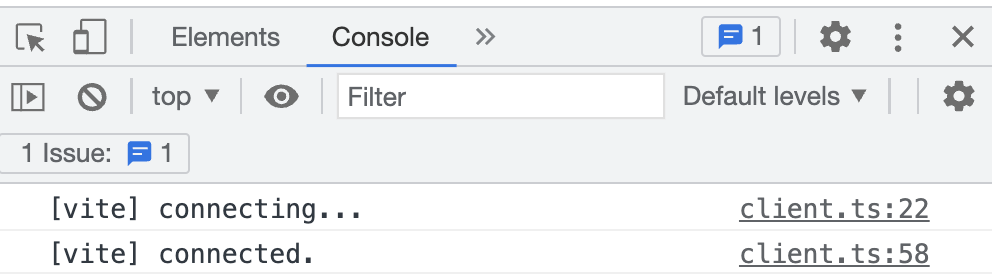

那么接下来我们就在这个项目下面构建我们所谓的HRM的例子。

我们先观察一下纯js的环境，这里有一个js文件叫main.js

```js
import './style.css'

document.querySelector('#app').innerHTML = `
  <h1>Hello Vite!</h1>
  <a href="https://vitejs.dev/guide/features.html" target="_blank">Documentation</a>
`

```

这个文件除了引入一个css以外，就是一个纯的HTML代码了，在页面上显示了h1和一个链接。下面我们可以把这个代码先删掉保存一下。这个页面显示 page reload，也就是页面重新刷新了一下。


接下来我们打算在 vite-basics里创建一个新的模块，取名为count.js

```js
export const count = 1
```

我们给这个模块定义一个变量，通过export 暴露，常量定义为count，初始值定义为1，那么接下来就观察我们的count.js自己，当这个模块发生变化时，我们可以实现页面的热重载，也就是页面不需要重新刷新，只是局部进行更新。

那么这里就需要用到HRM API了,有一点大家要格外注意，就是所谓的模块热重载（HMR），只在开发环境中使用，生产环境里我们并不需要这个热重载。为了让我们写的这个HMR的代码在生产环境里被删掉，我们得需要加一个条件守卫，这个条件守卫可以通过编译生产环境的时候，tree shaking会帮助我们进行优化。那么这个条件守卫我们该怎么写呢。

```js
export const count = 1
if (import.meta.hot) {

}
```

我们写一个if判断，在判断条件里边，我们判断一个对象是否存在，就是`import.meta.hot`，在开发环境里，这个变量是存在的，在生产环境里边它是不存在的。所以它就会被tree shaking给优化掉。

那接下来我们的HMR代码就写在if语句体里面。我们写什么呢？下面我们先实现一个监测模块自身的变化。所以呢我们先去调用到`import.meta.hot.accept()`这个方法。这个方法呢就可以监测我们某个模块的变化。这里我们监测模块本身，所以呢我们只需要传递一个回调函数就可以了。

```js
export const count = 1

if (import.meta.hot) {
  import.meta.hot.accept((newModule) => {
    console.log(newModule.count)
  })
}

```

我们可以定义一个箭头函数，在这函数的参数里边，我们需要拿到被更新以后的模块的引用，我们定义一个名字叫newModule，那接下来我们在这个方法体里头去打印我们新的module的一个count,由于我们是监测这个模块本身，所以我们能拿到这个模块里边定义的敞亮count，我们保存一下，接下来我们使用一下这个模块，

```js
// main.js
import './count.js'
```

打开main.js,我们引用一下count.js,可以直接通过`import`导入count.js,保存一下,那么下面这个页面(编辑器终端)又执行`page reload`，就是重新的去刷新了一下，接下来我们是去试图修改一下count.js,我们看页面的表现，我们把1改为2，保存一下，好，大家发现浏览器控制台立刻出现了一个2这样的一个打印，同时在终端上看到了vite有个提示，叫`hmr update /count.js`,说明我们这个页面是热重载的，也就是局部更新。

那其实accept除了观测我们模块自身以外，它还可以观测其他的模块，比如我们在当前项目下再创建一个新的文件，叫做foo.js，我们来通过export来去暴露一个foo这样一个函数，我们仍旧是使用箭头函数来定义，在里面呢，随便打印一个字符串，比如说`foo works`

```js
// foo.js
export const foo = () => {
  console.log('foo works')
}
```

定义好了以后，我们再到main.js中引入这个模块，我们先简单的引用一下，执行`import `,然后解构出foo这个方法，然后再去执行一下 foo 这个方法，保存一下, 大家发现，仍旧是 `page reload`,页面会重新刷线一下。

```js
// main.js
import './count.js'

import { foo } from './foo.js'

foo()
```


接下来我们打算去修改foo.js，看看这个模块能不能被侦测到，那我们想在main.js里去侦测foo.js的变化

```js
// main.js
import './count.js'

import { foo } from './foo.js'

foo()

if (import.meta.hot) {
  import.meta.hot.accept('./foo.js', (newFoo) => {
    newFoo.foo()
  })
}
```

接下来可以在这里做一个守卫，条件仍旧是`import.meta.hot`，如果这个变量存在，我们就去调用一下`import.meta.hot.accept`,这回给这个函数传入两个参数，第一个参数就是我们所谓的叫依赖的模块，那它依赖哪个模块呢，我们依赖的是当前目录下的foo.js这个模块，接下来我们再去定义第二个参数，仍旧是一个回调函数，那回调函数的参数呢，仍旧是我们newFoo这个模块，当然了，在这个方法里，你就可以做任何的事情了，当这个模块二次被更新的时候，我们可以调用`newFoo.foo()`,那可见newFoo就是当前模块的引用，保存一下，这页面又进行了一次`page reload`，好了接下来我们去修改一下foo.js,在后面加一个！，保存一下，观察我们控制台的变化，我们发现并没有刷新页面，只是打印了`foo works!`这个字符串，同时在控制台打印了`hmr update ./main.js`

```js
// foo.js
export const foo = () => {
  console.log('foo works!')
}
```

接下来我们去扩展一下accept这个api，打开main.js，在if判断语句里，再去执行`import.meta.hot.accept（）`,这回不给accept方法传入参数，它的语义表示当前这个组件一旦发生变化，会执行当前组件的热更新，保存一下，写一个用例，在main.js里写一个`console.log('main module')`，保存一下，发现立刻执行了模块的热更新，在终端控制台打印了`hmr update ./main.js`，

```js
// main.js
import './count.js'

import { foo } from './foo.js'

foo()

console.log('main module')

if (import.meta.hot) {
  import.meta.hot.accept('./foo.js', (newFoo) => {
    newFoo.foo()
  })
  import.meta.hot.accept()
}
```


如果在`main module `后加一个`.`，大家发现又一次执行了热更新，这样的话它就能监测这个main.js发生的变化

```js
// main.js
import './count.js'

import { foo } from './foo.js'

foo()

console.log('main module.')

if (import.meta.hot) {
  import.meta.hot.accept('./foo.js', (newFoo) => {
    newFoo.foo()
  })
  import.meta.hot.accept()
}
```


接下来我们再讲解另外一个api，叫做`disponse`，我们得需要去设计一些代码，我们打开foo.js，在这个代码里执行一个定时器，让他在控制台每过1s打印一个数字，一开始我们得需要定一个数字，我们可以定一个变量cache，它是一个引用类型，在这里头，去定一个amount这样的属性，后面的初始值为0，那么接下来就可以使用 `setInterval`这个方法来去执行一个每隔1s来去打印一个数字，在 `setInterval`里写一个函数，在函数体里执行一个`cache.amount++`的操作,然后打印一下`cache.amount`,然后让他每隔1s执行这个函数，好，我们保存一下

```js
// foo.js
export const foo = () => {
  console.log('foo works!')
}

let cache = {
  amount: 0
}

setInterval(() => {
  cache.amount++
  console.log(cache.amount)
}, 1000);
```

这样的话，我们就可以在控制台看到每隔1s后打印一个数字的效果

接下来我们来做一个试验，来发现一个奇怪的现象，在`foo works！`后再加一个！，先不保存文件，思考一下，如果修改了当前这个模块，按理说，这个模块会重新的进行模块热更新，那热更新以后的基本流程就是先把我们这个模块上一个代码给删除掉，然后再重新加载一批新的代码，这样实现一个模块的局部更新。那现在呢，我们来保存一下，我们发现的确是`foo works!!`热更新了

```js
// foo.js
export const foo = () => {
  console.log('foo works!!')
}

let cache = {
  amount: 0
}

setInterval(() => {
  cache.amount++
  console.log(cache.amount)
}, 1000);
```

但是你会发现两个定时器同时启动起来了，这是为什么呢？这是因为上一个定时器没有被清理掉，可见呢,定时器的操作是一个具有副作用的一个操作，那也就是说，我们在更新模块的时候，模块的上一个状态需要把它的副作用函数的一些变量给清理掉，很显然，我们的定时器函数是一个副作用函数，它没有被清理掉，所以他又启动了一个新的定时器，同时还保留了原来的定时器，那怎么办呢？

我们得需要使用`dispose`这个方法来去做一个所谓的有副作用的一些状态的清理，具体怎么办呢？在这个函数的内部，得需要一个在开发环境里的一个判断，首先判断`import.meta.hot`是否存在，如果存在，就调用

`import.meta.hot.dispose()`,这个方法直接收一个参数，这个参数是一个回调函数，这个回调函数在什么时候运行呢，就是在我们这个模块热更新的那个瞬间，它就会把我们的上一个模块清理的那个动作给记录下来，在清理的同时我们可以做清理副作用的一些东西，那也就是在模块状态发生变化的时候，我们就可以清理我们上一个模块的状态里面的一些内容了。比方说，正好在模块热更新的时候，我们就可以清理定时器了。

但是我们得定时器加一个引用，这样的话我们才能清理他，所以我们定义一个变量timer，然后做一个判断。如果timer存在，就通过clearInterval来去清理timer，保存一下，再次刷新一下页面，然后重新的看看这个逻辑，是否正常的运行。

```js
// foo.js
export const foo = () => {
  console.log('foo works!!!!')
}

let cache = {
  amount: 0
}

if (import.meta.hot) {
  import.meta.hot.dispose(() => {
    if (timer) {
      clearInterval(timer)
    }
  })
}

let timer = setInterval(() => {
  cache.amount++
  console.log(cache.amount)
}, 1000);
```


我们现在呢执行了 1 2 3 4 5 6这样累加的一个效果，那么接下来呢，我们去修改一下` foo works`,再添加一个！，我们发现果然 `foo works！！！`更新了。然后呢，我们的定时器会重新启动，因为我们在更新模块之前，我们已经把上一个定时器给清理了。

这个工作完成以后，我们再思考一个问题，我们能不能在模块热更新的时候保留上一个amount的值，这样岂不是更好？比如说这个应用现在有一个状态，这个状态我想在热更新的时候还保留它。那我们可以做个试验。

比方说我们还是拿amount为例，也就是说当我第二次修改`foo works`的时候，我希望它的定时器重新启动，并且会从上一个计数的开始，继续的计数，那这个功能呢得需要我们用一个data，也就是hot中的data属性来去做一些所谓的状态的记录。怎么办呢？我们可以基于现有的代码，来继续的进行编写，我们可以判断当前的hot如果存在的情况下，我们来去修改一下cache的值,我们让cache来缓存我们模块上一个状态的amount，首先给cache重新的做一个赋值，amount的值就等于 `import.meta.hot.data`，这个data就是可以帮助我们缓存模块在状态发生变化的时候一个公共的变量，或者是全局的状态，那它是一个引用类型，后面呢，可以吧cache给他，也可以把amount给读出来，这样呢，就把我们当前代码里的amount赋值给了一个新的对象，这样我们相当于做了一个状态的保存。

```js
// foo.js
export const foo = () => {
  console.log('foo works!!!!')
}

let cache = {
  amount: 0
}

if (import.meta.hot) {
  import.meta.hot.dispose(() => {
    if (timer) {
      clearInterval(timer)
    }
  })
  cache = {
    amount: import.meta.hot.data.cache.amount
  }
}

let timer = setInterval(() => {
  cache.amount++
  console.log(cache.amount)
}, 1000);
```


但是大家发现浏览器控制台报了一个错误,说你不能读取一个undefined的amount，说明

很显然我们一开始的时候cache是没有的，或者说至少我们还没有对它进行缓存，那么怎么办呢？

我们把`import.meta.hot.data.cache`给拷贝一下，做一个二次赋值，注意这个赋值需要给大家解释一下，在原生js里，这个赋值如果是两个等于号同时赋值的话，它会把最终的值先赋值给cache，再赋给第二个变量。

```js
// foo.js
export const foo = () => {
  console.log('foo works!!!!')
}

let cache = {
  amount: 0
}

if (import.meta.hot) {
  import.meta.hot.dispose(() => {
    if (timer) {
      clearInterval(timer)
    }
  })
  cache = import.meta.hot.data.cache = {
    amount: import.meta.hot.data.cache.amount
  }
}

let timer = setInterval(() => {
  cache.amount++
  console.log(cache.amount)
}, 1000);
```

那赋值完之后就没问题了吗？我们发现还是有问题。还是刚才那个问题，这是因为在第一次的时候`import.meta.hot.data.cache`,是没有值的，是为什么呢？因为前者的赋值是依托于后者计算，而后者的计算还没有开始，发现cache对象是没有的。所以我们做个判断，如果cache存在，再去读取cache下的amount，不存在呢就用0来赋值,这样才能保证我们的赋值是有效的。保存一下，刷新页面，发现没有问题，计数器正常的计数了。

```js
// foo.js
export const foo = () => {
  console.log('foo works!!!!')
}

let cache = {
  amount: 0
}

if (import.meta.hot) {
  import.meta.hot.dispose(() => {
    if (timer) {
      clearInterval(timer)
    }
  })
  cache = import.meta.hot.data.cache = {
    amount: import.meta.hot.data.cache ? import.meta.hot.data.cache.amount : 0
  }
}

let timer = setInterval(() => {
  cache.amount++
  console.log(cache.amount)
}, 1000);
```

接下来验证一下cache是否有效，再给`foo works`添加一个！，发现果然更新了，并且计数器会从上一个数继续的计数。这样我们的hot的data属性也就理解了。

最后我们再去讲解最后两个api。

一个是invalidate，一个是decline。

接下来我们在foo的后面暴露一个变量

```js
// foo.js
export const foo = () => {
  console.log('foo works!!!!')
}

let cache = {
  amount: 0
}

if (import.meta.hot) {
  import.meta.hot.dispose(() => {
    if (timer) {
      clearInterval(timer)
    }
  })
  cache = import.meta.hot.data.cache = {
    amount: import.meta.hot.data.cache ? import.meta.hot.data.cache.amount : 0
  }
}

let timer = setInterval(() => {
  cache.amount++
  console.log(cache.amount)
}, 1000);

export {
  cache
}
```

打开main.js,实现一个什么功能呢？就是newFoo.foo()的方法的执行，不是当foo发生变化的时候它就执行，而是我们根据cache的amount的数，然后看他具体的细节来去决定是否热更新。把它去掉，加一个判断，判断什么呢，因为我们刚才在foo.js中暴露了一个cache这样的一个变量，所以我们就可以通过newFoo拿到，我们读取一下newFoo的所谓的cache.amount，如果这个值大于5的话，我们做件事情，如果小于5的话，我们再执行newFoo.foo()这个所谓的热更新。如果大于5的话，我就让页面刷新了，那刷新的话该怎么作呢？我们要执行`import.meta.hot.invalidate`这样的一个方法，这个方法会帮助我们刷新页面，就不执行我们所谓的热更新了。

```js
// main.js
import './count.js'

import { foo } from './foo.js'

foo()

console.log('main module.')

if (import.meta.hot) {
  import.meta.hot.accept('./foo.js', (newFoo) => {
    if (newFoo.cache.amount > 5) {
      import.meta.hot.invalidate()
    } else {
      newFoo.foo()
    }
  })
  import.meta.hot.accept()
}
```

我们来做一个试验，首先刷新一个页面，打开foo.js，修改一下 `foo works`，再次添加一个！。如果没有大于5，是热更新的，如果大于5，再给`foo works`添加一个！，保存一下，刷新了，这就说明我们在main.js加了一个判断，这个判断中 invalidate 可以帮助我们刷新整个页面。

除了这个所谓的 invalidate 之外，还有一个api decline，它可以帮助我们，让当前模块立刻执行刷新，不执行热替换了。accept可以执行热替换，还有一个方法就是`import.meta.hot.decline`，这个方法就是让我们这个模块刷新，跟accept是矛盾的，把它给注释掉，接下来去试验一下，foo.js里再加！，当这个模块发生变化的时候，主模块肯定也发生变化，一到这里来肯定不会执行热更新了，而是页面刷新了，保存代码后发现页面果然刷新了。

这就是我们所有的api的讲解。

# 七、TypeScript

Vite 天然支持引入 `.ts` 文件。

Vite 仅执行 `.ts` 文件的转译工作，并 **不** 执行任何类型检查。并假设类型检查已经被你的 IDE 或构建过程接管了（你可以在构建脚本中运行 `tsc --noEmit` 或者安装 `vue-tsc` 然后运行 `vue-tsc --noEmit` 来对你的 `*.vue` 文件做类型检查）。

Vite 使用 [esbuild](https://github.com/evanw/esbuild) 将 TypeScript 转译到 JavaScript，约是 `tsc` 速度的 20~30 倍，同时 HMR 更新反映到浏览器的时间小于 50ms。

```sh
$ pnpm create vite
# 输入项目名称 vite-basics-vue-ts
$ cd vite-basics-vue-ts
$ pnpm i
$ pnpm run dev
```

运行项目 http://localhost:3000/

下面仔细观察一下 项目下的一些文件，发现多了一个ts的配置`tsconfig.json`，同时还多了一个`tsconfig.node.json`的配置，他两是有关联的。

另外打开src，发现我们的入口 main.js 变成了 main.ts，这就说明我们可以执行ts的文件了。

刚才我们说过vite可以天生的支持`.ts`这样的文件，我们可以做个试验，下面在src下创建一个新的文件，取名为test.ts，在这里我们可以写入一些ts的代码

关于ts的详细的基础知识，大家可以观看B站ts相关视频。

```ts
// src/test.ts
interface Person {
  name: string
}

let person: Person = {
  name: 'felix',
  age: 19
}
```


接下来我们可以通过interface定义一个Person这样的一个接口，在这里定义一个属性name，它的类型是string，然后我们在外侧再定义一个变量person，它的类型是Person类型，它的值是一个对象，里面有name这个属性，比方说我们定义为`felix`，接下来我们再定义一个属性age，它的值为19，大家发现我们现在已经通过所谓的IDE，也就是vscode，帮助我们检查出是有问题的，腻味我们再 interface里并没有定义age这个属性。但是我们也说了，vite只是帮我们ts的编译，并不做类型的检查，那这个检查的工作是由IDE完成的。那就意味着我们代码只要基本上能够编译，它就能够帮助我们的开发环境里运行。

我们可以做个实验，

```ts
// src/test.ts
interface Person {
  name: string
}

let person: Person = {
  name: 'felix',
  age: 19
}

export {
  person
}
```

```ts
// src/main.ts
import { createApp } from 'vue'
import App from './App.vue'
import { person } from './test'
console.log(person.age)

createApp(App).mount('#app')

```


下面呢我们可以在 main.ts 里边，去引入我们 test.ts，这个模块里边暴露的接口，那我们可以暴露一下，比如说我们执行一下 export，暴露一下 person，然后我们打开 main.ts，来去引入这个模块，注意这里有个问题，大家不要在这里边加入.ts 这样的扩展名，不然这情况下呢，我们在 VScode 里边会报，告诉我们不要以 .ts 扩展名结束，因为这里面呢，我们将来在浏览器上运行我们模块的时候呢，它是不能够支持 .ts 这样的扩展名的。所以呢我们就让 Vite 来做，给我们做编辑就好了，所以这个扩展名我们就不要加了，然后我们要导入一个 person，接下来呢我们可以去在控制台上面，打印一下person 对向下面的 age，我们看能不能正常打印出来哈，那事实上呢，在我们的 VScode 的里边已经告诉我们，这个 age 是有问题的，因为我们的 person，是不存在 age 这个属性的，但是事实上呢，我们的 Vite 也是帮助我们编译了，我们可以保存一下，打开控制台，我们看一下19正常的打印出来了，那如果是我们这个错误，不想在我们的生产环境下面去运行的话，那我们可以在编译的时候加一些参数 ，让我们的 Vite来帮助我们把这些错误拦截下来。当然了我们也可以在Vs的环境下面，通过它给我们的提示，来去解决这些问题，比方说我们打开 test.ts，我们可以把这句话注掉，这样的话呢就不存在这个问题了。

```ts
// src/test.ts
interface Person {
  name: string
}

let person: Person = {
  name: 'felix',
  // age: 19
}

export {
  person
}
```


那我们如果是在开发的时候写入了这样的代码，可以在 build 的时候来去检查。那我们现在来看一下，在 package.json 的时候

```json
{
  "name": "vite-basics-vue-ts",
  "private": true,
  "version": "0.0.0",
  "scripts": {
    "dev": "vite",
    "build": "vue-tsc --noEmit && vite build",
    "preview": "vite preview"
  },
  "dependencies": {
    "vue": "^3.2.25"
  },
  "devDependencies": {
    "@vitejs/plugin-vue": "^2.2.0",
    "typescript": "^4.5.4",
    "vite": "^2.8.0",
    "vue-tsc": "^0.29.8"
  }
}
```


我们有一个 build ，就是所谓的构建的命令，在这个构建脚本里边呢，它跟我们使用的是 vue-tsc --noEmit，那前提是我们到现在环境下，得需要安装 vue-tsc，很显然我们的这个脚手架已经帮助我们把这个vue-tsc 给装好了，所以呢，我们直接可以在去编译的时候呢，帮助我们检查这个错误，--noEmit表示当我们这个代码一旦出现错误的时候呢，编译是不通过的，它就会在控制台上面给我们打印个错误，我们来去运行一下，打开终端我们按住 ctrl c 先跳出我们的服务，执行一下`pnpm run build`,好等待我们命令的执行

哎我们发现呢，现在给我们报这个 age：19 这样的错误，这个编译是失败了的，当然了如果是你不使用 vue-tsc，比方说在 React 或者是其它的环境下面，你可以使用` tsc --noEmit`也是可以的，由于我们现在的项目环境呢是 Vue 环境，所以呢，我们就使用 Vue 给我们提供的 `vue-tsc --noEmit`。

接下来呢我们来看 ts 的一个重要选项，叫做` isolatedModules`，因为在 ts 里边，它都是使用 esbuild 的来去进行 ts 编译的，而 esbulid 是指执行没有类型信息的转移，而且呢它也只能支持单个模块的转移，因此如果我们使用一些不支持的特性，比如说像什么枚举啊，隐式类型啊等等。或者是我们一个模块引入了另外一个模块，在编译过程中，它不能够进行多个模块之间的编译，所以呢我们必须在` tsconfig.json` 的`compilerOptions` 里面设置这个`isolatedModules` 这个选项，并且把它设置为 true，这样的话呢，ts 就会警告我们不要使用类似于`isolatedModules`，也就是隔离的一些转移的功能了，我们来演示一下

返回代码，我们重新启动一下我们这个项目，执行一下`pnpm run dev`,我们在浏览器上打开这个项目， 然后接下来我们做一件事情，把 test.ts 里边的这个类型，给作为一个模块给导出出去，然后接下来我们在 src 下面定义一个新的 ts 文件，比方说我们叫 types.ts，然后把这个模块放到这，然后呢我们可以执行一下 export，把 person这个类型导出，这在我们 ts 编写代码的时候呢是非常常见的，然后我们在test.ts 里边再把这个类型给导入进来，我们执行一下 `import { Person } from './types'`,这样的话呢我们这个代码呢仍旧是没有问题。

```ts
// src/types.ts
interface Person {
  name: string
}

export {
  Person
}
```

```ts
// src/test.ts
import { Person } from './types'
let person: Person = {
  name: 'felix',
  age: 19
}

export {
  person
}
```


那我们来验证一下在浏览器上面是否能正常的运行呢。我们可以打开终端，然后这个19啊，我们可能怀疑是它第一次打印的，所以呢，我们现在先退出我们这个服务啊，再重新的启动一下，然后我发现 19仍旧被打印出来了，因为这个19的错误呢，不是我们当前考虑的问题，那很显然我们把一个单独的模块给导出出去以后，我们再导入是没有问题的，因为这个时候呢，Vite 会把我们这个模块进行正常的导入，因为这个模块，只有我们当前的这个 test.ts 去使用的，那如果我们在这个模块里边，再次导出这个 Person，

```
// src/test.ts
import { Person } from './types'
let person: Person = {
  name: 'felix',
  age: 19
}

export {
  person,
  Person
}
```


好，我们发现现在浏览器上面就报错了，它说 `The requested module` 就是你请求的src 下的 types.ts，`does not provide an export named person`，也就是说它没有提供一个导出的名字 person，这是为什么呢，因为我们的，beat 是使用 esbuild 的来进行 ts编译的，它只支持单个模块的编译，如果是我们这个模块，又导出到其它的模块里使用，那么很显然，在浏览器上面就会有问题了，因 Vite 不支持这种功能，而我们在开发过程中并不知道这个问题，因为它没有给我们报出错误来。

那我们得需要去加一个配置选项，所以呢，我们在 tsconfig. json 里边加一个新的配置，像叫 isolatedModules，

```json
// tsconfig.json
{
  "compilerOptions": {
    "target": "esnext",
    "useDefineForClassFields": true,
    "module": "esnext",
    "moduleResolution": "node",
    "strict": true,
    "jsx": "preserve",
    "sourceMap": true,
    "resolveJsonModule": true,
    "esModuleInterop": true,
    "lib": ["esnext", "dom"],
    "isolatedModules": true
  },
  "include": ["src/**/*.ts", "src/**/*.d.ts", "src/**/*.tsx", "src/**/*.vue"],
  "references": [{ "path": "./tsconfig.node.json" }]
}

```

把它设置为 true 好保存一下，那么接下来，我们在浏览器上面仍旧看到这个问题，因为这问题仍然存在，那我们在 type.ts 里边呢 ，我们看到这里就给我们画上一个红色的波浪线了，那很显然，当前呢我们这个问题呢，应该在开发的时候就发现了。

在 vite 的 esbulid 的里边，除了我们的这个模块的关联的导入导出，它不支持以外，其它的有一些 ts 的特性也不支持，比如像枚举，那我们举个例子，现在我们把 person 给注释掉，让我们的页面恢复正常，然后我们在上边呢通过 declare，来去定义一个枚举的类型

```ts
// src/types.ts
interface Person {
  name: string
  age: number
}

export {
  Person
}
```

```ts
// src/test.ts
import { Person } from './types'
declare const num Age {
  age1 = 18,
  age2 = 19
}
let person: Person = {
  name: 'felix',
  age: Age.age1
}

export {
  person,
  // Person
}
```


我们可以定一个常量，它是一个枚举的类型，比方说我们定一个 age，这样的枚举类型我们可以定义一个 age1，这是等于号啊等于18，然后我们再定一个 age2，它的值呢我们可以定义成19，好中间呢我们可以加一个逗号，定义完了以后呢，接下来我们就可以，把我们这个 age 的值，变成一个 age1 了，但这里边呢有另外一个错误，因为我们在 person 里边，并没有定义age 这个属性，我们可以在 type 里边把它定义上，在 types.ts 里边，我们再加一个新的属性，比方说我们定义一个 age 属性，它的类型是 number，这样的话我们在 test.ts 里边呢，就可以去定义我们 age 这个属性了，但是这里边给了我们一个新的提示，我们来看一下这个提示呢告诉我们，我们用了这个 `isolatedModules`，无法访问环境中的常量枚举，它是不支持的，那我们可以在开发环境中呢能够看到这个问题，那我们运行一下看看呢，这里告诉我们 Age 是没有定义的。

关于这个配置选项呢还有一点，这一点的话呢一般情况下我们只有在做一些特殊的代码编写的时候呢，才能遇得到，比方说我们在 src 里面创建一个新的文件叫做 no-export.ts,我们在里面呢 ，我们定义一个常量const ，比方说定一个a等于100，我们发现这里有一个新的错误了，它说这里加了`isolatedModules`这个选项，那它编译这个`no-export.ts`的时候，被视为全局脚本，让我们使用导入导出来去让他正常编译。那其实事实上我们不需要什么工作，我们只需要来一个`export { a }`就可以了，只要我们有导出的动作，或者是我们没有导出，我们直接来一个导入，比方说我们在这个模块里，`import { Person } from './types'`，当然这个Person暂时没什么用，但是他也不会出现什么问题了。

有关Vite中使用ts就讲这么多。大家如果想了解typescript的一些基础知识，可以去[B站上观看视频](https://www.bilibili.com/video/BV1H44y157gq?from=search&seid=17842477180917225598&spm_id_from=333.337.0.0)


# 八、Vue 与 JSX

## 8.1 Vue

我们继续的来学习 Vite 的功能，这章我们来看一下 Vite 中的 Vue。我们前面介绍过，Vite 的作者是尤雨溪，那它应该理应对 Vue 提供第一优先级的支持，事实上也是如此，比如 Vite 对 Vue3 单文件的支持

我们可以通过 vitejs/plugin-vue来去实现，我们在前面去安装 Vue3 的项目的时候，我们已经看到了这个插件了

那 Vite 能不能支持 Vue2 呢，在官方上我们看到，当我们去初始化一个  Vue 项目的时候，我们在那个模板列表里，我们并没有看到 Vue2，只是我们选择了 Vue 以后，它默认支持的是 Vue3。

那如果是我们非得要在 Vue2 里面去使用 Vite的话，可不可以呢。

当然也是可以的但是官方上并没有提供直接的支持，我们得使用社区里边的一个`underfin/vite-plugin-Vue2`来去完成.

下面呢我们来给大家演示一下

首先呢,我们先来到 `vite-plugin-vue2` 这个[ GItHub 的官方网站](https://www.github.com/underfin/vite-plugin-vue2),在这上面我们看到,首先我们通过 npm 去安装一个叫做 `vite-plugin-vue2` 这样的一个插件,然后从插件里边呢,我们结构出 `createVuePlugin`然后把它放在我们 Vite 的插件的配置里边.

那下面呢我们到VScode 里边来去创建这样的一个项目来演示一下

```sh
$ pnpm create vite
# vite-basics-vue2
# 这里没有vue2选项，不能选择vue，因为默认的是vue3
```

我们只能选择一个不带任何特性的一个纯 JS 的框架  `vanilla`

```
$ cd vite-baiscs-vue2
$ pnpm i
$ pnpm run dev
```

好我们现在呢点击一下,在浏览器上打开,我们项目的这个首页面.

那我们现在呢看一下, Vue2 这里面的一些代码,我们在前面讲解 Vite basics 的时候呢见过这个代码,它是一个纯 JS 的环境.

下面我们就在这个环境下面来搭建一个所谓的 Vite 的 Vue2 的环境,先退出来。

先去安装一下我们刚才提到的那个vue2的插件

```
$ pnpm i vite-plugin-vue2 -D
```

安装好之后再项目根目录下创建一个文件`vite.config.js`

```js
import { defineConfig } from 'vite'
import { createVuePlugin} from 'vite-plugin-vue2'
export default defineConfig({
  plugins: [
    createVuePlugin()
  ]
})
```


那么接下来呢我们写一段 Vue2 的代码来去测试一下,由于我们当前是个纯 JS 的环境,还没有 Vue 的这个模块

所以呢我们还需要去安装一下 Vue 2

```sh
$ pnpm i vue@2 
$ pnpm i vue-template-compiler -D.
```

我们打开 package.json,我们看到这里边,关于 Vue2 已经安装好了.

安装好了以后呢,我们在当前的这个项目的根目录下面创建一个新的文件,我们取名为叫 app.vue

然后我们可以编写一些,Vue 的单文件组件了,我们可以写一个 template

这样的话呢我们就可以去创建一个模板,在这里边我们可以写个 div 标签,我们可以写个 Hello  Vite Vue2,

```vue
// App.vue
<template>
	<div>
    hello Vite Vue2
  </div>
</template>
```


写完以后我们试图的去载入这个组件,我们可以在 main.js 里,把这段纯原生的 JS 先删除掉

```js
// main.js
import Vue from 'vue'
import App from './App.vue'
new Vue({
	el: '#app',
	render: h => h(App)
})
```


如果学过 Vue2 的同学应该知道啊,Vue 的一个实例化的方法,我们实例化一个根组件叫做 new Vue,这里边呢我们就配置一个 el,也就是它的渲染的根节点,就是我们 index.html 里面的这个 app,那我们可以在这上面写入 #app ,接下来我们就可以写用一个 render 函数,这个函数是  jsx 的一个语法的函数,我们可以直接用它来渲染我们的 app
好了下面呢我们看到,这个页面上已经快速的显示出 hello vite vue2 了.
好这就是我们如何在 Vite 里面使用 Vue2,或者是在 Vue2 里边我们怎么去使用 Vite,以前我们在 Vue2 里边都是通过 vue cli,也就是基于 Webpack 的脚手架,现在呢,我们可以在 vue2 里边使用 Vite 了.

## 8.2 JSX

另外 Vite 对 Vue 3 的 JSX 也有支持,官网有一个插件叫做 `@vitejs/plugin-vue-jsx`,有些时候呢,我们在 Vue 3 中也有使用 jsx 的场景,他比使用 template 要便捷一些,下面呢我们就来看一下这个插件该如何使用.
首先呢我们打开这个插件的官方网站 [plugin-vue-jsx](https://github.com/vitejs/vite/tree/main/packages/plugin-vue-jsx) ,使用方法呢比较简单 ,我们直接通过 npm 安装好 `@vitejs/plugin-vue-jsx` ,然后把它引入进来,然后把这个插件放在我们 vite.config.js 里边做一个配置就可以了。

我们在 VScode 里边去给大家演示一下，首先呢我们打开终端，然后再去启动一下我们之前创建好的 Vue 3 的项目。

```sh
$ cd vite-basics-vue
$ pnpm run dev
```

打开以后呢，我们再次打开我们的 vite-basics-vue这个项目，然后呢我们试图的去使用一下 jsx，启动完了以后，我们现在看到这是没有使用 jsx 的这样的一个项目。

接下来呢我们开始准备去安装 我们的 jsx 的插件。这个插件呢名字叫 vitejs/plugin-vue-jsx，我们复制一下然后回到我们命令行。

```sh
$ pnpm i @vitejs/plugin-vue-jsx -D
```

安装好了以后呢，我们就可以准备使用它了。使用的方法呢，打开我们的 `vite.config.js`，在这里呢，先把这个插件引入进来。

```js
// vite.config.js
import { defineConfig } from 'vite'
import vue from '@vitejs/plugin-vue'
import vueJsx from '@vitejs/plugin-vue-jsx'
// https://vitejs.dev/config/
export default defineConfig({
  plugins: [vue(), vueJsx()],
  optimizeDeps:{
    // include: ['esm-dep']
  },
  cacheDir: './.cache'
})

```

引入的方法呢就像这样，我们通过 import 把它当成是一个模块引入进来，那么 VueJsx 呢就是我们当前的插件的函数，然后呢我们在 plugins 里边，把它给执行一下，这样我们当前的这个所谓的 jsx 插件就安装好了，

接下来呢我们去编写一个，所谓的 jsx 的一个组件。

```jsx
// src/App.jsx
import { defineComponent } from 'vue'

const Test = defineComponent({
  render () {
    return (
      <div> hello vite jsx component</div>
    )
  }
})

export {
  Test
}
```

我们可以在 src 下面创建一个新的文件，我们取名为叫做 App.jsx，那这个文件肯定是一个 jsx  的方式来编写一个 Vue 的组件了。我们可以使用 Vue 的 方法叫 defineComponent，我们解构出 一个 defineComponent 这样的一个方法，他呢可以通过一个函数去定义一个组件。 这个组件的定义方法我们来看一下官方这个插件的一个介绍，我们可以通过类似于定义一个常量，然后呢 export 返回或者直接 export const 或者是 export default 都可以，但是我们不能直接 export const，或者是 const 这种方法 是不支持的。

 另外呢我们也看到了这个插件呢，其实是啊，事实上呢是基于 `@vue/babel-plugin-jsx`，也就是他还是得需要用 babel 去解析啊我们 jsx 的代码的。那回到我们的 jsx 的这个组件，然后呢我们接着就去编写一个符合规范的一个 jsx 的 Vue 3 的组件，那我们导入 defineComponent 以后，我们去 const 一个组件，比方说这组件的名字呢，我们可以取名为叫做 Test，然后我们去调一下 defineComponent 这个函数，这个函数里边呢我们直接可以配置一些所谓的 jsx 的一些方法了，那我们可以使用 render 函数来去构造一个  jsx 的一个模板，那我们可以写入 render，然后 render 函数呢本身返回的就是一个 jsx 了，我们在里边呢可以 return 一个 jsx。那 return 的内容呢，我们可以用一个小括号里边呢可以写个 div，然后呢我们选择一个` hello vite jsx component`，好了，这样的话呢我们的这个 jsx 就写好了，写好以后我们试图的在main.js 里边去载入这个组件，我们可以把这个 app.vue 先注释掉然后呢我们再载入刚才我们在这里面写入的 jsx。

```js
// src/main.js
import { createApp } from 'vue'
// import App from './App.vue'
import { Test } from './App.jsx'

createApp(Test).mount('#app')


```

我们没有去暴露，我们可以把它暴露一下执行一下 export，然后把 Test 这个组件给暴露出去，然后再 main.js 里边我们去从当前的一个叫做 App.jsx 里面解构出一个组件叫做 Test，然后呢我们在  createApp 的时候呢，再把 Test 传进去啊，保存一下，然后我们去运行一下，好运行完了以后呢，大家看到他已经自动刷新了，这里边显示出来了我们 jsx里边定义的这个字符串，那 jsx 我们都知道在 render 里边呢是唯一使用的一种方法。

那我们在 Vue 里面可以使用 template当然也可以使用 jsx，所以呢我们可以让我们的 Vue能够实现更加强大的一些模板渲染的功能,好关于在 vite 中使用 Vue我们就介绍这么多大家加油

# 九、CSS

我们来继续的学习 Vite 的功能,这一章我们来看一下,在 Vite 中如何使用 CSS。

其实 Vite 原生就支持 CSS,我们来演示一下。回到我们 Vue3 的这个项目，我们在App.jsx里打算引入一个样式，我们可以给字符串加点颜色。我们可以在assets里创建一个心的文件夹，取名为styles，在这个文件夹下创建一个心的文件叫做hello.css。我们可以写一个css 代码,比方说我们写一个class，`.title {color:red}`,

```css
// vite/basics-vue/src/assets/styles/hello.css
.title {
	color:red;
}
```

然后我们在 `App.jsx`里引入这个样式，我们可以使用导入的方法导入当前目录下的 `assets/styles/hello.css`，这样的话我们就可以在我们当前的组件里去使用我们在css里定义的样式了。比方我我们div上订一个class，我们可以把我们刚才定义好的title放进去

```
// src/App.jsx
import { defineComponent } from 'vue'
import './assets/styles/hello.css'
const Test = defineComponent({
  render () {
    return (
      <div class="title"> hello vite jsx component</div>
    )
  }
})

export {
  Test
}
```

大家发现，我们页面的文字的颜色就变为了红色。大家也发现了我们在控制台中打印的是`hmr update /src/App.jsx`,也就是我们样式的更新是所谓的热更新的。

比方说，我们把css中文字的颜色改成blue蓝色，

```css
// vite/basics-vue/src/assets/styles/hello.css
.title {
	color:blue;
}
```

好保存一下，大家发现，文字的颜色迅速的变成了蓝色，而且速度非常的快，那可见呢他也秉承了我们 Vite 这种高速局部刷新的这样的特性，另外我们在 Vite 中可以使用原生的 CSS 里的 variables 也就是变量，这个功能呢是浏览器自带的。如果浏览器不支持的话呢Vite 会使用 PostCSS 优雅的进行降级，我们可以打开所谓的 MDN 的官网来看一下这个 CSS 的属性的定义，那么基本的使用方法呢就是我们可以定义一个元素，然后呢可以通过冒号 root 来去定义一个根的这样的一个变量。然后呢我们就可以在 element 里边去通过 var 来去执行一个函数，把我们的变量放进去，就像我们使用CSS 里的预处理这样的工具，像 sass,less 呀等等这样的一些功能了，不过呢这个功能还不是很完善，我们只是去读取一些变量而已，不过呢他已经能够可以在浏览器原生的去支持类似于我们预处理的一些功能了，我们可以去在 Vite 里面使用一下。

回到我们代码，我们可以在hello.css中编写一个所谓的variables，我们可以通过`:root`这个所谓的伪元素，然后去订一个 --开头的一个变量，比方说叫做`--main-bg-color`,我们可以把它定义成所谓的yellow，接下来我们就可以在任何的地方使用这个变量了。比方说，我们可以给title加一个`background-color`让他的颜色就等于var，后面呢就写入 `--main-bg-color`,这样的话，我们就看到当前的这个div就产生了这样的一个黄色的背景。

```css
// vite/basics-vue/src/assets/styles/hello.css
:root {
	--main-bg-color: yellow;
}
.title {
	color:blue;
	background-color: var(--main-bg-color)
}
```


Vite 已经集成了 postcss，我们来看一下 Vite 的[官方网站](https://vitejs.cn/guide/features.html#postcss)关于 PostCSS 的介绍，如果我们项目中包含有效的 postcss 配置，也就是任何时候` postcss-load-config`支持的这种格式，比如我们在项目的根目录下面，创建一个 `postcss.config.js`，那么他将会自动的应用于我们，所有已导入的 CSS，你想去了解关于 postcss 细节，大家可以打开 postcss 的官网，这里我们打开 github 这个，所谓的 postcss 的一个 readme 介绍，在这里边呢大家看到 postcss 呢，是一个转换样式的工具，它使用的是 js 的插件的形式，这个插件呢可以去格式化我们的 CSS，他可以支持变量或者是混入 mixins，还可以去编译我们 CSS 最新的一些语法，行内的图片等.

那我们可以去做个例子，在这个官方文档的下边，还有一个 plugins，这里面介绍了很多很多的关于这个 postcss 的插件，我们看到这里关于有，我们可以使用 CSS 特性的 autoprofixer，我们可以去给 CSS 添加一些前缀，比方说我们在样式中使用 flexbox，那我们可以直接加个 `display:flex;`，他就会帮助我们加适合于一些浏览器的前缀，另外呢比方说我们还可以去，更好的去做一些 CSS 的可读，比方说我们去使用 postcss-nested，可以让我们的 CSS 的样式实现嵌套，这个在我们的 sass leas stylus 里面经常用到。

我们可以拿这个来举例，到这个插件的官网里面去，然后我们看到这就是真实的使用了 postcss nested的一个效果，我们可以在样式里边继续加级联的一些选择器。

具体的使用方法呢，大家可以去安装一下 PostCSS和 postcss-nested，我们可以回到 VScode，把项目先停止一下，执行一下

```sh
$ pnpm i postcss postcss-nested -D
```

稍等片刻，这两个依赖包安装好了。我们呢在项目的根目录下创建一个新的文件`postcss.config.js`，然后根据官网的提示，通过module.exports来配置一下这个插件，我们copy过来。这个`autoprefixer`我们没有安装，我们只使用了`poscss-nested`,好了保存一下，然后我们就试验一下这个效果是否正常的运行。

```js
// postcss.config.js
module.exports = {
  plugins: [
  	require('postcss-nested')
  ]
}
```


我们可以把我们的项目再重新启动一下，执行一下`pnpm run dev`，这样我们的项目就重新启动起来了。接下来我们在源码的App.jsx里，在这下面呢，我们在创建一个标签`<span>!!!</span>`,

```jsx
// App.jsx
import { defineComponent } from 'vue'
import './assets/styles/hello.css'
const Test = defineComponent({
  render () {
    return (
      <div class="title"> 
      	hello vite jsx component
      	<span>!!!</span>
      </div>
    )
  }
})

export {
  Test
}
```


保存一下，那么这三个叹号现在还没有使用样式，我们可以在 assets/styles/hello.css 里title的下边试图去添加一个span这样的级联的选择器。写到这以后呢你可能会说，这个样式肯定浏览器不支持的，那么有了 postcss 呢他就支持了，在这里边，VScode 还暂时不支持我们这种写法，这只是一个视觉上的一个提示，我们暂时先不用管它。我们在span的下面加一个color：red。

```css
// vite/basics-vue/src/assets/styles/hello.css
:root {
	--main-bg-color: yellow;
}
.title {
	color:blue;
	background-color: var(--main-bg-color)
	span {
		color:red;
	}
}
```

保存一下，大家看到现在呢，瞬间我们的三个叹号呢就变成了红色，如果我们不使用这个插件，这个 span 标签得写到外面去，那这样写的话，很显然不方便我们的样式的管理和读写

```css
// vite/basics-vue/src/assets/styles/hello.css
:root {
	--main-bg-color: yellow;
}
.title {
	color:blue;
	background-color: var(--main-bg-color)
	
}
.title span {
  color: red;
}
```


好我们把它给恢复一下，保存一下，有了 Vite 对 postcss 的集成，我们就可以通过  @import来实现内联和变机。

回到 Vite 的官网，关于 @import 的内联变基这里有段介绍，说 Vite 通过 postcss-import 来预配置，支持了我们 CSS @import 的内联，另外 Vite 的别名路径也遵循 CSS @import，一会我们演示一下如何去设置别名，换句话说，所有的 CSS url 这个引用，即使我们导入的文件不在这个目录里，他也总是能够自动变基，以确保我们引用路径的正确性，那 Sass Less 的文件，也支持 @import 的别名，和 url  变基，具体呢大家可以参与 CSS pre-processors了解相关的细节。

那回到代码呢，我们来详细的给大家演示一下，关于路径的别名变基等这些基础知识，我们可以在我们当前的这个，项目里边来去做一些改造，首先呢我们先打开 App.jsx，这个文件呢通过 import 引入了一个 CSS 文件，这个文件大家仔细看一下，它是处在我们 assets/styles/hello.css，那就意味着，我们可以使用相对路径来去引用，当然了，我们也可以在任何的路径里边，去引用我们 assets 的内容 那这样的话呢 我们就可以实现不在同一个目录下面 也可以引入任何的 CSS 文件了。

另外呢 这样的引用如果是路径比较浅的话还能可以，比方说在同一个目录下面也没有问题， 但是如果目录比较深 一个特别深的一个子目录下的子文件再去引入另外一个目录下的很深的一个子文件的话 ，这个路径需要上很多层 然后才能找到我们真实的这个文件，那需要我们给这个路径起个别名。

关于这个别名的 重命名啊 我们在 Webpack 里面经常用到一个 叫做 resolve 或者是 alias ，关于这块内容呢 大家可以参照 Webpack 的 B站的我的一些视频。

 那现在呢 我们看看如何在 Vite 里边去设置这个别名，我们可以在vite.config.js里直接去配置，因为vite可以直接支持所谓的别名的配置，我们可以直接输入一个叫做resolve，resolve是一个对象，里边有个alias就是别名，别名也是一个对象，对象的key就是我们别名的名字，比方说我们起名为@styles，它的值呢就是设置一个具体的物理路径，这里我们可以以 / 开头，表示我们项目的根。在项目的根录下有有个src目录，src目录下有个assets，assets下有个styles，那我们把这个路径呢就设置到了sytles下面

 ```js
 // vite.config.js
 import { defineConfig } from 'vite'
 import vue from '@vitejs/plugin-vue'
 import vueJsx from '@vitejs/plugin-vue-jsx'
 // https://vitejs.dev/config/
 export default defineConfig({
   plugins: [vue(), vueJsx()],
   optimizeDeps:{
     // include: ['esm-dep']
   },
   cacheDir: './.cache',
   resolve: {
   	alias: {
   		@styles: '/src/assets/styles'
   	}
   }
 })
 
 
 ```


那将来呢 我们想要引入这个目录下的文件 我们只需要去使用这个别名就可以了。

 我们做个实验 下面呢我们再次打开 App.jsx 将我们这个相对路径的引用 变成一个别名的方式。保存，好 我发现呢这个页面正常的能够引入我们的样式。

 那同时呢我们在同一个目录下面当然也可以用，比方说我们在 styles 里边创建一个新的文件取名为 index.css，然后我们可以通过 @import 这个语法去引入我们某个路径下的这个 css 文件。

```
// src/assets/styles/index.css
@import url(@styles/hello.css)
```

当然可以是同一个目录,也可以是不同的目录.在这里面呢我们照样可以使用别名 比方说 @styles 然后下面呢我们有一个叫做 hello.css 。

 保存一下,然后打开 App.jsx 将 hello.css 改成 index.css ,保存一下我发现呢这个页面正常能够应用我们样式而且呢是一个所谓的热更新的。

```css
// App.jsx
import { defineComponent } from 'vue'
import './assets/styles/index.css'
const Test = defineComponent({
  render () {
    return (
      <div class="title"> 
      	hello vite jsx component
      	<span>!!!</span>
      </div>
    )
  }
})

export {
  Test
}
```


那接下来呢我们下面再去通过这个所谓的 index.css 去覆盖一下我们 hello.css title 下面的 span 的样式, 我们来看一下是否生效。我们再写一个 `.title { span { color: green }}`,

```css
// src/assets/styles/index.css
@import url(@styles/hello.css)
.title {
  span {
    color: green;
  }
}
```


保存一下大家发现这个三个叹号呢就变成了绿色, 说明我们这个 @import 的引用是没有问题了。

我们在 Vite 中还可以使用 CSS modules，我们再次来到 Vite 的官网。任何以 .model.css 作为后缀名的 CSS 文件 都可以被认为是一个 CSS modules 文件，也就说我们在 Vite 中想使用 CSS modules 就必须把这个文件的名字 命名为 X.module.css 。那关于 CSS modules 也就是 CSS 模块，大家可以点击这个链接去了解详情，他的本身不属于 Vite 的内容，那在 Vite 中如何使用呢，比方说我们定义这个 example.modules.css 然后我们定义了这样的一个样式 定义个类 `.red{color: red}` 然后呢 我们可以把这个文件当成是一个模块 导入进来,我们使用一个公共对象 classes 来代表我们这个模块对象,然后呢我们想访问 red 这个样式 我们只需要写 classes.red 就可以了.我们回到代码来演示一下 我们可以在 styles 里面创建一个新的文件 取名为 example.module.css 注意这个扩展名一定是点 model.css , 我们可以写一个.size这样的样式，我们设置字号为30px。接下来我们就可以使用这个css模块，打开App.jsx,我们来导入这个模块，通过import ，我们也可以起一个别名，由于这个需要使用一个变量，我们可以改造一下class语法，写一个方括号，里面就可以写表达式了，我们可以使用es6的模版。在这里我们先把刚才的title写好，接下来我们使用 `${}`来写一个变量，我们可以写一个fonts对象下的 size这个class样式。保存一下我们发现这个字号就变大了

```css
// src/assets/styles/example.module.css
.size {
	font-size: 30px
}
```

```jsx
// App.jsx
import { defineComponent } from 'vue'
import './assets/styles/index.css'
import fonts from '@styles/example.module.css'
const Test = defineComponent({
  render () {
    return (
      <div class={ `title ${fonts.size}`}> 
      	hello vite jsx component
      	<span>!!!</span>
      </div>
    )
  }
})

export {
  Test
}
```

 说明刚才我们的 example.module.css 已经生效了,我们再回到官方文档,这里还有一个知识点,说 CSS modules 的行为可以通过 css.modules 这个选项 来进行配置,比方说我们可以配置一个 localsConvention,这样的话我们可以配置一个 camelCase 或者是 camelCase only 等等,那我们定义成一个 camelCase 以后 我们就可以直接通过这个小写的 驼峰的方法来去引入某个样式了,比方说我们在样式里边定义了一个 .applyColor,那我们就可以直接的 从这个模块里面导出 applyColor,注意这里是小驼峰的写法,不需要再通过一个公共的对象来去访问 某一个样式了。

我们再举个例子，回到代码我们可以把这个配置文件先配置好，打开 vite.config.js，输入如下代码：

```js
// vite.config.js
import { defineConfig } from 'vite'
import vue from '@vitejs/plugin-vue'
import vueJsx from '@vitejs/plugin-vue-jsx'
// https://vitejs.dev/config/
export default defineConfig({
  plugins: [vue(), vueJsx()],
  optimizeDeps:{
    // include: ['esm-dep']
  },
  cacheDir: './.cache',
  resolve: {
  	alias: {
  		@styles: '/src/assets/styles'
  	}
  },
  css: {
    modules: {
      localsConvention: 'cameCase'
    }
  }
})


```

那么接下来我们就可以去修改一下 我们的example.module.css,比如我们把title改层 title-size,这是一个 kebab-case的写法。

```css
// src/assets/styles/example.module.css
.title-size: {
	font-size: 30px;
}
```


我们在App.jsx里去导入所谓的`title-size`，我们就不使用fonts了，我们呢直接使用`{titleSize}`，注意我们使用小驼峰的写法，注意S要大写，t要小写，接下来我们直接把它的size放到这来,效果是一样的。

```jsx
// App.jsx
import { defineComponent } from 'vue'
import './assets/styles/index.css'
import { titleSize } from '@styles/example.module.css'
const Test = defineComponent({
  render () {
    return (
      <div class={ `title ${titleSize}`}> 
      	hello vite jsx component
      	<span>!!!</span>
      </div>
    )
  }
})

export {
  Test
}
```


最后我们来看一下在 Vite 里边，如何使用 CSS pre-processors 也就是使用 Sass Less Stylus 。我们再次回到 Vite 的官方网站，关于 CSS 预处理器 ，我们看到这里边提到了 Vite 其实提供了对 sass/less/stylus 的内置的支持。

我们没有必要为它们安装特定的 Vite 插件，但是必须安装相应的预处理器的依赖。比方说 sass 我们需要装一下 sass， less， stylus 。大家都知道在装 Sass 的时候之前我们还必须得装一个 node-sass 去编译我们的 sass。 在 Vite 里面我们就不需要装了直接装个 sass 就可以了。
 我们来给大家演示一下，回到代码 我们在 stylus 里面去构建我们这个 sass/less/stylus 的文件， 我们先演示一下 sass，我们新建一个文件，取名为`sass-test.scss`，scss是sass文件的一个扩展名，我们先推出这个服务，执行一下`pnpm i sass -D`，安装完之后就可以写一个sass的代码了，

```scss
// src/assets/styles/sass-test.scss
$bgColor: red;
.title {
	background-color: $bgColor
}
```

大家都知道这个代码在浏览器里是不能运行的，必须通过vite解析sass才可以。好保存一下，然后在App.jsx里边去引入这个所谓的sass文件，我们可以直接导入`import '@styles/sass-test.scss`,

```jsx
// App.jsx
import { defineComponent } from 'vue'
import '@styles/index.css'
import '@styles/sass-test.scss
import { titleSize } from '@styles/example.module.css'
const Test = defineComponent({
  render () {
    return (
      <div class={ `title ${titleSize}`}> 
      	hello vite jsx component
      	<span>!!!</span>
      </div>
    )
  }
})

export {
  Test
}
```


保存一下，然后我们再次重新启动项目，好我们看到现在呢 我们的服务启动起来了,这个 div 的背景变成了一个红色。

接下来呢，我们再演示一下less，我们仍旧退出来，执行一下 `pnpm i less stylus -D`,我们先演示less，首先呢，我们创建一个文件 `less-test.less`，

```
// src/assets/styles/less-test.scss
@bgColor: tomato;
.title {
	background-color: @bgColor
}
```

保存一下，回到App.jsx，注释掉sass的引用，引入less

```jsx
// App.jsx
import { defineComponent } from 'vue'
import '@styles/index.css'
// import '@styles/sass-test.scss
import '@styles/less-test.scss
import { titleSize } from '@styles/example.module.css'
const Test = defineComponent({
  render () {
    return (
      <div class={ `title ${titleSize}`}> 
      	hello vite jsx component
      	<span>!!!</span>
      </div>
    )
  }
})

export {
  Test
}
```

保存一下，重新启动服务，看到我们的背景变成西红柿的颜色。

那接下来呢我们再去演示一下 stylus

我们创建一个文件 `stylus-test.styl`，

```
// src/assets/styles/less-test.scss
bgColor = orange;
.title 
	background-color bgColor

```

保存一下，回到App.jsx，注释掉less的引用，引入stylus

```jsx
// App.jsx
import { defineComponent } from 'vue'
import '@styles/index.css'
// import '@styles/sass-test.scss
// import '@styles/less-test.scss
import '@styles/stylus-test.styl
import { titleSize } from '@styles/example.module.css'
const Test = defineComponent({
  render () {
    return (
      <div class={ `title ${titleSize}`}> 
      	hello vite jsx component
      	<span>!!!</span>
      </div>
    )
  }
})

export {
  Test
}
```

 保存一下 好我们看到现在背景颜色变 成了一个橙色 这都是模块热替换的


# 十、静态资源引用

我们来继续的学习 Vite 的功能,这一章我们来学习 Vite 中,静态资源是如何处理的.

何为静态资源呢像图片 CSS JS 都算是静态资源,我们在前面已经学会了如何在 Vite 中去引入一个 CSS,接下来呢我们来看一下如何在 Vite 中引入一个图片,回到我们的 VScode,仍旧是打开 vite-basics-vue 这个项目,在 src 里边我们有一个 jsx 的文件,下面呢我们打算在这个文件里边去引入一张图片,然后在页面上显示出来。我们先把这个项目启动一下，我们先cd到`vite-baiscs-vue`,然后`pnpm run dev`, 我们在浏览器上打开它，接下来呢我们来看一下如何在页面里头引入一张图片。

首先呢我们来看一下图片的目标，我们打算去引入 src  assets 里边原来这个项目里边有的一个 logo.png。

这张图片呢，如果是我们想在页面上引入，我们得需要一个模块导入的方法，比如我们可以通过 import，这里呢我们起名为 logo然后 from，路径的话呢，就是我们当前目录下面的 assets下面的 logo.png，注意这里边呢我们把这个 png当成是一个模块来导入了。

那接下来我们看看这个 logo现在是什么内容，其实这个 logo 就是一个字符串，我们先保存一下，然后我们在下边呢去`console.log(logo)`保存,好我们打开控制台,好大家看到这就打印出来我们当前的这个图片的 url 路径。那接下来呢我们依据这个就可以在页面上去引入一张图片了。

```jsx
// App.jsx
import { defineComponent } from 'vue'
import '@styles/index.css'
// import '@styles/sass-test.scss
// import '@styles/less-test.scss
import '@styles/stylus-test.styl
import { titleSize } from '@styles/example.module.css'

import logo from './assets/logo.png'
console.log(logo)
const Test = defineComponent({
  render () {
    return (
      <div class={ `title ${titleSize}`}> 
      	hello vite jsx component
      	<span>!!!</span>
      	
      </div>
    )
  }
})

export {
  Test
}
```


我们写入一个 jsx 的语法，我们的路径的内容就是 logo， 保存一下好大家看到现在呢，这张图片就被引入进来了。

通过刚才的图片资源的引入我们发现其实事实上呢，就是使用的这种 ?url默认的一种方式，也就是说这里边引入的这个 logo，其实事实上就是这个图片的 url，其实我们也可以在 png 的后面加一个 ?url 。

```jsx
// App.jsx
import { defineComponent } from 'vue'
import '@styles/index.css'
// import '@styles/sass-test.scss
// import '@styles/less-test.scss
import '@styles/stylus-test.styl
import { titleSize } from '@styles/example.module.css'

import logo from './assets/logo.png?url'
console.log(logo)
const Test = defineComponent({
  render () {
    return (
      <div class={ `title ${titleSize}`}> 
      	hello vite jsx component
      	<span>!!!</span>
      	
      </div>
    )
  }
})

export {
  Test
}
```


保存一下，好我们再去刷新一下页面，我发现呢效果是一样的，也就说默认情况下呢这个 logo 就是代表了我们当前这个图片的 url。

其实除了 url 以外我们还可以添加其他的一些参数，比方说我们在后边呢可以缀以 ?raw，raw 顾名思义就是原生的，也就是原始的代码我们现在再做个实验，把这个先注释掉，然后接下来呢我们在当前的这个文件里边再导入一个比方说 main.js我们可以写一个 main from当前目录下面的main.js 后边呢我们加一个 ?raw，好接下来呢我们来打印一下这个 main看一下是什么效果

```jsx
// App.jsx
import { defineComponent } from 'vue'
import '@styles/index.css'
// import '@styles/sass-test.scss
// import '@styles/less-test.scss
import '@styles/stylus-test.styl
import { titleSize } from '@styles/example.module.css'

import logo from './assets/logo.png?url'
import main from './main.js?raw'
// console.log(logo)
console.log(main)
const Test = defineComponent({
  render () {
    return (
      <div class={ `title ${titleSize}`}> 
      	hello vite jsx component
      	<span>!!!</span>
      	
      </div>
    )
  }
})

export {
  Test
}
```


保存,好我们在控制台上面来看一下打印的呢,就是我们 main.js 的一个原始的代码.

那就说我们可以把任何的一个文件,后边在导入模块的时候缀以 ?raw就可以导入到这个模块的具体的代码了.

这个有没有用呢,在一般情况下我们可能都用不上,那有时候呢我们在特殊的需求下面可以使用它来去导入我们这个文件的源代码。

除了 raw 以外我们还可以通过 new URL() 来去产生一个ES 模块的一个 URL 的引用。

其实这个 new URL() 呢是浏览器原生支持的，我们可以通过 import.me ta.url来完成一个 url 的定义和返回。他与原生的 URL 构造器是结合在一起使用的。

在我们一个 js 模块里边我们可以通过相对路径得到一个被完整解析的一个静态的 URL。

我们来做个实验，回到我们编辑器，我们再次打算引入我们vue的logo。我们换一种引入方法，现在我们把这句话注释掉，接下来我们把这句话也注释掉，把这句也注释掉，接下来我们看看如何去引入这样的一个模块。

我们先定一个常量叫做 imgUrl，它的值等于 new URL(),这个对象是浏览器可以直接支持的，但是得需要在现代浏览器里边，现在我们引入一下当前的`./assets/logo.png`，后面需要传入第二个参数`import.meta.url`，后面再加一个href，那这个对象的href就返回了这个图片的url路径，接下来我们可以把这个logo改成imgUrl。保存一下，我们发现这个logo照样能被引入进来。

```jsx
// App.jsx
import { defineComponent } from 'vue'
import '@styles/index.css'
// import '@styles/sass-test.scss
// import '@styles/less-test.scss
import '@styles/stylus-test.styl
import { titleSize } from '@styles/example.module.css'

// import logo from './assets/logo.png?url'
// import main from './main.js?raw'
const imgUrl = new URL('./assets/logo.png', import.meta.url).href
// console.log(logo)
// console.log(main)
const Test = defineComponent({
  render () {
    return (
      <div class={ `title ${titleSize}`}> 
      	hello vite jsx component
      	<span>!!!</span>
      	
      </div>
    )
  }
})

export {
  Test
}
```

另外呢我们也可以把这个图片的地址改写为es6的模版字符串，也就是说我们可以在这里使用变量。

最后我们再来介绍一个 public 目录，这个我们学习 Webpack 的时候呢应该接触过他。在我们的 Vite 里边呢也有一个  public 目录，这个目录下面的资源，我们可以直接在页面上进行引用。那一般情况下我们什么时候可以使用到这个 pubilc 目录呢，其实事实上就是不会被我们 js 的源码来去引用的情况下，比方说我们在这里放一个 favicon.ico 文件，当一个robots.txt文件，也就是可以给我们的爬虫使用的。另外呢我们还可以保存一些没有hash值的文件，也就是不需要我们hash转换的操作，也就是不需要缓存，或者是我们压根都不想引用这个资源，只是想得到一个URL，那我们就可以使用public目录下的资源了。

我们下面呢，来做个试验，举个例子，比方说我们在public下创建一个新的文件，叫做style.css,那么这文件呢，我们是可以直接在index.html去中引用的。比方说，我们在这里写一个link，我们去引入一下`/style.css`，也就是它的路径表示表示当前的public目录下的文件。

```html
<!DOCTYPE html>
<html lang="en">
  <head>
    <meta charset="UTF-8" />
    <link rel="icon" href="/favicon.ico" />
    <meta name="viewport" content="width=device-width, initial-scale=1.0" />
    <title>Vite App</title>
    <link rel="stylesheet" href="/style.css">
  </head>
  <body>
    <div id="app"></div>
    <script type="module" src="/src/main.js"></script>
  </body>
</html>

```

好，我们保存一下，接下来呢我们在这里去写点样式，比方说

```css
// style.css
body {
	background-color: blue
}
```

保存，重启服务，我们看到现在呢当前的页面的背景颜色就变成了蓝色，所以呢这个style.css就被引入到。

但是大家注意我们不能在jsx 中引入public目录下的内容，或者试图通过/来去引用是有问题的。我们可以试验一下，比方说

```jsx
// App.jsx
import { defineComponent } from 'vue'
import '@styles/index.css'
// import '@styles/sass-test.scss
// import '@styles/less-test.scss
import '@styles/stylus-test.styl
import { titleSize } from '@styles/example.module.css'

// import logo from './assets/logo.png?url'
// import main from './main.js?raw'
const imgUrl = new URL('./assets/logo.png', import.meta.url).href
import style from '/style.css'
// console.log(logo)
// console.log(main)
const Test = defineComponent({
  render () {
    return (
      <div class={ `title ${titleSize}`}> 
      	hello vite jsx component
      	<span>!!!</span>
      	
      </div>
    )
  }
})

export {
  Test
}
```

 好，保存一下，你会发现，导入失败了。

 关于 Vite 处理静态资源呢，我们这一章就讲这么多，在后面呢我们还会涉及到Vite 如何去加载其他的静态资，大家加油。

# 十一、WebWorker

我们继续的来介绍 Vite 的功能，这一章我们来看一下 Vite 中，如何使用 Web Worker。

那什么是 Web Worker 呢，我们来回顾一下JavaScript 语言采用的是单线程编程，也就是说

所有的任务只能在一个线程上完成，一次只能做一件事，那前面的任务没有做完，后面的任务只能等着。那随着我们电脑计算能力的增强，尤其是多核的 cpu 的出现，单线程带来很大的不便，无法充分发挥计算机的计算能力，那 Web Worker 的作用就是 JavaScript 创造的多线程环境。

它是在 html5 出现的时候随即推出来的，允许主线程来创建  Worker 线程，将一些任务分配给后者来运行，在主线程运行的同时，Worker 线程在后台运行，两者互不干扰，等到 Worker 线程完成计算任务，再把结果返回给主线程。这样做的好处，就是一些计算密集型，或者是高延迟的任务，被 Worker 线程负担了，而主线程就会很流畅，比方说主线程通常会负责UI 的交互，不会阻塞或者是拖慢。那 Worker 线程一旦创建成功就会始终运行，不会被主线程的活动所打断，比如像用户点击按钮啊提交表单啊等等。这样呢，就有利于随时响应，我们主线程的通行那如何使用纯的 JS，直接在浏览器下，运行 Web Worker呢，我们只需要去new 一个 Worker 对象就可以了。然后把我们写的 Worker 程序给引入进来。通过返回的 Worker 对象我们就可以实时的监测到我们 Worker 里边的一些数据的返回了。

那在 Vite 中我们，不用这么复杂我们只需要通过模块的方法导入一个模块的 js，然后在后面冠以问号 Worker


就会返回一个 MyWorker 或者是任何的 Worker 对象。然后呢我们再去通过实例化这个 Worker就会返回这个 Worker 对象了 。

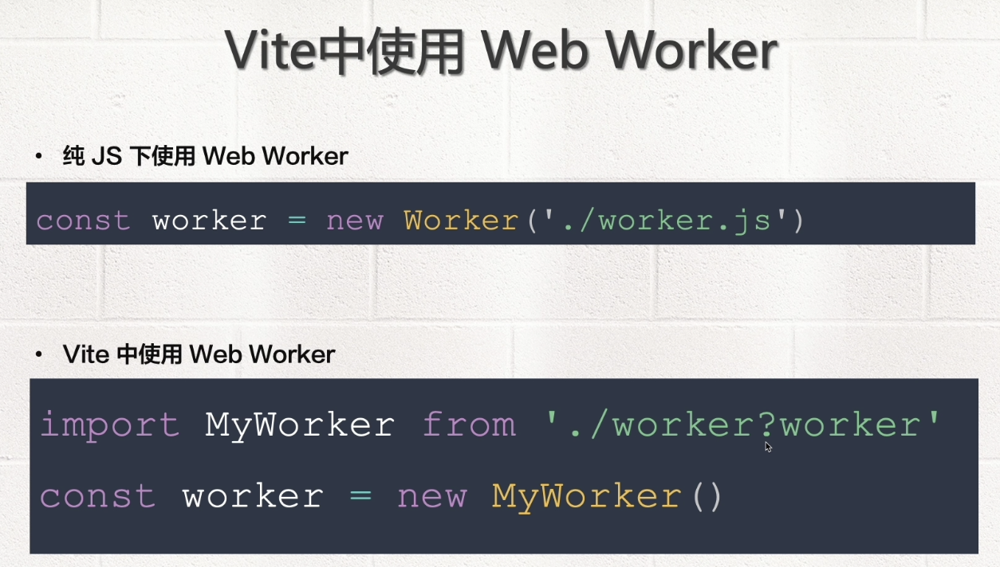


也就说我们可以把这个 Worker 的 js当成是一个模块来使用。

那下面呢我们就来演示一下回到 Visual Studio Code ，打开

来创建一个项目

```sh
## 执行下
$ pnpm create vite
## 然后我们把项目命名为纯的原生js 
$ vite-basics-vanilla
preact
## 选择
vanilla
## 然后再选择
vanilla
## cd 到 vite-basics-vanilla 这个文件下面
$ cd vite-basics-vanilla
## 然后接下来我们执行下
$pnpm i
## 安装我们这个依赖
## 安装好了以后
## 我们执行下
$ pnpm run dev
```


服务启动起来了，然后我们点击一下这个链接，我们就打开了这样的一个欢迎页面。


那接下来呢我们就在vanilla 这个项目里边，去创建我们的 Web Worker，我们在项目根目录下面出现一个新的文件，取名为叫做worker.js，在这里边呢我们可以写一段运算

```js
// worker.js
var i = 0
function timedCount () {
	i++
	postMessage()
}
timedCount()
```

然后在下面我们再去写一个 postMessage，这是一个非常有用的方法，这个postMessage可以把信息传递给我们的主线程，那它的信息的内容就是这个  i  了，那接着下面呢我们让它每过一秒去执行一次。所以我们执行下  setTimeout，在里面我们去调用下，我们方法本质然后通过一秒去执行一次，我们得用这个方法先去调用一下，这样的话我们的worker.js 就编辑好了。

那么这个线程呢会单独的运行,那如何的去引用呢,我们先使用原生的 js,我们在 main.js 里边,将这个代码先删除掉,然后呢我们去引入我们的 worker.js.我们先使用原生的方法,我们定义一个常量叫做 worker ,然后它应该是 等于new Worker ,注意这个 Worker 是我们浏览器自带的.所以我们可以直接使用。但这个路径就是我们当前目录下面的'./worker.js'引入进来以后，我们需要收取我们在子线程发过来的数据，所以我们要给 worker定义一个 onmessage 这个事件

```js
// main.js
const worker = new Worker('./worker.js')
worker.onmessage = fucntion (ev) {
	console.log(ev.data)
}
```

这个事件后面是一个回调，在回调函数里面我们可以拿到一个 event，这个 event 就可以拿到我们的数据了。所以我们可以通过调用 event.data拿到这个数据，好下面呢我们可以打开控制台。我们看到每过一秒就会输到子线程里面获得信息。

那接下来我们可以看下 如何在 Vite 去使用我们这个 Worker，也就是我把我们这个Worker.js 当成是一个模块来调用，而不是直接原生的去使用方法。就是我们现在可以吧这句话先注释掉,然后呢我们在通过 import去导入一个模块，这个模块的名字我们可以取名为 MyWorker，大家发现 ，我们这个变量的名字开始是大写的，字母开头那就是说他应该是个对象 ，然后from 就应该是当前目录下的  './worker.js'，注意，在这后面呢一定要 加?worker，这样的话这个资源才是被当作成是一个 worker来引入的。

```js
// main.js
// const worker = new Worker('./worker.js')
import MyWorker from './word=ker?worker'
const worker = new MyWorker('./worker.js')
worker.onmessage = fucntion (ev) {
	console.log(ev.data)
}
```

最后呢我们还得去const worker 来去定义一个 实例，然后呢，他就等于 new MyWorker，他返回的就是一个 worker 对象，接下来呢我们再看效果跟刚才我们使用纯原生 js 的效果是一致的。这就是我们如何的在 Vite 中去引入一个Worker，关于 Worker 我们就讲这么多，大家加油。

# 十二、WebAssembly

我们继续的来介绍 Vite 功能,这一章我们来看一下,在  Vite  中如何使用 WebAssembly,WebAssembly 是一个可移植,体积小,加载快并且兼容 Web 的全新技术,是大前端的重要内容.


自从提出来以后就一直的被火热关注,他可以实现 JS 在宿主环境中,比如在浏览器里边,直接的调用 C C++ 等程序前端的性能,从此有了一个更好的解决方案。我们先来搭建一个能将 c和 C++ 编译成点  .wasm 的环境。

接下来呢我们在 Vite中来引入这个文件，关于 WebAssembly，不是我们这堂课重点讲解的内容，如果感兴趣的小伙伴呢，可以去访问一下 WebAssembly  的官方网站WebAssembly.org去了解详细的内容。

接下来我们详细的给大家讲解一下如何在我们本地搭建一个能编译.wasm 的这样的一个环境。这个环境分成很多的步骤我们详细的给大家讲解一下，大家照着我的 ppt 去演练就可以了。

第一步呢大家先安装 GIT，我相信大家机器上应该是已经安装好了，如果没有安装的话，大家可以去 git 的[官方网站](https://git-scm.com/)去下载相关的操作系统的版本，安装好 GIT 以后.

第二步 我们来安装 CMake，如果是 Mac 系统,大家可以通过homebrew，也就是brew install去安装，如果是 Window系统 ，大家可以参照官网去找相关的解决方案。

第三步 安装 GCC，就是 C 的编译程序，这个的话如果大家是 Mac 系统的话，大家可以直接安装 Xcode 就可以了， Window 系统的话，可以安装 Visual Studio

第四步 我们来编辑  Emscripten，这个的话分成五个步骤

```sh
## 第一步 我们先到 git上克隆项目
$ git clone https://github.com/juj/emsdk.git
## 然后我们 进入到 emsdk 目录下面
$ cd emsdk
## 然后执行下安装
## 安装的方法
## 就是当前目录下
$ ./emsdk install latest
# 注意注意这个呢跟某些网站说的不一样
# 有的小伙伴可能会去看关于 WebAssembly 的中文网站
# 那么这里边呢安装的版本可能跟这个不一样
# 所以大家一定按照我们 ppt展示的这个方法去做是没有问题的
```

接着呢我们在去执行 

```sh
$ './emsdk activate latest --permanent'
```

后面我们一定要加 --permanent，不然的话 可能会有问题，最后呢，我们在执行下

```sh
$ source ./emsdk_env.sh
```

第四步完成以后呢，我们来看第五步，我们就可以编辑一个C 程序。这里呢你可能会问，为什么没有 main 的一个入口文件我们可以直接的去写一个 C 的函数就可以了，然后呢，我们就可以在 js 里边去调用这个函数。然后接下来呢，我们再去编译一个 .wasm 的文件，我们搭建这个环境，其实事实上就是为了调用一个 emcc，去把我们的 c编译成一个 wasm 的文件，具体的这句话呢大家抄一下就可以了

```sh
$ emcc src/math.c -Os -s WASM=1 -s SIDE_MODULE=1 -o ./dist/math.wasm
```

注意两点，第一呢，我们先找到我们 C 的源文件的位置，我当前是在，src目录下的 math.c 文件，输出的话是放到了dist/math.wasm，这个文件编译好以后呢，我们就可以把它拿到 Vite。在 Vite 调用  .wasm，去执行一个 import  导入  './math.wasm'，把他当成是一个模块，然后呢，我们去调用初始化的函数，会返回一个 promise，在 promise 这个回调函数中 ，我们就可以通过  exports  去访问我们在  C 语言里面写的 这个 add 方法，这样的话 ，我们就实现了 在浏览器端 ，通过 JS  来去调用 一个 C 程序了 。

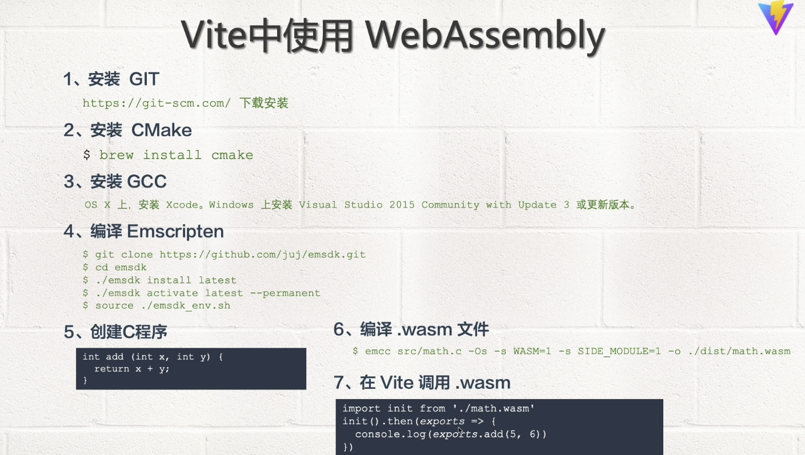

下面呢我们来详细的演示一下。

我已经按着 PPT 的步骤，在我 VITE 目录下面创建一个 emsdk 这样的目录，他就是我们当前的一个 能将我们的 C 编译成 wasm 这样一个文件的环境，那我们来简单的看一下这个目录下的内容 还是不少的，接下呢，我们在这个目录上面，点击右键创建一个新的目录取名为 src，我们在 src 里面创建一个新的文件，叫做 math.c，我们来写一段 C 的程序，我们先来定义 一个函数，函数的返回值的类型是 int，函数的名字叫 add，函数接受两个参数，一个是 x 一个是 y，它的类型都是 int函数体里边 我们要返回  x 和 y 的和这里呢我们不需要写入口函数 main，也不需要导出 add ，我们只需要定义一下这个函数就好了

```c
// math.c
int add (int x, int y) {
	return x + y;
}
```

这样的话，我们在 JS 里面就可以调用了，这个 C 文件填写好了以后，我们在 emsdk 目录下面创建一个新的文件夹叫做 dist。我们打算把他编译好的内容 放在 我们 dist 目录下面，然后， 我们进入到 emsdk 这个目录下面

```sh
$ cd emsdk
```

然后，将我们 PPT 里面的编译命令 粘贴过来，

```sh
$ emcc src/math.c -Os -s WASM=1 -s SIDE_MODULE=1 -o ./dist/math.wasm
```

然后，我们看，我们要编译 src 下面的 math.c，放到我们  dist 目录下面 取名为 math.wasm，好 ，我们 回车一下，发现，这里报了个错，return 后面要写分号。下面呢，我们打开 dist 目录，我们能 看到 math.wasm，就已经创建起来了，但是，我们打开它以后发现，它并不能直接的观看，因为这是一个二进制的文件，那怎么办呢，我们下面必须要在我们的Vite里载入它 ，我们先把这两个文件关掉，接下来我们去 Copy 一下这个文件，把他粘到 Vite-basics-vanilla 这个目录下面，然后，我们试图在 main.js 里面把它导入，现在呢，我们先把 main.js ctrl+c  ctil+v  ，copy 一个， 然后我们把它保存一下取名为 main-webworker.js，然后，我们把  main-webworker.js 代码先删除掉，然后在 main.js 里试图的去载入math.wasm。怎么做呢，我们需要像一个模块导入它，我们导入一个名字叫 init 初始化，然后 from 当前目录下面的 './math.wasm'，我们把这个文件给导入进来导进来以后呢，我们就去调用一下这个 init 这个函数，这个函数返回的是 promise，所以在这个后面 main 的后面可以给一个回调函数，比方说，形参是 exports  ，方法体里面我们就可以拿到 exports了，我们先 console.log(exports)  保存一下。

```js
// main.js
import init from './math.wasm'
init().then(exports => {
	console.log(exports)
})
```

我们把我们的项目启动下，然后 ，我们在 Vite-basics-vanilla ，右键 open in Integrated Terminal，打开我们这个终端接着我们执行下  

```sh
$ pnpm run dev
```

 好我们的项目启动在 3000 上，我们点击一下，打开我们的 控制台，console.log(exports) 打印的是一个对象，对象里面就有这个 add 这个方法，所以我们就可以直接调用了，我们就可以调用下 exports 里的 add方法，我们传入一个 4， 5 保存，在控制台打印了一个 9

```js
// main.js
import init from './math.wasm'
init().then(exports => {
	console.log(exports.add(4, 5))
})
```

注意这个代码 是我们 读取的一个 C 编译的成的 wasm 这样的一个代码，这个例子呢，我们只是简单的引入一个 C 的函数。如果我们把一个大型的 C 项目，或者是一个比方说 C语言写的一个程序放到我们页面里，我们就可以通过这个 WebAssembly 技术，来提高我们前端的性能了。好关于 WebAssembly 我们就讲这么多，大家加油。


#  十三、导入JSON以及Glob

我们来继续的做  Vite  功能的介绍,这一章我们来看一下,如何的在 Vite 里导入 JSON,以及 Globl 导入。

关于在  Vite 里边导入 json,其实事实上呢,是可以直接的作为一个模块来导入的,同样他还支持具名的导入,这样的情况下我们就可以使用,Vite 给我们提供的 tree shaking。

关于 Glob 导入,是为了支持的一个特殊的情况,这个导入方式呢是 Vite 的一个功效,它并不是浏览器对于模块天生支持的,它使用的特殊的 import.meta.glob 函数,来进行多个文件的导入。这样的情况下呢,我们可以一下子导入一组文件,对一组文件的模块进行特殊处理了。

下面呢我们来演示一下,回到VSCode，我们还是在vite-basiscs-vanilla这个项目里边去实验，,我们这个项目的根目录下面创建一个文件夹，,叫做json, 在json文件夹里我们创建一个新的文件，我们可以取名为data.json,这里边儿呢我们来写一个jason字符串，我们先定义一个x,x的值可以定义为100这个数值，然后我们再定义一个'text',定义一个字符串'hello'这个json文件定义好了以后呢，

```json
// json/data.json
{
  "x": 100,
  "text": "hello"
}
```


接下来呢我们再(min.js)里面去引入它，我们通过import来导入一个模块的名字叫做data然后from应该是当前目录下的json下data.json，接下来我们来看一下(  )把json导入进来以后是个什么样子的内容。

```js
// main.js
import data from './json/data.json'
console.log(data)
```

我们可以consele.log(data)保存一下，然后我们进入到vite-basiscs-vanilla这个目录下面执行一下pnpm run dev。然后呢，我们在这个浏览器里面打开我们这个项目，然后我们打开控制台，来看一下，这里打印了一个对象，对象里面包含了text以及x,说明vite已经将我们导入的json变成了一个对象了，那我们就可以直接的去解构我们某一个变量，

```js
// main.js
import { text } from './json/data.json'
console.log(text)
```

比方说这里我们可以去解不出text，然后我们可以打印这个text保存一下，这样的话我们这个hello这个字符串也就打印出来了，当然x也可以解构构出来。这样做的好处呢？如果我们json文件的内容特别的多，我们指导出了text。那么其他的内容vite会通过tree shaking 帮助我们把它去掉。

关于vite导入json还是非常简单的，下面我们来看一下vite如何import.meta.glob通过函数从文件系统导出多个模块,回到代码，我们现在在我们项目根目录下面创建一个新的文件夹，叫做glob在这个文件夹下面我们创建两个js，一个json，js我们可以取名为m1.js。我们通过export default，然后导出一个字符串，m1保存一下。

```js
// glob/m1.js
export default 'm1'

```

然后我们在创建一个新的文件叫m2。m2的内容呢也是export default，然后导出一个字符串m2。

```js
// glob/m2.js
export default 'm2'
```

然后我们在这个目录下面再创建一个json，我们可以取名为叫做j1.json。然后我们在这里面呢去随便的编写一个这个字符串，我们给写个x:100保存一下。

 ```json
{
  'x':100
}
 ```

接下来呢我们在main.js里边儿通过glob的方式来去导入这一些文件。我们可以把main js copy一下，然后粘贴把这个副本改名为main.json，然后我们把这个main.json内容去掉，然后呢我们对一个常量const用的叫做modules等于import.meta.glob

```js
const modules = import.meta.glob('glob')
```

这个函数导入的目录的路径，注意这里边的路径呢，我们一定要使用相对或者绝对路径。其他路径是不能用的，比方说我们可以使用一个./*，当前目录下的下，如果我们不写后边的文件的话，来我们看一下效果。我们可以在下面呢console.log(modules)，

```js
const modules = import.meta.glob('./glob/*')
console.log(modules)
```

我们看到这里呢返回的是一个空的对象。如果我们可以在glod后面写一个*这样的情况下表示我们要导入glob这个目录下面所有的资源。那么大家看到就返回了一个对象，我们仔细的观察一下这个对象，对象呢key就是我们的文件和目录的名字。他的value呢是一个导入函数 。那这样的话，我们现在就有了思路，我们可以执行这个导入函数会返回我们导入的模块。那我现在改造一下代码，我们可以通过

```js
const modules = import.meta.glob('./glob/*')
object.entries(modules)
```

把modules放进去，这样的情况下会返回一个数组，数组里的第一个元素是我们的key。第二个元素是value，我们可以打印一下，

 ```js
const modules = import.meta.glob('./glob/*')
console.log(object.entries(modules))
 ```

看一下。我们看到打印了三个数组，每个数组的第一个元素就是我们的key第二个参数就是我们导入模块的函数。那么接下来呢我们可以把这个数组进行遍历

```js
const modules = import.meta.glob('./glob/*')
object.entries(modules).forEach(([])=>{})
```

在后边我们通过forEach来遍历这里回到函数里边。我们就可以拿到每个元素，在每个元素的导入的过程中，我们可以给它解构出来。比方说第一个元素的名字，我们给他起个别名叫key,第二个元素我们可以给他起个别名叫做value，那么接下来呢我们就可以看一下

```js
const modules = import.meta.glob('./glob/*')
object.entries(modules).forEach(([])=>{
  comsole.log(key,value)
})
```

我们来看一下key和value，效果跟刚才的结果呢是一样的，那么接下来我们可以去调用一下我们这个所谓的模块导入函数。

```js
  const modules = import.meta.glob('./glob/*')
  object.entries(modules).forEach(([])=>{
    value().then(module => {
    console.log(module.default)
  })
})
```

调用方法呢就是我们可以通过value函数的调用,来返回一个promise，这个promise的话，那当然我要问一下。在这个返回结果里面，我们拿到这个模块module。然后呢我们可以去打印一下这个模块儿了一下module。这样的话呢，我们就拿到了这个每个模块，每个模块里面有个default，所以呢我们可以打印一下。这样的话，就可以把我们每个模块的结果给打印出来了。那同时呢我们也可以把模块的名字放在这前面，比方说key我们写个保存一下。

```js
 const modules = import.meta.glob('./glob/*')
 object.entries(modules).forEach(([])=>{
    value().then(module => {
    console.log(key,module.default)
  })
})
```

好，这样的话呢，我们就可以对每个模块儿进行单独使用了。这里有一个点需要注意的是，我们这个模块儿其实上呢都是由vite来帮助我们的。事实上这个glob并不是我们浏览器里自带的，如何验证呢？现在我们可以打开sources这个文件夹,这里边我们可以找到main.js，我们来仔细的观察一下这个main.js的浏览器端的代码，我们就知道了。我们看到其实事实上呢他是定义了modules一个变量，里边呢可以通过我们刚才看到的key和value单独的进行定义。然后呢再通过我们刚才写的代码来进行单独的显示，也就说这个工作呢其实事实上是由vite他来帮助我们完成的。我们可以进一步的来去验证，在glod里面还给我们提供了另外一个方法，叫做globEager，

```js
 const modules = import.meta.globEager('./glob*')
 object.entries(modules).forEach(([])=>{
    value().then(module => {
    console.log(key,module.default)
  })
})
```

保存一下，现在呢我们打开控制台，现在我们来看一下这个value的值。因为这个Eager的返回的就不是我们真正的异步模块了，所以我们这个代码要注释一下

```js
 const modules = import.meta.globEager('./glob*')
 object.entries(modules).forEach(([key,value])=>{
   console.log(key,value)
   // value().then(module => {
   // console.log(key,module.defaul)
 // })
 })
```

然后我们在上边儿呢，我们可以log一下key和value保存一下，好，我们看一下这个结果呢就不再是刚才的那个模块导入的异步函数了，而是具体的一个模块儿了。那就说现在我们可以直接使用这个模块下的default的。那我们可以在这里面写一个value.default。保存一下好，我们的结果呢就出来了，我们再次打开看一下main.js,你会发现这个代码呢其实事实上它是帮助我们把每个模块儿都导进来，起了一个别名。然后呢我们再通过这个别名来进行处理，这就说明我们的vite在中间一直在工作，帮我们解决一些问题。接着呢我们再去研究一下，导入了glod这个语法我们可以打开控制台(console)。这里其实事实上呢，我们可以去导入一个*.js保存一下，刚才发现现在呢我们只把js模块给导入进来了。当然了，我们也可以写*.json。那如果是我们这里面去使用其他的一些正则可不可以呢？其实是支持的。比方说我们在*的后面加一个中括号，写个1然后我们写个一保存一下

```js
const modules = import.meta.globEager('./glob/*[1].*')

// console.log(modules)
Object.entries(modules).forEach(([key, value]) => {
  console.log(key, value.default)

  // value().then(module => {
  //   console.log(key, module.default)
  // })
})

```

大家发现这里边呢导入了j1.json。那如果是我们把扩展名名改成js就会导入m1.js。那如果是我们板块来名改成*，那这样的话呢，就会把j1.json和m1.json给导不进来了。那就是说这里我们是可以随意的定义一些正则的.

那么关于这个glob函数的细节呢，大家可以参照这个因为就使用的fast-glob，vite就是使用fast-glob完成这个任务的，那么具体的细节呢，大家可以看看它的官网，这里面介绍了一些基础的语法。以及高级的语法,这里呢我们就不再详细的指出了。

最后一点官网还提到我们不能在这个glob语法里面去使用变量，比方说我们把这个变成一个变量的格式是不允许的，比如说写一个x，x可能代表字符串glob,这是不允许的，所以呢我们一定要使用一个具化的一个字符串。好，关于Vite导入json以及glob导入我们就介绍这么多，大家加油！

# 十四、集成ESLint

从现在开始，我们来介绍 Vite 的高级应用。

首先呢我们来看一下，在 Vite 中如何集成 eslint，为了使我们的代码具备可预测性，易于浏览并易于理解，在构建一个大型规模的应用的时候，我们需要在Vtie中集成 ESLint 改善咱们开发人员的体验，特别是与一个团队的合作，我们更需要设置一些自动化的代码提示和格式化。

首先呢，我们来看一看在 Vite 中如何集成 eslint，返回 vscode，我们打算在 vite-basiscs-vanilla 这个项目里边，去使用 eslint，在没使用之前，我们先来看一下我们这些文件的表现，我们先看一下 main.js，这个文件很显然好像没有什么问题，包括 main.json.js 也是没有问题的，但事实上呢，我们这些代码如果在一个团队里边，按着统一的规范的话，可能不规范。

那么接下来呢，我们首先在vscode 里边去安装一个扩展，点击这个按钮，我们输入一下 eslint，这样的话，我们就搜到了关于 eslint 这样的扩展，我们点击安装就好了，这里呢很显然我们已经安装好了，他的版本是2.2.2，安装好了以后呢，我们回到我们代码里边，很显然这一步还不够，我们得需要去安装 eslint相关的一些插件。

首先我们在这个目录下面点击右键，在集成终端中打开我们这个目录，我们去安装 eslint 相关的一些插件，我们执行`pnpm i eslint-config-standard eslint-plugin-import eslint-plugin-promise eslint-plugin-node eslint -D`稍等就安装好了，这里头有一个warning就是他说我们这里边需要依赖的7.12.1的版本,但是我们装的是8.1.0版本这个无大碍，所以我们暂时不用去关注他。

那安装完了以后呢，我们现在再看一下main.json还是没有任何的反馈。那么接下来我们在当前的目录下面创建一个新的文件，取名为叫做.eslintrc.js我们来去通过module exports来做一个配置。在配置里边儿呢，我们去定义一个extends这样的一个属性，它的值呢怎么可以定成stamdard的是刚才我们安装好那个标准的的eslint配置好了，现在呢我们看到这个eslintrc.js已经有关于语法的问题了。

```js
// eslintrc.js
module.exports = {
  extends: 'standard'
}

```

那我们看一下problem，他告诉我们string必须要用一个单引号。很显然我们这个字符串呢用的是双引号，另外呢他告诉我们新行必须要求我们在这个末尾上添加一下，那很显然，我们需要手工的去做一些调整。

我们可以把这个给改一下，改完了以后我们看到这个文件就没有任何的关于也是语法的问题了，那接下来我们再来看一下main-json.js，我发现这个文件貌似没有什么问题。

再去打开一个文件，再去打开一个文件，再去打开一个文件，我们看到呢这里头貌似好像都满足了们所谓的eslint的一些语法要求。

那如果我们的代码里面有一些不满足的要求会怎么样呢？

比方说我们再打开一个glob下面的m1.js，好，我们看到这个代码呢给我们的提示,新行要求我们在末尾需要添加一下,很显然我没有添加，那大家想一想，如果我们每一个这样的js文件都属工的进行真的修改一来费时间，二来呢可能我们也改不全，会漏改一些内容。

那怎么办呢？哎，我能不能有个工具来帮助我们来去自动的进行这样的问题的发现并且修改呢？我们可以采用比方说保存文件以后格式化就帮助我们自动实现了呢。这是可以的，我们得需要借助于另外的一个工具。这个工具呢就是我们介绍的prettier，它可以帮助我们实现这个功能。

这功能的添加我们首先得做几个工作，第一步我们先在vscode里面安装一个prettier的这样的一个所谓的扩展。我们属于一个prettier，好，发现了，这里头就有一个这样的prettier的插件，我们的安装好就可以了，这里我们已经安装好了，他的版本是9.3.0。

安装好这个插件以后还没有完成彻底的任务，我们得需要在我们项目的根目录下面去做一个prettier的一个配置，我们这里面呢再去创建一个新的文件。这个配置文件我们可以取名为叫做.prettierrc，注意，这是一个类似于json的一个文件，我们呢不要在这里面去编写.js的语法，我们先写个花括号，然后在里头呢我们去写一个叫做semi也就是所谓的分号。我们要不要加分号呢？我们可以对应为false，不让我们说的语句加分号，第二呢就是我们在后面要加一个所谓的singleQuote，也就是我们语法里面的字符串的双引号要不要加呢？这头我们可以写个true。也就是说我们双引号要变成一个单引号

```js
// .prettierrc
{
  "semi": false,
  "singleQuote": true
}
```

这就是定义了我们一个的规则。那以后呢我们在检查的时候，可以按照我们这个规则来继续的定义。关于prettier的其他规则，大家可以参照官网网站去看一下。

配置完了以后呢，那我们来再去看一下m1.js，很显然这里头它并没有帮助我们做相关的修改。我们保存一下文件也没有完成，那怎么办呢？我们还得需要借助于vscode的一些功能。

首先呢，我们打开一个配置。在配置里边呢，我们去搜索一下(format on save)，我们要把它勾掉，等于我们在保存这个文件的时候呢去做一些格式化。另外呢，我们还得需要在这后边再去搜索一个叫做(formatter)，这里头有一个default formatter。我们选择哪一个格式化的工具呢？我们选择这个prettier就可以了。好，这个完成了以后，接下来我们打开这个文件按一下Ctrl+s，好，发现了它会自动的帮助我们产生一个新行。以此类推，m2 Ctrl+s一样的，那么所有的这些文件呢我们都可以看出会帮助我们做符合eslint的这样来一些语法，那prettier他会帮助我们完成这个工作。

说到这儿感觉我们的工作呢貌似已经完成了，但事实上如果是我们手工的需要去把每一个文件都进行保存也是一个问题，我们也会漏保存一些东西。那能不能让eslint帮助我们自动的进行检测，看看还有哪些文件有问题呢？这个也是没有问题的，我们可以在package.json里面去配置一个eslint的脚本，我们可以取名lint为或者是eslint都可以，后面的命令呢就是eslint --ext我们要去检查js文件，检查哪个目录呢？就是当前目录下，如果将来我们可以把我们的js文件放在src这个目录下面，那你就可以写的当前目录下的src。目前呢我们没有src目录，所以呢我们就检查当前目录下面的js文件就好了。

```json
// package.json
{
  "name": "vite-basics-vanilla",
  "private": true,
  "version": "0.0.0",
  "scripts": {
    "dev": "vite",
    "build": "vite build",
    "preview": "vite preview",
    "lint": "eslint --ext js ./"
  },
  "devDependencies": {
    "eslint": "^8.11.0",
    "eslint-config-standard": "^16.0.3",
    "eslint-plugin-import": "^2.25.4",
    "eslint-plugin-node": "^11.1.0",
    "eslint-plugin-promise": "^6.0.0",
    "husky": "^7.0.4",
    "vite": "^2.8.0"
  }
}

```


保存一下，然后在我们的终端上面我们清一下屏，执行一下pnpm run lint，大家看到还有一个漏改了worker.js就是的，这里边告诉我们的错误是，关于空格方面以及关于postMessage没有定义方面，那我们来打开这个worker文件，它是在当前我们这个项目的根目录下面我们打开这个worker.js我发现了，你果然有一些问题，我们先去保存一下。保存完了以后呢，我发现还是有很多问题的，希望我们要像var改为const,第二呢，他希望我们在这个function的后面加一个空格儿，另外呢postMessage并不是我们当前这个文件里头具有的一个方法。他应该是一个window对象，上面带着一个全局的函数。我们现在呢可以执行一下保存，发现了这些问题并没有直接的解决。

很想来我们那些配置呢可能不全，现在我们先不着急解决这些问题。留着的这个问题以便于我们后边的测试，我们先把相关的这些文件都关闭掉。

接下来呢我们来看一下另外一个需求，我们也希望在项目打包之前来发现一些eslint错误，如果我们这些错误不解决，我们不希望我们的项目进行build首先呢我们来看一下package.json，在这里边儿有一个叫做pnpm run build的命令，我们可以看行一下。发现呢，这个build的工作已经完成了，很显然在build之前没有进行eslint的检查。我们可以在这面命令的前面加一个pnpm run lint &&表示的build这个命令，

```json
// package.json
{
  "name": "vite-basics-vanilla",
  "private": true,
  "version": "0.0.0",
  "scripts": {
    "dev": "vite",
    "build": "pnpm run lint && vite build",
    "preview": "vite preview",
    "lint": "eslint --ext js ./"
  },
  "devDependencies": {
    "eslint": "^8.11.0",
    "eslint-config-standard": "^16.0.3",
    "eslint-plugin-import": "^2.25.4",
    "eslint-plugin-node": "^11.1.0",
    "eslint-plugin-promise": "^6.0.0",
    "husky": "^7.0.4",
    "vite": "^2.8.0"
  }
}


```


首先先进行对他的检查，然后再进行build，保存一下，然后呢我们再去执行一下`pnpm run build`，好，我们发现呢这里头有很多问题，这里头有一大堆问题是什么呢？

我们来看是这个编译以后的js文件，也就是我们dist目录下的文件。这个呢我们暂时不用管它，因为dist目录是我们编译后的文件，我们不用检查它的es问题。我们只关心我们这个worker.js的这个错误。

另外呢，我们也不希望我们的项目在进行代码提交的时候带着我们这些问题提交,也就说我们希望在git进行提交的时候，能够检查出我们的一些es问题。当我们把这些问题都解决了以后，再进行代码提交，这个工作我们该怎么实现呢？

我得需要一个git husky这样的一个所谓的hook。关于git hook，大家可以参照git相关的一些文档，或者是参照一下我的webpack相关视频。在那个视频里边儿呢详细的介绍了一下git hook的一个使用，我们就直接的去使用它就好了。

返回我们当前的这个目录，在这个下面呢我们来去执行一个关于git一些操作。首先在我们当前的目录下面呢去初始化一个git环境，我们执行一下git init。

那好，这样的话呢，我们初始化的环境就搞定了，接下来我们再git上面去做一个远端的仓库。

好，登录我的git我们新建一个项目。我们创建一个新的项目，叫做(felix-courses-vite-vanilla)。好，接下来我们其他的内容按照默认点击(create response)就可以了，这样话就创建了一个远端的仓库。

我们可以把这句话copy下来。好，回到我们的vscode，我们把那个代码粘贴过来，好，这样的话没有任何反应，表示我们这个远端仓库已经创建好了。好了，接下来呢我们执行一下git status。看到我们有很多的文件需要提交，我们执行一下`git add.`，提交完了以后呢我们执行一下`git commit -m 'vite init'`。好，这样的话呢，我们就已经提交成功了，打开`.gitignore`。我们看到这里有定义了很多文件不需要我们提到服务器上的，比方说这个dist,但这个文件呢并不能够帮助我们拦截代码里的问题。那怎么办呢？

我们得需要去做一个所谓的git husky，我们需要去安装一下。执行一下pnpm i husky，husky是一个非常好用的一个好用的工具。好，安装完了以后呢，我们执行一下`npx husky install`。我们安装一下husky，安装完了以后呢，大家看到这里有提示说git hooks  installed

这是我们的这个钩子已经安装好了，那现在呢我们来看一下.husky下面呢就有一个所谓的叫做husky.sh。那接下来呢我们开始准备去编写一个hook，也就是在git提交之前去执行的一个命令。

那这里呢？我们执行一下`pnpm husky add. husky /pre-commit`，pre-commit就是我们在提交之前的一个hook，后边我们去输入一个命令叫什么pnpm run lint 回车。大家看到现在呢在我们的目录下面会产生一个新的目录叫做pre-commit,这里呢就有一个pnpm run lint，也就是在git提交之前执行一下我们lint的检查。

好，那接下来呢我们执行一个`git commit -m 'add husky'`。好，回车。好，大家看到他先去执行了一下lint发现很多问题，那我们可以把这个问题解决了以后再进行所谓git的提交。

这里呢为了不让他检查我们dist目录里面的问题，我们暂时把dist目录给删除掉。其实上呢大家也可以把我们这些js文件放到src的目录下面，我们只需要去检查当前目录下src的就可以了。暂时呢我们就临时的把dist目录给删除掉。保存一下，那接下来我们来去看一下重新的检查，我们再去进行一次这个提交。

大家看一下，只剩下这三个问题了。那我们就去改这个问题，我们把这个关闭掉打开worker.js。第一个呢是个warning，他希望我们不要var使用来用let const来代替。那很显然，我们得需要去改成let，因为下面我们对i还做了一个操作。let以后第一个问题就没有了，接着我们看第二个问题说我们丢了一个空格在我们的function这个名字在后面，那我们可以在在后面加个空格，如果说我们就希望他不需要这个空格的话，那我们也可以做个配置，后边这个配置的语法呢我们可以把它copy一下。到我们eslintrc这个目录下面我们去定义一个叫做rules的规则。在这里边儿呢，我们可以我们刚才那个过来，后面我们可以定义成字符串off。表示我们要关闭掉它。那很显然下面呢这里头还有其他的问题，一会儿我们再来看这个问题，

```js
// .eslintrc.js
module.exports = {
  extends: 'standard',
  rules: {
    'space-before-function-paren': 'off'
  },
}

```

那接下来呢我们到worker.js的里头看到这个问题果然不存在了。

接着还有一个问题就是postMessage没有发现，因为它是挂载到这个对象上面的。所以呢我们还得需要去做深度的配置，postMessage这个呢是一个未定义的问题。我们可以来看一下这个not-undef 我们可以copy一下到我们的eslint里头再去加一个规则叫no-undef变为off。

```js
// .eslintrc.js
module.exports = {
  extends: 'standard',
  rules: {
    'space-before-function-paren': 'off',
    'no-undef': 'off'
    
  },
}


```


保存一下，好，我发现了这回这个问题就不存在了，我们再次编译一下。好，我们看到这里还有两个新的问题，是eslintrc的问题我们打开eslintrc，我们看到我们保存一下。发现了prettier已经不能够帮助我们解决这个问题了，我们再来看一下他的问题是什么？就是这个所谓的comma-dargle我们可以放在我们这里头进行一个配置，我们可以在这后边呢去写一个comma-dargle那它的规则我们可以去配一下，或者直接写个off。

```js
// .eslintrc.js
module.exports = {
  extends: 'standard',
  rules: {
    'space-before-function-paren': 'off',
    'no-undef': 'off',
    'comma-dangle': 'off'
  },
}


```


保存一下，好，我们看到了这里头这个提示就不存在了，我们再次执行一下。好，大家看到现在呢我们这个提交就已经可以了，但是呢他告诉我们有几个内容还没有加进来，那我们可以执行一下`git add. `,  `git commit -m 'test husky'`。

我发现在我们就成功的提交到我们远端的仓库里了。

好，至此呢我们就学会了如何在Vite中使用eslint以及如何使用prettier这个工具，在我们代码保存的时候呢能够帮助我们自动的修正问题，并且呢我们还可以通过git husky 这个hook工具来进行代码提交之前的一个eslint检查。好，这一招我们就讲到这里，大家加油！

#  十五、构建生产版本

我们继续的来学习 Vite 的高级应用，这一章我们来看一下如何构建生产版本，当需要将我们的应用部署到生产环境的时候，我们只需要运行，Vite build 的这个命令就可以了。

默认情况下呢，他会使用根目录下的 index.html，作为他的构建入口点，然后会生成能够静态部署的应用程序包。

我们来演示一下，回到 vscode，我们按一下 ctrl 加 ~，打开我们项目的根目录，在这里边呢，我们去创建一个新的项目，我们执行 pnpm create vite，我们创建一个新项目，名字叫vite-advanced-build，我们来去选择vue作为我们的模板，然后选择vue，cd 到 vite-advanced-build 这个文件目录下，执行pnpm install安装一下依赖。

然后呢，我们打开 vite-advanced-build  这个文件夹，我们看到这是一个最基本的vite 的一个vue的环境，下面呢，我们来看看如何去将项目打包，打包的目的就是为了让我们的项目，在真实的环境里运行，那我们打开 package.json，我们看到这里有一个bulid一个脚本,他的执行内容vite空格build，那我们现在呢去运行这个脚本，我们清一屏，去执行 pnpm run bulid，稍等片刻以后呢，他会在我们当前根目录下面生成一个dist目录。
在这里面我们看到有两个文件和一个文件夹，index.html是我们打包好的入口文件，这里又有一个favicon.ico,表示我们当前项目的icon图标，在assets里面包含了我们js css以及图片资源，那我们现在打开一下index.js，我们折下行，在这个文件里面呢，就是已经帮助我们代把码压缩了，那接下来呢，我们运行一下这个项目，注意现在运行呢，不是在我们项目开发环境下面，而是在生产环境下面，我们需要另爱起一个服务，来去运行我们dist 下的这些资源，那如何去启动呢，我们现在关闭这个文件，再次打开package.json，我们看到scripts脚本里面，还有一个preview，preview就是来预览我们打包好的这个项目的，我们清一下屏，执行一下 pnpm run preview 回车，我们看到当前项目启动在http://localhost:4173。

我们来打开看一下，回到浏览器，我们看到，这个呢就是我们当前的项目启动的效果，那你可能会问，这个和我们之前的本地开发环境效果不是一样吗。
我们刚才说过其实preview启动的是dist目录下面的资源，我们可以做一个实验，打开index.html，我们可以在body下面，写一个h1标签 上面呢我们可以写一个build test这样的字符串保存一下。回到浏览器，我们刷新一下浏览器，我们发现呢，它一确是它打开的是dist里面的index.html。
接下来，我们来看一下构建生产版本的，关于浏览器兼容性的问题，用于生产版本的构建，他会假设我们的目标浏览器会支持现代的JavaScript语法，默认情况下呢目标浏览器支持原生的ESMScript标签以及支持原生ESM动态导入。
我们再次回到代码来观察一下，在index.html里面我们看到这里面又一个script type=module，如果我们浏览器不支持这个模块化js导入的话肯定是有问题的。
另外呢我们再次打开assets下index.js我们来看一下，这个代码，在这个代码上面呢有个 import然后from，这就说明我们这个代码使用的是我们原生的import导入模块的方法，如果浏览器不支持这个语法呢肯定就挂掉了。同时呢我们还可以设置我们当前这个import ESM支持的版本，我们只需要在vite.config.js里边去做个配置就好了。

配置的方法呢，就是在这下面我们加一个bulid，bulid下面我们定义一个target他最低支持的是es2015也就是es6。

```js
// vite.config.js
import { defineConfig } from 'vite'
import vue from '@vitejs/plugin-vue'

// https://vitejs.dev/config/
export default defineConfig({
  plugins: [vue()],
  build: {
    target: 'es2015'
  }
})

```

保存一下，我们就可以再次去 重新的打包，我们执行一下pnpm run build，这样的话 呢，打包以后生成的js就是能支持es6这个浏览器了。

说到这儿，你可能会问低版本的浏览器怎么办呢，我们得需要注意了，默认情况下呢vite只处理语法转义，它不包含polyfill，polyfill就是垫片，它可以是我们js代码降级，来支持我们低版本得浏览器，那传统的浏览器我们可以同个几个插件来完成，这个插件呢，就叫vitejs/plugin-legacy。

下面呢我给大家演示一下这个插件如何安装，我们把这些代码呢先关闭掉，然后呢我们再次打开我们vite-config.js,我们在命令行里面先把这个插件安装好,我们执行一下pnpm install 后面是@vitejs/plugin-legacy -D 回车,安装好这个插件以后,我们就可以在这个里面去导入了。

我们可以import 一下插件,我们给起个名字 legacy,然后from应该是@vitejs/plugin-legacy,我们就可以在这里面去定义他了,我们可以把这个plugins做个扩展。在这下面呢,我们来去调用 这个legacy方法,在这个里头我们可以去定义一个对象,对象里头呢定义一个targets这样一个属性,后边呢是一个数组,我们可以定义一个叫做defaults这样一个元素，defaults它可以支持百分之零点五以上的浏览器,并且呢会获取两个最新得版本,那关于这个知识呢,大家可以参阅关于polyfill垫片相关知识,那后边呢我们还可以继续扩展它,比方说我们这里写一个not IE 11,也就是不要在ie11浏览器执行。

```js
// vite.config.js
import { defineConfig } from 'vite'
import vue from '@vitejs/plugin-vue'
import legacy from '@vite/plugin-legacy'

// https://vitejs.dev/config/
export default defineConfig({
  plugins: [vue(), legacy({
  	targets: ["defaults", "not IE 11"]
  })],
  build: {
    target: 'es2015'
  }
})


```

好保存一下,好，那这个配置会给我们带来什么呢,我们在这个命令行里面再次执行一下 pnpm run build。
好，我们等待片刻以后呢,我们发现现在打包的内容就变多了,我们可以打开dist目录的assets来看一下，这里面呢 除了index.js以外,还有一个index-legacy.js以及poliffill-legacy.js以及vebdor-legacy.js/vendor.js等等,那我们打开index.html，我们发现呢这些文件就被引进来了,这样做得目的呢，就是让我们一些低版本浏览器,可以运行我们vite的vue代码。

接下来呢我们再看一下公共基础路径,什么叫做公共基础路径呢,就是说我们在部署项目的时候我们可以不部署在根目录上面,我们可以定义部署在哪个目录下,这样的话在我们服务器端部署多个项目的时候就很有用了,那具体的刚怎么实现呢,我们可以通过 vite build --base来去指定一些资源的路径。
我们来演示一下，回到代码，我们把这些文件先关闭掉，我打开package.json，这里呢我们再次复制一个build，在这后边写一个：vue3这只是一个名字而已，在这后边呢加一个--base等于定义一个路径，比方说/project/vue3保存一下，运行一下pnpm run build，但是我们这次build的时候，就是不是build我们这个原来的build，我们后边呢要加一个：vue3，好，下面我们来看一下发生了什么。我们在dist文件目录下，看一眼assets这个目录下文件没有发生什么变化，我们再次打开index.html，我们发现这里的路径都变成了这样的路径。那你可能会问这个路径变了以后我们的资源还能访问吗,我们可以是一下,清一下屏,执行一下pnpm run preview,然后回到浏览器,我们再次刷新一下,好,我们发现呢这些资源找不到了。

```json
// package.json
"scripts": {
	"build:vue3": "vite build --base=/project/vue3"
}
```

接下来呢而我们可以把assts资源传到服务器的project/vue3这个目录下面就可以了。

最后我们再来看一下多页面应用模式,有时候我们在做我们项目时候可能除了vue这个环境以外我们还希望搭载一个其他的路径,这样的话呢我们可以设置大型多屏的网站了。

那比如说我们现在呢在我们当前根目录下面，有一个nested这样的文件夹，这里面有一个index.html和nested.js，这些资源可以跟我们vue的本身没有关系，另外我们还要再vite.config.js里面做一些配置，我们要配置build roullupOptions.input，这里你可能会问为什么还要有roullup呢，因为我们知道vite在开发环境里面，我们可以浏览器自带的模块化的功能，在生产环境里边呢，我们要借助于roullup，所以呢，我们在配置的时候要配置roullupOptions.input这些选项。
我们来演示一下，回到我们代码，首先呢我们先把这些文件关闭掉，然后我们下文件的根目录下面创建一个新的文件夹取名叫做nested，在nested下面我们创建一个新的文件取名为index.html，再去创建一个nested.js文件，回到index.html ，我们通过！生成一个模板，然后通过script标签，引入当前目录下nested.js保存，然后在nested,js里面下一句简单console.log去测试一下，我们去配置一下，我们打开vite.config.js，在build这个地方我们开始准备去配置我们的rollup。

```
// nested.js
console.log('nested')
```

```js
// vite.config.js
import { defineConfig } from 'vite'
import vue from '@vitejs/plugin-vue'
import legacy from '@vite/plugin-legacy'
const { resolve } = require('path')
// https://vitejs.dev/config/
export default defineConfig({
  plugins: [vue(), legacy({
  	targets: ["defaults", "not IE 11"]
  })],
  build: {
    target: 'es2015',
    roullupOptions: {
    	input: {
    		main: resolve(__dirname, 'index.html'),
        nested: resolve(__dirname, 'nested/index.html')
    	}
    }
  }
})

```


首先呢，我们去写一个rollupOptions，在这里面可以配置一下input也就是输入的配置，在这里边我们先把我们view的入口配置好，我们对应一下main 后边呢我们可以使用resolve来去解析具体的物理路径，那我们得去引入resolve，我们可以引入nodejs原生模块path，从path里面去导出resolve这个方法，然后我们去调一下resolve方法，这个方法呢可以帮助我们解析物理路径，第一个参数我们可以使用dirname这样的话指向了当前vite.config.js所在得物理路径，也就是我们项目的根目录，那main也就是vue的入口应该和vite.config.js同级，因此在这个地方呢直接写index.html就好了。
接下来我们在配置nested，我们再写一个nested这样一个入口的名字后边呢我们再通过resolve，参数还是dirname，第二个参数的话，那我们要基于当前这个vite.confige.js，下面的nested下的index.html，所以说后边呢我们可以写一个nested下的index.html保存一下，这样的话我们的配置就完成了。

那接下来我们看一下打完包的效果，我们可以退出这个服务，执行一下pnpm run build，好打完包以后我们来观察一下dist目录下的变化，我们发现这里面多出一个nested目录，那我们去访问一下我们这个打完包的以后的应用，我们行一下pnpm run preview，再次回到我们浏览器 刷新一下页面 ，我们发现my view的入口文件已经没有问题了，那接下来呢 我们在输入一个nested，好我们发现呢，现在nested.js没有找到 这是为什么呢。
我们再次回到编辑器，我们仔细的观察一下我们在当前项目根目录下面定义的这个index.html，好我们再去看在打包的时候他还给了我们一个提示，说呀你这种script标签没有加type=module这个属性，那他在vite环境下面可能会有问题，那问题处在这那我们就可以直接定义一个type他的名字叫做module，好保存一下，然后呢我们再次回到命令行，执行一下pnpm run build 再次打包 ，打完包以后呢，再去执行一下 pnpm run preview，然后回到浏览器，我们再次刷新一下，我们发现 nested就显示出来了，这样的话，我们就实现了在vite环境里面，去打包不同的目录这样一个目的。

好关于Vite构建生产版本，我们就讲这三个重点内容。
关于构建生产版本的其他的一些知识点，大家可以参照Vite的官网，大家加油！

# 十六、环境变量和模式

我们继续的来学习Vite的高级应用，这一章我们来看一下如何在Vite中使用环境变量和模式。

环境变量在项目工程化里担当着越来越重要的角色了，他能够很好的帮助我们区分不同的环境。

最简单的呢，就是development和 production 环境，也就是 dev 和 prod 环境，也是开发和生产环境，他们在配置上和使用上都有一定的区别。

那在Vite中如何使用环境变量呢，我们通过` import.meta.env` 来实现，我们在前面的章节里边接触过这个变量，我们可以通过在 ` import.meta.env ` 里边，去挂载一些东西，这里所有的挂载的内容都是Vite内置的。那在Vite中默认可以存在四个环境变量.

第一个就是 mode，他表示应用运行的模式，可以通过他来实现不同环境的区分。比如 devlocal 环境 ，dev 环境， test 环境，集成环境或者是线上环境等等，我们都可以通过这个环境变量来区分。

第二个贝斯 BASE_URL这个表示部署用的基本 url，比如本地的localhost:3000，以及发到线上的某个具体的域名等等。

第三个PROD，PROD 呢是 production 的缩写，表示应用是否运行在生产环境中。

最后一个  dev表示应用是否运行在开发环境中，这个环境变量永远与 PROD 相反。

接下来我们来具体演示一下，看看他们如何使用。

返回我们vscode 我们执行一下ctrl 加 ~，呼唤出我们命令行的终端工具，然后我们执行一下` pnpm created vite`，创建一个新的vite项目，取名为 vite-basics-env，然后我们去选择vanilla，在选择vanilla ts。

我们cd 到 vite-basics-env，我们执行一下pnpm install，我们安装一下项目的依赖,然后我们执行一下pnpm run dev。

我们在浏览器上边打开这个项目，然后我们看到一个欢迎的页面，再回到我们的项目,打开vite-basics-env这个目录，到src main.js里把这些代码暂时的先删掉。我们就来打印一下 import.meta.env保存一下，我们在开发环境里面他的打印是什么内容，回到浏览器 ，点击右键检查在console里面，我们看到这里打印了一个对象，这个对象的里边是什么内容呢。

```ts
// main.ts
console.log(import.meta.env);
```

一共有五部分内容 BASE_URL 表示我们当前站点的根，那就是一个斜线了，dev 表示我们是否在开发环境里，这里是true。mode 表示我们的环境的名字，这里头有个单词叫 development，PROD 表示是否在开发环境里，肯定是 false。他跟 dev 肯定是互斥的，ssr 是 false,表示我们当前并不是在服务端渲染的环境下，关于 ssr我们后续的章节里还会详细的介绍。

那么下面我们来看一下 Vite 在开发，环境里边代码究竟是什么样的呢。我们可以打开 sources，在 src 下面有一个 main.ts，我们看到在 import.meta.env 上面他挂了一个对象 。

这对象呢就是刚才我们在控制台上面打印的这个对象，然后在后边呢他又通过 console.log打印一下 import.meta.env，那我们在生产环境里面是什么样子的呢。

我们也可以看一下，回到我们的编辑器。这里面我们按住ctrl  c退出我们这个服务环境，执行一下pnpm run build，这样在我们项目根目录下面就产生一个dist这样一个问价夹。

我们打开assets下面的index后面加了哈希的编译好的js文件，我们按住Alt 加 z 来作做一个代码的折行，在代码的最后 ，我们看到这里有一个console.log打印了一下这样一个对象，我们仔细的观察一下这个对象，BASE_URL  MODE跟刚才我们在开发环境里看到的是一样的，DEV 和 PROD 他直接附以 !1  和 !0。 !1翻译过来就是flase，!0翻译过来就是true，因为在生产环境中所以PROD的值为true。

大家也发现了我们console.log的内容并没有 import.meta.env，因为在生产环境里边呢他直接的把我们那个内容给替换了。我们又称之为prodution  replacement就是开发环境的一个替换，那我们为了进一步去验证他，我们在main.js里 去打印一下，我们可以console.log一下` import.meta.env.MODE`保存一下，然后我们重新去build一下。

```
// main.ts
console.log(import.meta.env);
console.log(import.meta.env.MODE);
```

这次打开build好的js文件 我们折下行，我们看到最后这个打印呢，就是一个字符串prodution了,也就是说由此证明build完以后,在生产环境里边肯定不会有import.meta.env了。

使用过webpack的vuecli的同学肯定知道我们会在项目的根目录下面，去定义一个.env这样的文件，这样我们在不同的环境下面读取不同的变量来完成我们的打包任务。
那我们做个实验看看，vite里面如何去做这个功能呢，我们在项目的根目录下也创建一个文件叫做 .env 。
然后我们试图去定义一个变量，我们这个环境变量名字在vite环境里面，要以VITE作为前缀等于我们的值可以定义成http://localhost:3000 保存一下。

```
// .env
VITE_ENV = http://localhost:3000
```

然后我们看到VITE_ENV能不能自动的被读到环境变量里呢，去启动一下服务pnpm run dev，启动起来以后呢。我们再回到浏览器上面来刷新一下页面，我们看到果然现在对象里面多了一个新的对象叫做VITE_ENV ，他的值就是我们本地的一个url地址，那可见呢我们可以用VITE开头这样自定义一个环境变量的。

我们只需要在根目录下，创建一个.env这样的文件就可以了，VITE会自动读取，这一点呢，跟webpack有点类似，其实除了 .env以外我们还可以定义另外的一些内容。

比方说.env.development表示我们要在一个集成开发环境里面去配置环境变量，好我们仍旧定义一VITE_ENV=http://192.168.100.2:8080保存一下，表示这是本地一个集成开发环境。

```
// .env.development
VITE_ENV = http://192.168.100.2:8080
```

然后接下来我们看一下，这个配置优先级是否高于env呢，我们再次回到浏览器，我们刷新一下发现并没有发生变化。

原因是因为我们每次创建一个新的或者修改配置文件的时候呢，要重新的启动一下我们本地的服务，启动完了以后呢，我们再来看这里头就变成了这样一个地址了，就说明.env.development他的优先级高于.env.

那同理我们还可以继续的去定义.env.development.local，local表示本地一个配置他的优先级比.env.development更高。我们可以定义一下 VITE_ENV=http://localhost:3000

```
// .env.development.local
VITE_ENV = http://localhost:3000
```

保存一下，我们重新的启动一下我们的服务。回到浏览器我们再来看一下,这回又变成loclhost:3000了.

那在生产环境里能不能去定义一个环境变量呢，当然是可以的，我们在项目的根目录下面再次创建一个新的文件叫做.env.production ，然后在定义一个VITE_ENV=http://www.abc.com

```
// .env.production
VITE_ENV = http://www.abc.com
```

保存一下。然后我们退出这个服务执行一下pnpm run build，好然后我们打开dist的目录下面的index.js，好 我们看一下后面会帮助我们把.env.production里面这个字符串给读进来了。

这样的情况下 我们就可以根据不同的环境去读取不同的预制的变量了，这样情况下对于我们项目调试 提供了一个非常大的便利。

那使用过webpack的同学，应该还知道我们能不能在启动的时候自动的来指定mode呢，当然是没有问题的。

我们可以在vite-basics-env下面创建一个新的文件，比方说我们定义一个.env.test

```
// .env.test
VITE_ENV = test
```

然后呢 我们依旧使用VITE_ENV=test，然后我们打开packsge.json。这里面这个dev呢我们可以指定某个mode，比方说写一个新的dev：test，后边呢我们可以编写一个新的命令行，比方说vite --mode test其中这个test就是我们刚刚编写的.env.test 

```json
// package.json
{
  "name": "vite-basics-env",
  "private": true,
  "version": "0.0.0",
  "scripts": {
    "dev": "vite",
    "dev:test": "vite --mode test",
    "build": "tsc && vite build",
    "preview": "vite preview"
  },
  "devDependencies": {
    "typescript": "^4.5.4",
    "vite": "^2.8.0"
  }
}

```


好 保存一下。然后我们执行一下pnpm run dev:test，好 然后呢 打开浏览器，我们发现这个 VITE_ENV 就变成test了，最后我们看一下再vite Ts的环境里边如何识别这些环境变量。

我们把这些文件都先关闭掉，然后代开我们src下的main.js，现在呢我们想去读取 .env后面的变量，我们写一个点,我们可以看到只能读取到BASE_URL DEV MODE PROD和 SSR，那他不能够把我们的VITE_ENV给指示出来，说明我们这个env下面没有这个类型。

那我们如何去定义这个我们自己定义的类型呢，可以在vite-env.d.ts里边去定义，具体的定义方法 我们来写一个interface后面加一个名字 ，叫做importMetaenv，后边呢就可以把我们的自定义的名字VITE_ENV给定义上，他的类型是个string，定义好了以后呢，再去点的话 就可以读取到VITE_ENV了。

```ts
// src/vite-env.d.ts
/// <reference types="vite/client" />
interface ImportMetaEnv {
  VITE_ENV: string;
}

```


这样的情况下就可以再ts里面集成自己定义的这些变量了，有关 Vite 中的环境变量以及环境的模式我们就介绍完了。

用过webpack的小伙伴应该发现了Vite 工具的使用体验还是很丝滑的，有了这个 `import.meta.env`环境变量的配置，就要比webpack显得简单一些。这个功能在现代的大型项目里边非常的有用，好本章就介绍这么多，大家加油。

# 十七、腾讯云Webify部署

我们继续的来学习 Vite 的高级应用，这一章我们来看一下如何将我们构建好的项目部署到腾讯云Webify。
腾讯云 Webify也就是web云托管，他支持从 git 仓库直接部署我们的 Vite 项目，
我们可以先在本地构建一个生产版本，通过 vite build 来完成 ，这个我们在前面已经介绍过了。
第二步呢我们将项目发布到 github 上去，首先我们在远端创建一个 github 仓库，然后将本地代码发布到 git 上去，第三步我们要注册腾讯云的账号，下面呢是一个腾讯云的网址，大家直接按着，官网的指引去完成就可以了，第四步呢我们要做web云托管的项目部署，这个地址是我们云托管项目部署的官方的文档，大家仔细的去参阅就可以。

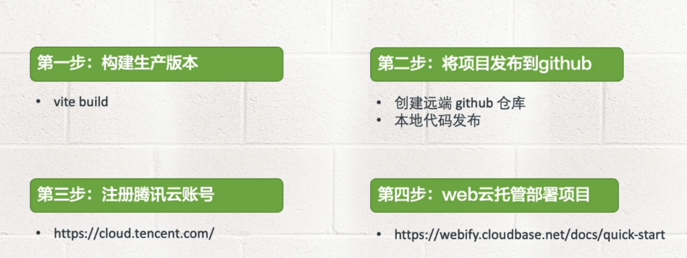

接下来呢我们详细的给大家演示一下如何将我们的项目部署到腾讯云的webify上去。

返回vscode，我们在根目录下创建一个新的项目，执行如下

```sh
$ pnpm create vite
# vite-advanced-deploy
# vue
$ cd vite-advanced-deploy
$ pnpm i 
$ pnpm run build
```

构建项目的应用，构建好以后我们会在项目目录下生成一个dist文件夹。

那么接下来就把我们项目部署到腾讯云webify上去。

首先我们需要在远端github上创建一个仓库，我们回到浏览器，打开github，大家可以进入到自己的gitbub残酷，点击new，给项目仓库起个名字，叫做 vite-advanced-deploy，然后点击create repository,等待片刻，就会穿件一个远端的仓库，我们可以copy这句话，回到命令行，清一下屏，项目根目录下执行`git init`，这样就在我们当前项目下创建一个空的本地仓库，然后把我们刚才复制的那句话粘贴进来，git remote add origin，后面是git远端仓库的地址，这样的话本地和远端的仓库就关联起来了。接下来我们执行`git add .`将本地的代码提交到库里，然后执行`git commit -m 'deploy vue3 project'`，回车，接下来，再执行`git push`将项目push到远端仓库。接下来把这句话复制一下，粘贴，回车，我们看，这里告诉我们不能连接到远端的仓库，应该是网络瞬间除了问题。然后我们再次执行`git push --set-upstream origin master`，回车，就会直接把我们的项目发布到远端的仓库里了。我们现在回到浏览器，刷新一下页面，发现这个项目已经部署到远端的git仓库里面了。

细心的小伙伴应该发现了，我们这个项目的目录下的dist是灰色的，这是为什么呢？因为我们在`.gitignore`里配置了dist这个目录，这样的话，我们本地的发布的dist文件夹并不能提交到远端的git仓库里，这样会不会影响我们腾讯的发布呢？不会，我们腾讯云的webify会帮助我们构建dist这个目录，所以我们就不用把dist这个文件夹传递到远端。我们再次回到github，我们看到在这个目录下面的确是没有dist这个文件夹。

那么接下来呢，我们就把我们这个项目部署到腾讯云到服务器上去。我们打开腾讯云的[官网](https://cloud.tencent.com)，然后可以去免费注册一个账号，这里我们就不详细的演示了，大家去注册就好了。接下来呢我们在这里点击登录，这样的话我们就可以登录账号了。

大家呢可以用微信登录，这个比较方便，大家打开微信，然后扫一扫，去扫描我们这个二维码，咱们完了以后呢他会提示确认登录，那我们点击确认登录允许他访问我们手机的一些资源。然后呢我们就登录到腾讯云的这个网站上来了，然后大家呢可以点击控制台，在这里边可以选择自己喜欢的腾讯云的产品，比方说我们滑到云产品这个地方往下拉看到这里有个云开发，这里有很多云开发的产品包括 CloudBase ，包括云托管CloudBase Run以及腾讯云微搭低代码 ，还有 web应用托管。
现在呢我们用的就是 web应用托管，大家点击一下，然后这里有个概览，告诉我们还没有应用，那我们就可以创建一个应用，我们点击创建应用，这里呢直接跳到了从git仓库里选择。因为我之前已经做过git仓库的选择了。
如果大家的账号是第一次创建应用，那么他第一步会让你选择git仓库，比如选择github还是gitee，我选择的是github，所以呢他就帮助我们记忆下来了，那一步的话呢大家点选一下就可以。
那接着我们来看到我的git仓库，他会自动的帮助我们关联进来，这里头看到7分钟前，我们曾经创建过一个项目，叫做`vite-advanced-deploy`，那我们直接点击导入，导入进来以后呢，这里边有几个构建命令是默认的。
首先我们看第一个应用名称，这就是我们在 github 里面，创建了仓库的名字，第二呢框架预设，它里边自动的帮我们选择了Vite， 当然你可以选择其他的，比方说像 vue.js 的 vue-cli 等等，后面的构建命令我们都不用去改了，我们也改不了，一个是 npm run build，输出的目录呢是 dist 。大家发现没有，实际上我们不需要把 dist 的目录，推送到 github 上去，因为我们的腾讯云的 webify，会帮助我们输出这个 dist  目录，那安装的命令呢就是 npm install，然后我们点击部署应用，这里点击我已知悉，创建应用就可以了。
稍等片刻以后呢，这里面就显示了我们部署的进度，这个每个进度呢都需要花点时间，大家稍微等待一下。
第一步他先做初始化资源，第二步呢叫构建应用，第三步要做应用的部署，最后呢发布成功。
第二步和第三步需要点构建时间，大家耐心的等待。
这里呢大家保证网络畅通，保证我们的网络能轻松的访问github，有的小伙伴呢可能是选择 gitee，这样可能会更快一些，我还是方便使用 github。所以呢我们的项目就部署到 github 上去了。
现在正在进行部署应用，大家稍等片刻，在部署过程中，你也可以看看构建的日制，我们往下拉，他会把我们的构建的日志，都打印到我们当下的浏览器里，我们看到这里他的一步已经完成了，也就是我们的构建已经完成了，现在正在部署，稍等片刻 。这个web 应用托管呢，默认情况下是免费的，大家可以作为我们测试来用，如果是你产生了一些流量，或者是扩展其他的应用，可能要收费。
所以呢现在我们对于，刚开始学习这个腾讯云的发布，或者说学习我们应用的部署的话，大家就可以直接使用这个免费的流程来去完成我们的任务了，我们要稍微等一会。部署应用的话呢需要点时间，好，应用部署完成了以后呢，这里边显示发布成功了，成功了以后我们现在就可以点击，我们应用的列表了，这里呢就显示了我们当前应用的名称和域名，注意这里给了我们提供了一个免费的域名，我们可以通过这个域名，来访问我们的部署好的应用，我们点击下这个域名，大家发现现在呢他还是有些问题
因为呢他部署完了以后，需要做一些 cdn 的发布，所以呢我们要等待1-3分钟，我们可以点击一下概览 ，在这里面我们看到现在 cdn 配置生效中，也就说他在做一些 cdn 的配置，所谓 cdn 叫内容分发网络，他需要把我们的资源同步到各个 cdn 的服务器上去。大家这块需要等大概3到5分钟，好，了现在呢我们这个应用就部署好了，我们可以点击一下这个地址，大家发现我们的应用就部署成功了。
我们再来看一下Vite的官网，在这里边呢我们找到部署静态站点，大家看我们使用的是腾讯云的webify ，这是官网给我们推荐的，你也可以使用官网推荐的其他的一些部署静态站点的方案，关于部署静态站点我们就讲这么多，大家加油。今天也晚上吃到这个好吃又美味又来了吧

# 十八、服务端渲染

## 第一部分

我们继续的来学习vite的高级应用,这一章我们来看一下如何通过vite实现服务端渲染。

服务端渲染又称为 ssr,也就是 server side 的 renderer,我们可以将 vue 或 react 这些框架,运行在 node js 环境中,通过预渲染出来的 html,在客户端进行注水化处理,从而实现对 seo 友好的网站。

官网上给的这个文档,说这是一个底层的 api,专门是为库和框架的作者而准备的,如果呢,我们的目标是构建一个应用程序,那请确保我们优先查看了这个章节更上层的 ssr 和工具,我们点开看一下。

这里边呢,给我们提到了关于 ssr 的 libraries,也就是一些库,像 vite ss,vite plugin ssr 等等,这些库呢都支持 react和 vue3,另外呢还有一些框架,比如像 vitedge,vitext以及 rakkas 等等等等,这一章我们给大家介绍的也是通过low level api来实现服务端渲染,学习这个部分的内容呢,假设我们要对 vue和 react,都有一定的了解。

我们先来看一个,vue3的服务端渲染的案例,回到 vs code,我们来创建一个新的项目,按照 ctrl 加~,打开我们整个项目的根目录,执行一下 pnpm create vite,起个名字 `vite-advanced-ssr-vue3`,回车选择 vue  vite,然后 cd 的 `vite  advanced  ssr  vue3`,执行 pnpm install 安装一下依赖,然后我们可以启动一下我们的项目,执行 pnpm run dev,好,这样我们的项目就启动起来了,我们可以访问一下 localhost :3000。

**项目具体操作流程大家可以观看视频加以练习，下面为友情提供的逐字稿，大家可以作为参考**

我们先来观察一下我们这项目,打开 vite  advanced  ssr  vue3,这是一个最基本的 vue,通过 vite 创建起来的项目,然后在这里头呢我们可以做一些改造,把它变成一个路由的项目,我们可以看一下 src 下的main.js,这里呢很显然我们只是加载了 app.vue 这个组件,还没有创造路由,那我们可以在 src 里边,创建一个新的文件夹,取名为 pages,我们来创建两个页面,这里呢我们新建一个叫做 home.vue,然后我们通过 vt 创建一个模板,这里呢我们写个div,写一个 home,保存一下,然后我们在pages下面,再创建一个新的文件,叫做 about.vue,通过 vt 创建一个模板,然后 div 我们写一个 about,好,两个组件创建好了以后,我们通过路由来去加载这两个组件,我们在src 下面创建一个新的文件夹,叫做 router,然后在这下面创建一个新的文件,叫做入router.js,然后我们编写一段 js,定义路由来去载入我们的组件,首先呢我们先做一个导入,从哪里呢,从vue-router,那我们还得需要安装一下 vue-router,我们先退出这个服务,执行一下 p n p m install vue-router-S,安装好了以后呢,我们可以从这里边载入 createRouter,这样的一个方法,我们可以给他起个别名 as_createRouter,接下来呢我们再去导出一个,createWebHistory,这样的话我们就可以创建一个路由,并且在页面上来去定义他了,然后呢我们来去载入,我们在pages里边定义的所有的组件,我们可以使用vite给我们提供的这个import.meta.glob,这个功能,我们先定一个变量pages,等于import.meta.glob,后边呢我们可以写入这个路径,就是当前目录下的 pages 下的*.vue,我们这个routes .js,是放在了router这个目录下面,所以呢我们还得上一层,上一层目录下的,关于这个 import.meta.glob,我们在前面已经介绍过了,这样的话呢他会返回一个数组,那接下来呢我们对这个数组进行遍历,我们可以定义一个 routes,通过 object.keys,我们就,拿到了pages这样的Key 的一个数组,然后呢我们进行 map,map里头呢是一个回调函数,我们可以拿到这个路径,这个函数体里边,我们就可以去做一些详细的处理了,首先呢我们先定一个变量name,那它等于 path.match,我们去定义一个正则,这个正则呢其实上就是pages下面的,任何的以.vue 作为扩展名的组件,我们可以写一个斜线斜线,在这里边来定一个正则,我们加个 下面呢就是一些.vue文件,所以呢我们可以定义成任,意的字符写个小括号,写一个.*表示任意字符,然后后面呢再加一个斜线. vue,表示我们以. vue结尾的,所以我们再加个$,那最后呢拿到这个信息以后,然后我们写一个[1].toLowerCase(),来去变成小写,好这样的话我们就拿到了这个,文件的名字,这里还少了一个点,再加一个杠点,好这个name获取到了以后呢,我们可以做个测试,我们先去对外暴露个东西,我们在这个外头呢我们叫 export,然后 function 去暴露一个函数,这函数的名字呢我们可以叫 createRouter(),然后在方法体的里头,我们去 return _createRouter的一个方法,这个一个真正的创建一个路由的方法,在这里头我们先去定义一个history,这history呢我们先使用 createWebHistory,然后我们调用一下这个方法,接下来呢我们再去定一个routes,这个routes呢就是我们上边定义的routes,好我们为了检查这个name到底是什么,我们可以 console.log()一下name,好,这个路由的基本定义我们就完成了,接下来呢,我们在,main.js里边去引用一下这个陆游,那我们就直接 import,然后 from,当前下的 router下的routes.js,这个js呢?,导出了一个 createrouter,这样的一个函数,所以在这里边呢我们可以把它,导入进来,那这是一个函数,在这里边呢,我们要去应用一下这个路,所以我们在这前面写一个 use,给这个函数呢我们可以传入一个 createRouter这个方法,这方法的话我们需要调一下,这个方法调用完了以后呢,就返回了一个,createRouter()这个函数的一个执行结果,所以呢我们直接可以通过use,来去引用它,然后我们保存一下,我们重新启动一下服务,执行  pnpm run dev,好,起来以后呢我们再次打开浏览器,我们刷新一下,好,我们打开检查--控制台,console 我们看到呢这里的 about和 home 就,定义出来了,但这里面呢有一个,需要读取路径的信息,我们一会再去解决它,所以现在呢,我们拿到的就是一个/about和/home,两个内容,好,返回 vs code,我们再次的进行路由的编写,那在routes.js 这个文件里头呢,我们现在已经拿到了这个所谓的,文件的名字,在这个打印里边,我们看到 about,和 home 就是我们这个组件的名字,不过已经转成小写了,并且呢在前面还加个斜线,那么现在,我们知道这个name是什么内容了,那么接下来呢我们开始准备往下写,继续的去使用我们这个name,然后我们可以返回一个对象,这个对象呢,作为我们这里routes的一个对象内容,那他通过map方法返回的对象,很显然这个routes是一个对象数组,那么在这个结果里边呢,我们先定一个路径,路径的话,我们还可以看看这个name,是否等于等于,所谓的/home,如果是的话呢,我们就可以返回一个斜线,让他做一个基本路由的跳转,然后在这后边呢我们再加个冒号name,就是,如果我们这个路由不是/home的话,那么他就取到我们这个name的名字了,接下来呢我们再定一个 component,就是路径匹配以后的这个组件,这里头呢我们可以使用pages,然后我们再加一个中括号,把这个 path放进去,那 path是什么呢,刚才我们知道,就是我们在这里头,拿到的每个路径的内容,其实这句话,相当于我们一个,动态的一个组件的载入,我们相当于一个 import一个函数的调用,里边呢就是一个所谓的叫做,上一层的 pages 下的星号点vue,好了,这个 component 以及 path我们都定义好了,返回这个对象呢,会装载到一个routes的数组里,那这样的话我们routes就定义好了,那接下来呢我们再次打开浏览器,好我们看到现在呢,页面上显示了一个正常的页面,但事实上呢,我们的路由还没有真正的渲染出来,所以我们回到代码,再次打开我们的 app.vue,这块的代码呢是我们之前的代码,我们暂时可以把它删除掉,然后呢,我们定义一个真实的一个路由的定义,我们在 template的里边去定义一个 div,在 div 的下面我们先定一个 router-link,在 router-link 里头我们写一个 home,我们给 router-link 定一个属性 to,他的值呢是,就是斜线,然后我们再次定一个router-link,然后再定一个属性 to,他的值呢,就是/about,再去写一个内容,我们再去给他定义一个显示的内容,叫做 about,那有了两个链接以后,我们再去定一个路由的插座 ,我们定一个 router-view,让路由渲染的组件都,放在这里头进行显示,好这个改完了以后呢,我们再次回到浏览器,大家看到,现在我们有一个 homeabout,这样的一个路由了,这是一个使用 vite+vue3,定义的一个路由,而且呢是在浏览器端定义的,那么接下来呢,我们开始准备,一步一步的逼近我们的 ssr,看看如何通过,服务端渲染来去渲染出这个路由来,刚才的这一波操作呢,都属于 v ue3的基础知识,下面呢我们在 src的外边,去创建一个新的文件,我们取名为叫做 server.js,那这个服务端渲染呢,我们可以把这个后端的服务,通过 node.js 环境给接管过来,我们得需要去通过一个 node.js 的服务,我们可以安装一个 node.js 的框架,比方说 express,那我们现在可以把其他的,先关闭掉,然后呢我们再次停止这个服务,在这下面我们安装一下 pnpm install express,安装完了以后呢,我们就可以使用这个 express 了,我们定义一个常量叫做 express,然后等于 require,我们去载入一下 express,载入进来以后我们再去定义一个常量,当然这个常量的话呢,我们是从,vite里边结构出 vite的相关的一些创建,server 的方法,所以呢,我们这里边要去结构出一个 create server 方法,那我们可以给他起个别名叫做 create  vite  server,我们去定义一个函数,函数的名字呢,我们可以取名为叫做 createServer,然后呢,我们可以在函数体里边做一些事情,比方说我们先定一个常量 app,他应该就是 express 的一个实例了,由于这里面呢,我们是以中间键的模式,来创建vite应用的,这样就会禁用我们vite自身,携带的 html 服务器的逻辑,并让上级服务器来接管,我们整个的服务的控制,如果我们想用使用vite自己来去,创建一个 html 的服务逻辑的话,我们可以去做一些配置来完成,比方说我们可以定一个常量 const  vite=createViteServer,那这个 server 的话可以去加一个配置,这个配置就是 server,他的具体的内容就是个对象,我们来定义一个属性叫做 middlewareMode,这个值呢有两个,一个是 html 一个是 ssr,那如果是我们纯粹是创建一个,服务的话,就像我们之前的 vite的那个 server 服务,那我们选择 html,我们先使用 html 我们来看一下效果,然后在下边呢,我们得需要去通过 app.use,去创建一个,我们可以使用为他这个实例上的vite.middlewares,这样的话,我就创建了一个的一个中间键实例,然后最后我们要去通过,app.listen去监听一个端口,比方说这里我们端监听3,000端口,这个 server 的方法呢我们已经定义好了,我们得需要去执行一下这个 server 方法,所以呢我们在这下边去,调用一下 createserver,调完了以后我们,就可以去运行这个 server.js 了,注意这个 js 呢是在 node.js 的环境里头,并且呢他把我们之前 vite的那个 server,也就是我们在,package 的 json 里边启动的这个 vite,给接管起来了,然后通过 express 来创建了一个 server,所以呢,在这命令行里边我们可以执行 node server.js,好我们看到呢这里报了个错,这个错误信息呢其实是比较诡异的,其他的原因是这样的,就是我们这个 createViteServer,他返回的是个 promise,所以呢在这前面我们需要加一个 vite,然后去等待他返回的结果,但这个vite有个条件,就是他所在的这个函数,一定是一个异步函数,所以呢我们在这函数前面加个 async,好接下来我们再次去运行一下,好我发现呢,这里头已经正常的启动起来了,我们再次打开浏览器,我们看到呢,现在这个页面,仍旧是能够正常的显示出来,然后我们点击一下也没有问题,这跟之前呢是没有任何区别的,不过呢我们是使用了一个 node.js,来去,接管了我们之前的启动服务的方法,那接下来呢,我们来开始正式的用 ssr 来去,实现我们这个应用,那我们可以把这个 middlearemode,html 改成 ssr,改完以后呢我们再次保存这个文件,我们重新的启动一下我们这个服务,好启动完了以后呢,大家发现他就停留在这个地方了,我们回到浏览器,哎发现呢,这个路由已经不能够正常的访问了,那说明我们已经把这个后端,变成了一个 ssr 的形式,来提供服务了,所以呢我们还得需要去做一些事情,第一步呢,我们得需要在 server js 里边,去定义一个所谓的任何请求的监听,因为现在呢,我们把前端的所有的请求,都拦截下来了,我们可以把它放在这个下边,执行一下 app.use,然后路径的话我们可以用星号表示,任何的请求都会走我这个路径,后边呢是一个回调函数,那学过 express 的同学应该知道,在这个回调函数里边有一个 request,和 response 两个对象,我们可以在这个函数体里边呢,去做一些异步的操作,所以呢我们可以把这个函数对应成,async 也就是异步的函数,那下面呢,我们在这个方法体里边,去定义很多内容,那具体的定义什么内容呢,我们来一步步的做,首先呢我们先去定义一个 url,他的值应该就等于 r e q 就是 request,后边呢我们定义一个 original url,也就是他的原始的 url,拿到以后呢我们可以去做个实验,比方说我们可以 console log url,来我们看是什么内容,我们可以重新的,启动一下我们这个服务,启动完了以后呢,我们到的浏览器上面刷新一下,好,我们看到呢现在没有任何的反馈,所以呢我们应该写一个 r e s .end,好让他结束了,我们看到这里头有个打印了,就是 about对吧,在浏览器上面呢我们并没有看到东西,但是我们在这里边看到了,这个原始的 url,就是我们在浏览器里边,访问的这个/about,好了 url 拿到以后呢,那么接下来我们就可以去做,后面的事情了,首先呢我们得需要去做一个trycatch,去捕获一下错误,那至于说 catch 的底下写什么,我们一会再写,我们先写try里的内容,第一步呢,我们先要读取我们的 index.html,就是我们这个文件,那 index.html 的话,我们得需要一个文件的一个模块,所以呢在这上边我们得需要去,载入一个文件模块,我们 const 一个 fs 等于 require,fs 载入进 fs 以后呢,我们在这里头就可以做文件的读写了,我们可以使用 let来定一个变量,叫做 template,后边呢我们可以使用 fs. readFile,加一个 Sync,Sync的话呢表示同步,那我们就省的再再去定义回调函数了,在这个方法里头呢要传两个参数,第一个呢就是我们去定一个 path.resolve,那这个 path现在还没有,所以呢我们现在得需要去,定义一下这个 path,从我们node.js原生的模块里边,载入进来,那我们就可以去调这个 path.resolve 了,那我们去,传第一个参数   __dirname,表示我们 serve.js 所在的物理路径,也就是这个vite-advanced-ssr-vue3的这个目录,然后后边呢,我们可以去读取这个目录下面的,index.html,因为这个    index.html,跟我们server.js是在同一级,拿到以后呢,我们还别忘了传递第二个参数,就是 u t f -8,让他能够解析任何的字符,好,第一步读取 html 已经完成了,并且呢,把它装载到了 template 这个字符串里,那么第二步呢我们就使用 vite.html 转换,这叫呢会注入为他的html客户端,同时,也会从vite插件中应用我们 h t m l转换,那我们现在可以去重新的,定义这个 template,然后他的值呢,我们可以去调一个方法叫做 vite.transformIndexHtml,它需要传递两个参数,第一个参数 url,第二个参数就是 template,那经过这个转化以后呢,我们的模板应该发生了变化,我们可以去演示一下,但是这个方法返回的是 promise,所以呢我们要在这前面加个 await,那我们就直接的去打印一下这个,template看看是什么内容,我们得需要重新启动一下,大家发现每次我们都需要重新启动,所以呢我们可以安装一个工具,让他只要在我们的node.js环境下面,我们改了 js,他就会帮助我们重启,这样的工具有很多,比方说nodemanager和supervisor等等哈,现在呢我们先出来,执行一下,pnpm install 比方说 nodemon,然后-g,我们在全局里头安装这个工具,然后我们执行 nodemon,然后当前下载 server.js,好,这样的话呢,当我们去改变这个代码的时候,他会自动帮助我们重启,好了那接下来我们到前端呢,再次刷新一下页面,好接着我们到后端看一下,这里头就返回了一段 html,这个 html为什么打印在,我们的node.js 环境下呢,因为我们这个打印是在后端打印的,所以呢大家看到node.js 这里, 就返回了我们 html 的内容,好那经过这样的一个转化以后,那么接下来呢我们就来看第三步,我们要加在服务器入口了,这个我们可以通过,vite.ssr load mode 来自动转换,我们的 esm 原码,就可以在 node.js中运行了,无需打包啊,我只要我们提供 hmr 的,相关信息就可以,好接下来呢我们就来去定义他,我们来定义一个常量,然后等于 await,后边呢为await.ssrLoadModel,那接着我们就来开始准备,载入一个所谓的叫 server 的一个 js,这个 js 的话呢,我们可以把它放在 src 的下面,一会我们去创建,我们先把路径写好,应该是,当前文件夹,我们可以写个,大家知道这个 js 呢现在还没有,那我们现在呢开始准备去定义这个 j s,我们在 s r c 的下面创建一个新的文件,好我们起名为叫做entry-server.js,那这个 js 干什么事呢,就是刚才我们说的,他可以帮助我们进行模块的转化,下面呢我们就来编写这个 server 的内容,首先呢我们先把main文件导入进来,我们要 import,然后 from,main.js就是我们当前目录下面有个 main.js,这个 main.js的话,这是之前我们使用浏览器端,进行的应用的创建,那么这个代码呢可能就要修改,所以呢现在我们先把这个代码先删掉,我们重新编写一下 main.js的内容,我们呢先去 import 一下 app,然后 from,应该是当前目录下的 app.vue,导入进来以后呢,接下来我们再去 import 导入,然后从哪里呢,从 vue里,从 vue里边因为我们要做 ssr,就服务端渲染,我从这里边呢再去导入一个 create ssr app,然后我们再去做一个导入,from 应该是当前下的 ,我们把我们路由导入进来,当然了这个方法呢就是createRouter,这个我们刚才已经使用过了,接下来呢我们就去 export一个function,我们要导出一个函数叫做 createapp,我们要重写这个 createapp,那里头呢我们可以去监听一个常量 app,等于createssrapp,好然后呢把我们的 app,这个组件给放进去,接下来我们再去定一个常量,名字叫做 router,好它就等于createrouter,把我们刚才定义好的那个方法,调用一下,然后我们再去执行一下,app.use这个方法,把我们的router给放进去,最后呢我们要返回两个对象,一个就是 app,一个就是router,好这个写完了以后呢,我们接着再回到entry-server.js,这样话我们就可以导入这个,main下边导出的那两个对象了,这个方法呢当然就是可 createapp了,倒入进来以后,我们接着再去倒入一个东西,从我们的 vue下的,叫做 server renderer,这里边我们要导出一个方法叫做 renderToString,好这个方法导出来以后呢,接下来我们就可以定义一个函数了,这个函数的名字我们可以定义成 render,我们可以给这个函数定义两个,接收参数的形参,一个是 url,一个是 manifest,manifest 我们先不定义,那接着里头呢,我们来开始准备去定义一个常量,然后我们去调一下createapp,然后,结构出一个 app,还有一个 router来,这个我们刚才已经看到了,在main.js里边呢我们已经做了导出了,那么定义好这个导入以后,接下来呢我们就来开始准备去调用,router下的push方法,我们给它push个路由,这个路由的话呢,就是我们传递过来的 url,然后接下来我们再去调用一下 router.isReady,注意这个方法返回的是 promise,所以呢我们要加个 await,那么这个函数呢也得需要加一个 async,由于这个方法呢我们将来要去导出,所以呢我们在前面还要加个 export,好了那这个定义好了以后呢,接下来我们再去定义一个上下文对象const,我们先首先定义一个空的对象,接下来呢我们再去定一个 html,这个我们还是仍旧,使用 await去等待一个 promise,我们调一下 renderToSting,这个方法呢需要传递两个参数,一个是 app,一个是 ctx,好 html 拿到以后呢,我们就直接把渲染好的 html,给返回去就可以了,那么这个render函数其实上就是,给一个url路径,然后呢我们通过 renderToSting,把我们的这个,传递过来的String转化成一个 html,这样的话呢我们在后端, 把真实要返给浏览器的 html,给转化出来,然后我们才能够在浏览器上渲染,那么这个render方法对应好了以后呢,我们再次回到 server.js,那看我们再去 ssrloadModule的时候,我们就可以通过entry-server.js 里边,解读出刚刚我们定义好的,render 这个函数,这个函数的话应该就是我们这个方法,导出的,那我们看到这里边我们导出一个 render,定义好了一个 render 函数,然后接下来呢我们再往下做,我们来做第四步,就是渲染我们应用的 html,这里呢我们假设entry-server.js ,导出的这个render方法函数呢,调用了适当的,ssr 框架的 api,那我们现在呢开始准备定一个常量,叫做 appHtml,后边呢我们可以用 await 去等待一下,render 调的结果我们可以把这个 url 呢,传递给这个 render 函数,那么这个 a p p.ht m l 的话呢,其实上就可以显示了,我们可以console.log(appHtml)保存一下,那我们现在在浏览器上面呢,我们再去刷新一下,好我们到后端来看一下这个打印结果,好我们看到呢,仍旧是返回了这样的一段 html,那你可能会说,这个 html 跟刚才有什么区别呢,其实事实上是有区别的,他已经做了这个转化了,那么这个转换我们要干什么呢,我们得需要这个 aap.Htm l,把我们准备要返回给浏览器的内容,装载到我们的页面上,我们在浏览器上很显然,没有看到任何的内容,就是因为我们还没有去装载,那我们可以再次打开index.html,去定义一个注释,这个注视的可以帮助我们,进行内容的加载,那我们可以在这里边写一个叹号杠杠,这样的话,我们可以在这里边去写个注释,当然我们可以不加这个空格 ssr-outlet,当然这个注释你写什么都可以,我们一会呢要把它给替换掉,这多了一个尖号我们要把它去掉,那接着我们就把它给复制一下,到达我们 serve.js,然后做一个替换,替换的方法呢,就是我们可以定一个常量 html,等于template,就是刚刚我们定义好的那个模板,然后呢我们再去做一个 replace,然后我们要把一个字符串,替换成一个新的内容就是 app html,就是把我们刚才拿到的这个 html,然后替换到我们的 server outlet里面去,好接下来呢,我们就可以把 html 返给我们前端了,最后一步我们要返回渲染后的 html,我们执行一下 res.status,我们返给前端是200,然后呢我们执行一下 set,我们对应一下这个,返回给前端的content-type也就是类型,他应该是个 text /html,那最后呢我们要在这下面执行一下.end(),.end以后呢把html然后就,传给浏览器了,我们这个摁呢就可以删掉了,好保存一下,然后接下来呢我们的页面上刷新一下,好,我们返回代码来看一下这是什么问题,我们可以把这个 catch 里边的这个内容,给定义好,然后呢我们就可以捕获这个错误了,也就是让 awaitt 来修复我们这个堆栈,可以映射出我们在实际,开发代码中的那些问题,我们可以来一个 ssr fix stack trace,里边呢我们传个 e,接下来我们再 console.error,打印一个错误,把 e 放进去,然后我们再来个res.status,我们给给浏览器返回一个500的状态码,然后呢我们再end然后返回 e . message,我们来看一下到底是出了什么问题,好我们看到这里的已经有打印了,说 window 没有定义,我们在浏览器上看也是这样的,说 window 没有定义,那接下来呢我们就来看看,呃这个问题是怎么出现的,我们现在呢可以把这些代码先都删掉,好那window 没有定义,很显然我们当前的这个环境呢并不是,呃通过服务器端渲染来产生的,肯定里边用了,关于浏览器的一些对象了,那我们想一想,应该是出在路由的那个地方,我们可以打开入routes.js,在这里边呢,我们用的是createWebHistory,那我们得需要去把它转成,一个基于内存的一个路由,这样的话呢,我们可以在服务器端来进行一些操作,那学过vue3路由的同学应该知道,我们曾经有一个叫做 creatememory History,也就是在内存里创建路由,我们可能一直没有用过,那现在呢我们应该知道了,他就是服务端渲染啊,去使用的一个路由的方法,那在这上面呢,我们可以去,载入一个新的陆游叫做 creatememory History,那拿到他以后呢,那我们得需要去做个置换,什么情况下才使用这个呢,那我们也可以把这个改造一下,我们可以使用 vite给我们提供的,import.meta.env.SSR,如果是 ssr 环境的话呢,那我们就使用creatememory History,否则我们再去使用 createWebHistory,好这样的话呢,我们把路由改造成非浏览器的环境,我们再去到页面上刷新一下,我们发现现在,这个路由跳转就没有问题, 一个 ssr 的关于开发环境的,代码我们就写好了,那我们验证一下,他是不是达到了我们要求呢,我们现在打开检查,在console这个地方,我们再刷新一下,点一下页面,然后我们看一下网页原代码,好,我们看到这里果然都是一个,在页面上渲染好的这样的一个内容,这就说明,将来我们爬虫,去爬取我们页面的时候呢,是能爬取到相关内容的,而之前呢我们没有这些内容,只是一个 div,id app 的一个空的 div,现在呢,我们已经有实质性的内容渲染了,好这就是服务端渲染的作用,那大家想一下,如果是我们整个页面,都被渲染成一个真实的,这样有内容的页面的话,那么搜索引擎呢,就可以抓到我们页面的内容了,所以这就是我们,服务端渲染的一个最大的意义所在,这一节的内容比较多,大家仔细的去照着视频啊,去敲一下代码就可以了,这是在开发环境下通过vite来集成 ssr,那么生产环境的话,我们vite是如何集成 ssr 呢,我们下一节来介绍,大家加油.

## 第二部分

这个视频我们继续的来研究,vite+vue3的一个 ssr,就是服务端渲染情况的东西,在上一节中我们学习了,vite如何实现vue3的,在开发阶段的一个 ssr,下面呢我们来看一下如何在,生产环境中实现一个vue3的 ssr,其实这个实现也比较简单

**项目具体操作流程大家可以观看视频加以练习，下面为友情提供的逐字稿，大家可以作为参考**

我们只需要先,把我们当前的代码 build 到一个,client和 server 文件夹里,然后呢,我们去修改一下 server.js就可以了,首先呢我们打开package.json,在这里边我们需要去重新,定义几个所谓的 npm 脚本,我们来去构造两个新的 build,第一个呢就是 build client,后边的内容呢就是 vite build --outDir,我们指定一下输出的目录,为 dist/client文件夹,然后我们再去定义一个 build server,他的内容是 vite  build  --ssr,再去定义一个 entry server js的一个引用,我们来定义他的路径是 src 目录下的entry-server.js然后我们再去定义一下输出文件夹,--outDir  dist/server,这两个 build 定义好了以后呢,我们再去重新定义一下 build 的内容,让他去同时启动我们 build 的 client,和 build server,那我们可以改造一下,执行一下,p n p m run build  client  && pnpm run build:server,保存一下,这样的情况下当我们运行 build 的时候,他就把我们这两个 build 的命令,一并给运行了,我们执行一下 p n p m run build,好,我们看到当前的,项目下面有一个 dist目录,这里边有两个文件夹,一个是 client一个是 server,那client里边呢,包含了我们静态的一些资源和,入口 index.html,server 端呢,把我们entry-server.js,打包到我们 server 里头去了,注意这个 server 呢已经做了改造了,我们暂时不用看 build 完了以后的代码,那么接下来呢,我们再去改造一下 server.js,由于这里呢,我们可能会,要满足在生产环境,和开发环境两个环境,所以呢我们还得需要去,定义一个入口的 node env,我们根据不同的环境,让我们这个代码呢都能运行,上一小节,我们已经实现了在开发环境中,如何去实现一个 ssr,这些代码呢我们继续保留,下面呢我们来添加,在生产环境中如何去实现一个 ssr,那我们得需要去区分一下环境,所以呢我们再次打开package.json,在这里边呢我们去定义一个入口的,所谓的环境变量,这里我们就定义一个名字叫,serve 的一个脚本,那后边呢我们来去定义具体的内容,我们可以写一个 cross-env,这个模块主要是满足 windows 和mac,能够在不同的环境下,进行环境变量的识别,在后边呢我们去定义一下node_ env,他的值我们可以定义成 production,也就是生产环境,后边呢我们去运行我们的命令,执行 node server,那其实事实上就是,运行了我们根目录下的 server js,那 cross env 是一个模块,我们需要安装一下,所以在这里边呢我们执行 pnpm install  cross env -D,安装好了以后呢,我们这个命令就可以运行了,同时呢我们也可以改一下 d e v,把它改成叫做node server,也就是我们没有去定义 node env,默认情况下呢就是在开发环境下,好这个定义好了以后我们保存一下,然后再次回到serve.js,我们就可以拿到不同的环境了,首先呢我们先来去改造几个东西,第一个呢,我们先去改造一下,这个所谓的 create vite server,如果在开发环境里边,我们使用create vite server 来去创建一个vite 这样的一个实例,那如果是在生产环境下面呢,我们只需要去定义一个,静态的目录就可以了,所以呢这里我们得需要去做一个,是否是开发环境或生产环境的,一个判断,那这个判断该如何实现呢,为了实现这个功能,我们需要在create server 这个方法里边,去传入一个变量,叫做 isproduct,这个我们可以设置一个默认值,然后我们通过 process.env.node_env,来去看他是否等于,production,如果是的话,就说明他是在生产环境下面,那么process.env.node_env,其实读取的就是我们开始在运行 serve,的时候传入的 env的值,那如果是生产环境的话,那么 is product 就为true了,那接下来呢我们来去做一个拆分,首先呢我们得需要对vite做个改造,我们首先在上边呢,来去定义一个 vite,接下来呢我们来去判断不同的环境,然后给 vite来去赋予不同的值,那么这个条件呢应该就是如果,非 is product 就是在开发环境下面,那我们得需要把vite的赋值,这两句话给移上去,好那else呢就是在生产环境下,我们只需要设置一个,静态的目录的定义就可以了,node.js的设置静态目录呢有很多,我们可以使用 server static,所以呢我们需要安装一下,执行 p n p m install serve-static,安装好了以后,我们在else 的下面呢,就可以去执行一下 app.use方法,在这里头我们去 require 一下,刚刚我们安装好的那个模块,就是serve-static,他会定义我们当前的服务的静态目录,后边呢我们可以调用他返回的方法,里边我们可以去,解析一个 dist下面的client的目录,那这个解析呢我们多处都使用,所以呢,在上边我们可以定义一个公共的方法,在这句话的上边,我们去定义一个 resolve 方法,这个方法呢我们可以定义成一个函数,函数的行参是 path也就 p,然后呢我们调一下 path.resolve,在resolve方法的里头,我们写个点name,第二个参数呢就是 p,这样的话,我们就可以使用这个方法来去,加载我们的路径了,我们也可以把我们之前,写好的那个  path.resolve,给改造一下我们把这个  path去掉我们就不需要这个__dirname那同理呢我们上面这个代码也可以做同样的改造我们继续的编写我们这块内容我们在这括号里边呢可以写个 resolve里头呢我们可以定一个路径,叫做 dist/client,下面呢我们定义第二个参数,我们还一把把它折下行,这样的话呢看的比较清晰一些,在这个 resolve 方法的后边,我们再去传入第二个参数,比方说我们可以写一个 index :false表示,不让他自动打开我们的索引页面,这个定义好了以后,那么我们区分了生产环境和开发环境,做了不同的事情,那接下来呢我们再去看看 app.use,这里边的关于模板的加载呢,也得需要做一些相关的配置,我们要根据,不同的生产环境和开发环境,来去做些事情,首先呢,我们得需要去对模板进行重新的定义,所以在这上边呢我们定一个变量 let  template,我们把 template 放到外侧去,然后我们再去定义一个 render,很显然 template 和 render 都是不同的值了,那这里的 template 呢,我们暂时可以把这个let去掉了,那在开发环境里边,我们是通过这种方法来定义我们的,template 和 render 的,我们可以把这两句,切掉然后再去判断一下环境,如果我们在开发环境下也就是! is,product 那我们可以把这三句话粘过来,粘过来以后呢我们稍微的做一下改造,首先 template,我们先去定义这样的一个值,然后呢我们再去把,vite.transformIndexHtml的值付给 template,最后呢那个 render,因为他是要赋值一个新值,所以呢我们可以改造一下,把他的写法改成,在后面的方法,调用完了以后返回这个render,再赋给这个render函数,这是在开发环境下,那么在生产环境下,我们该怎么去处理呢,我们去直接的写个 template,我们可以把 template 直接赋给,一个 index 的一个解析就可以了,这个解析的话呢,我们也可以在上边单独的去定义一下,比方说在 resolve的下面,我们可以再去定一个变量 const,叫做 index product,它呢要根据我们是否是 product 的环境,如果是的话呢,那我们通过 fs.readFileSync里边呢我们去 resolve 一个路径,那我们这里的路径写什么呢,就是我们当前下的dist/client/index.html,然后我们再去加一个编码 u t f -8,这样转成我们想要的一个文本的内容,接下来我们再定义开发环境,他就是一个空的字符串,好这个 index prod 定义好了以后呢,我们就把这个内容直接,放在刚才我们写的那个地方,也就是可以把template,变成这样的一个内容,然后接下来呢我们开始准备往下写,在生产环境下,我们仍旧,是得需要去定义一下render函数,这个函数的话我们不需要await了,我们只需要 require,去加载这个内容就可以了,因为在我们node.js 的生产环境下,我们只需要去加载  ./dist/server/entry-server.js,然后呢我们直接拿到他的 render 方法,直接给我们 render,那么底下这个代码呢,我们暂时可以不用变,因为它可以,在生产环境下和开发环境下,都可以通用这个代码,好了关于这个改造呢我们也完成了,我们去运行一下,看看我们的改造是否真正的起作用了,我们可以执行一下,我们package.json里面的serve,我们在命令行里边输入 p n p m run serve,这样的话呢,就完成了一个在,生产环境下我们的 ssr 运行的效果,好我们来看这里头报了个错,说 cross env 没有安装,应该是我们安装别的模块,导致他出问题了,那我们再次安装一下,pnpm install cross env -D,好安装完了以后呢,我们再次执行 pnpm run serve,好了现在我们的服务启动起来了,光标停留在这个地方,我们打开浏览器,输入localhost 3,000刷新一下,好我们看到呢并没有任何的效果,好我们看在 server js 的58行出了问题,我们看一下58行,这里很显然是报错了,那我们检查一下看看到底是什么错误,我们看可能的一个错误呢就是这里
,我们得需要给他加个括号,这个render函数呢,得需要括起来我们才能拿到,我们看看是不是这个问题,我们再次重新启动一下这个服务,再次刷新,好我们看到还是有问题,我们再次回来看一下其他的问题,我们往下翻翻这个错误,发现呢这里边报了关于,路由方面的问题,我们再来看一下package.json这里边,没有路由,应该是我们这个应用没有安装路由,我们执行一下 pnpm install vue router,刚才我们安装其他模块的时候,可能这两个模块,有问题了,那我们重新的安装一下vue router - S,好接下来呢我们再次运行一下 serve,好打开浏览器,我们刷新一下,哎看到现在呢没有问题了,好了,我们再次的呢来进行一下这个演练,我们可以再退出来执行一下 p n p m run dev,也就是我们package.json里边的,所谓的在开发环境里的效果,我们看到这里呢已经把我们预绑定了,这个依赖 vue 和 vue-router,很显然这是开发环境的效果,那我们打开页面刷新一下,我们看到呢没有问题,那接下来呢我们再去回到 pnpm run serve,好再次回到浏览器我们再次刷新一下,发现这个效果也没有问题,那么他俩有什么区别呢,我们可以点右键,查看一下网页的源代码,这个呢很显然是在生产环境下,我们看到在生产环境下呢,我们这个代码直接的就打印出来了,我们不需要去加载其他的 js,那我们现在再次回来,退出来再次执行 p n p m run de v,然后我们再次到页面上面,关闭他刷新一下,然后我们再次看一下网页源代码,我们看到这里他的加载方式呢,是先加载main.js,来去做运行,那可见呢,我们在开发环境里边呢,应该脱离了,我们生产环境下的一些内容,以上我们就实现了在vite里面vue3的在,生产环境下面的 ssr 的环境搭建,这个环境呢,其实上,是我们使用最底层的 api 来去完成的,那其他的框架呢,都是按照我们这个,思路来去搭建起来的,有的同学可能使用过 vue的,naxt 的这样的一些框架,那你会发现呢,他会帮助我们实现,可以帮我们的这个 ssr,发布成静态的资源,比方说我们执行一下 generate,那我们就可以生成静态页面了,那在vite这个 vue3环境下面,能不能实现呢,当然是可以的,那下一节我们就来实现,如何发布成静态页面,大家加油.

## 第三部分

这个视频我们继续的来研究 ssr,在上两个视频里边,我们通过在vite里面将vue3的项目,完成了一个,开发环境和生产环境的 ssr 的搭建,现在呢我们再来完成,通过 ssr 来生成一些静态的资源,也就是说现在呢,我们不光能够在生产环境,和开发环境里边,去运行我们 ssr 的页面,我们也可以将它生成一个静态的目录,这样的话我们就可以把这目录,放在任何的地方来运行了。

**项目具体操作流程大家可以观看视频加以练习，下面为友情提供的逐字稿，大家可以作为参考**

我们现在,在我们当前的这个项目目录下面,来去打开package.json,在这里边呢,我们来去编写一个新的 npm 脚本,这个名字呢我们可以叫做 generate,也就是生成的意思,在这后边呢我们准备去,生成一个静态的资源,我们可以写入一个vite build -- ssrManifest,这样的一个参数,然后我们再去定义一下 outDir,我们把它放在一个 dist/static 这个文件夹上面,然后我们再去&&执行一下,p n p m run,build 后边呢我们去运行一下 server,然后我们再通过 node 运行一下,本地的一个prerender.js,那很显然,这个脚本里边我们得需要去,构建一个prerender 这样的一个 js 文件,然后我们再去运行他,生成我们的静态资源,我们先保存一下,这个文件呢,应该是跟我们的 server.js,同目录的一个文件,我们在项目跟目录下面创建一个,新的文件,叫做 prerender,叫做预渲染.js,这里边呢我们就做一些预渲染的工作,也就是说我们生成静态资源,得需要重新的渲染,那我们来看一下这个预渲染的js,都包含哪些内容,首先呢我们去定义一个 fs,来去引入,我们 fs 这个模块,然后呢我们再去引入 path这个模块,我们也是 require 一下,nodejs 里边的这个 path模块,接下来呢我们来去定义一下 resolve,或者我们改个名字就叫做 toabsolute ,我们生成一个静态的,一个绝对路径的目录,然后我们去编写一个参数,参数的后边呢,我们要写一个返回值叫做 paht.resolve,后边呢就是__dirname,然后我们把这个传入的路径给写进去,这样的话呢我们就产生一个,物理的绝对路径,这个跟我们,上一小节编写的 resolve是一个意思,然后呢我们再去定义一个变量叫做,manifest,这个变量他的内容呢应该是去 require,我们去加载一下 ./dist/static,当然这个我们得需要先生成出来,然后呢我们再去读取一下它里边的 ssr manifest,这个我们看一下package.json,这个generate呢有几个命令联合起来,这个generate命令,这个generate,是有几个命令联合起来的,一个是我们先 build ,然后加一个 ssr manifest,这样的话呢,会在 dist static 里面产生,一个 manifest 的文件,那这个文件呢一会我们来看一下,这个文件呢,等一会我们打完包以后再看一下,那么最后的这个 node prerender,这个 js 运行,要基于我们前面生成的这个 manifest,所以呢在这个 pre render 里边,我们已经能够访问我们这个 ssr-Manifest,我们已经能够访问,ssr -manifest 的. json 这个文件了,那接下来呢我们再去定义一个模板,template,这个模板的话呢我们使用 fs . readFileSync,我们去读取一个文件,我们首先呢先去构造一个绝对路径dist/static/index.html,也就是我们读取一下这个入口文件,然后后边呢我们可以加个参数 utf -8,好这个常量定义完了以后呢,我们再去定义一下,这个定义就是我们去,解构出我们的 render 函数,那我们得需要去 require 一下,就是我们当前目录的 dist下面的 server,下面的 entry server.js,好了那我们可以从这个,模块里面解构出一个,render 函数,这个我们前边呢已经实现了,接下来我们再去定一个变量 const  routesToPrerender,顾名思义就是,通过 pre render 将我们的路由来做个转化,但路由里边是有路径,还有对应的组件的,然后我们通过 fs . readFileSync,我们通过同步的去读取一个文件,这个文件呢是在哪个目录下,是在 src 下的,叫做pages,也就是我们的路由的,对应的组件,我们再通过map函数,来将我们这个数组做个映射,这个数组返回的每个元素,就是我们的文件的,整个名字,然后在里头呢我们做一些转化,首先呢我们定一个name,我们通过 file.replace,我们来去做一个转化,做个什么样的替换呢,这里边呢我们将这个file的字符串,后面的.vue这个扩展名给去掉,只取这个文件名,所以呢后面我们可以写一个正则,也就是说我们只取到文件名,然后我们再执行一下tolowercase,好,经过这个转化以后呢,我们就可以拿到这个文件的名字了,拿到以后呢我们再去返回一个name,是否等于等于home这个字符串,如果相等的话呢,那我们就可以返回一个斜线了,如果不等的话呢,那我们就给他返回,我们的一个模板字符串,比方说我们这里边可以写个,好了那这个返回回来以后呢,接下来我们就可以去完成一个循环了,我们可以在这下面呢写个for循环,循环的里头我们去定义一个 ,通过 fall off 来循环我们这个数组,我们在这个循环题里边来定一个变量,app html,然后我们通过 await,等待一个 promise,这个 promise 呢,就是 render 函数的执行结果,我们给它传入一个 url,再传入一个 manifest,这个 manifest 呢,我们在前面已经定义好了,大家可能注意了,这里我们有个 await,他没有所在的函数,我们怎么去定义async 呢,所以我们得需要把这句话先剪切下来,然后呢我们去构造一个函数,我们构造一个箭头函数,那我们让这个函数呢立即调用,那我们得需要在这前面呢加一个分号,然后防止我们压缩的时候出问题,然后呢我们在这函数前面加个 async ,然后这样的话呢我们这里的,await 就可以使用了,那定义好了这个 app html以后呢,我们再去定义一个 html,那就是我们使用 template,然后后边呢使用 replace 我们去,做一个字符号替换,将我们模板里边的那个字符串,我们可以打开 index.html,将这句注释拷贝下来放到这,然后我们将它给做个一个替换,替换成 app html,将我们渲染好的,路由的这个组件给装载进来,放到我们 html 里,好接下来呢我们再去定义一个常量,叫做filepath,他应该,等于我们先定一个字母串模板,dist/ static,后边呢我们可以使用一个变量,看看 url 是否等于等于斜线,如果是的话呢那我们就使用,一个斜线 index 来代替,否则呢我们就使用 url 了,那这个模板字母串里头,应该是还要加一个.html,相当于我们要去生成一个类似于,html 的这样一个文件,最终的目标我们要通过 fs.writeFileSync,大家应该发现了,我们得需要去写一个文件,也就是生成这样的静态的文件了,那我们通过 to absolute 里边,写一个写入文件的路径,也就是 fail path,写入文件的内容呢就是 html,这样的话呢,我们就,完成了一个静态资源的一个生成,那for循环完了,以后我们还需要把,之前,生成的那个 manifest 的文件给删除掉,我们执行一下 fs.unlinkSync,unlinkSync就是删除一个文件,这个文件的路径呢,就是to absolute 里边呢,应该是dist/static/ssr/manifest.json就好了,相当于我们读取,或者是用完了这个json文件以后,我们需要把它给删除掉,当然不删除也没有关系,好了这样的话呢我的 pre render 就写好了,然后接下来呢,我们再来看最后,我们要去修改的一个文件,就是 server.js,在这里边呢,我们得需要去读取一个 manifest,那在这下面呢我们去定义一个常量,名字叫做 manifest,他等于我们先判断一下当前是否是,生产环境,如果是生产环境的话呢,我们就 require 一下,dist/client/ssr-manifest.json,那你可能会问,那你刚才不是删除掉了吗,怎么还能够 require,就是因为我们的删除的这个操作,应该是在刚才的操作的后边,所以呢我们是可以读取到的,那如果是在开发环境里边呢,这就是一个空对象了,manifest 拿到以后呢,我们需要把 manifest 的,传到我们刚才的那个 异步render函数里,那我们找到那个render函数,在这我们把刚才的 manifest 给传递进来,这样的话呢,我们生成静态页面的,所有的动作就完成了,那我们可以一步一步的去完成它,首先呢我们可以去执行一下,前两步我们把后面这步呢先删除掉,然后我们看能不能直行,我们按一下 ctrl 加波浪线,呼唤出我们这个文件夹,进入到 vite-advanced-ssr-vue3这个目录下面,然后我们执行 p n p m run generate,这个命令,执行完了以后呢会执行这两个命令,我们现在打开 dist 目录,然后我们看到这里面有个 static,这里头有一个 ssr manifest.json,那么这个 json文件, 我们看到就是一个文件的映射,前面呢是一个 js 的路径,也就是我们的 key,后边呢对应着这个 js 的实体的文件,这些 manifest 的配置呢会被替换,那现在呢我们生成了静态资源了吗,很显然,我们看到没有生成我们路由的文件,因为,我们并没有执行我们的 pre render .js,所以呢回到package.json,然后呢,我们再去把刚才的那句话给恢复回来,然后保存一下,然后我们再次去执行一下,pnpm run  generate 回车,好这里头我们看到报了个错,我们看应该是这个 readFileSync 出了问题,我们呢来打开一下 prerender .js,好我发现这啊这,不是读取我们文件的 Sync,而是读取我们的目录的 Sync,所以这里边呢应该是redDirSync,保存一下,然后呢我们再次执行一下,执行一下 p n p m  run  generate,好我发现呢还有一个错误 ,这啊这个单词拼错了,应该是 lower case,好接下来我们再去运行一下,好现在,貌似我们的静态资源就生成出来了,好,我们现在打开 dist目录下的static,我们看到这里有 about.html 和 index.html,并且这些资源也生成出来了,那我们怎么去用 static 的这个目录呢,其实上他就是一个普通的静态资源了,我们可以把这个目录拷贝到任何的地方,直接运行 index.html就可以了,我们来去做个实验,我们可以通过 pnpm,来去在全局里边安装一个,叫做 ,我们也可以使用 npx 直接的去使用它,直接执行 npx ,然后我们去运行一下当前,好我们看到他已经在8081上运行起来了,我们的浏览器上面打开他,然后我们去点击一下,哎发现呢这个已经没有问题了,那这个运行,跟我们之前的,那个server运行有什么区别,那很显然,这里边都是本地的一个静态资源了,你可以把它部署到任何的服务器上去,好了关于vite结合vue3的 ssr,我们就全部讲完了,你使用的任何的框架,他的底层都是基于这些 api,或者基于我们现在这个,案例来去实现的这个所谓的服务端渲染,通过这个案例,希望大家能够得到一些启发,然后,就可以顺利的去使用别人写好的框架,或者是自己搭建一个 ssr 这个服务了,这里有个问题就是关于 vite 的 ssr 呢,还是在试验阶段,大家如果是想在自己的生产环境里使用,还是稍微等待一下,好关于 vue3的 ssr 我们就讲到这里,大家加油.

## 第四部分

这一节我们来看一下 react,在vite的环境下如何实现 ssr,其实他的实现方法跟 vue3特别的类似,下面呢我们就来看一个 react,实现 ssr 的案例。

**项目具体操作流程大家可以观看视频加以练习，下面为友情提供的逐字稿，大家可以作为参考**

回到 vs code,我们现在呢已经把代码给大家写好了,因为它的实现方法跟 vue3特别的类似,所以呢我们读一下代码就可以了,首先呢我们先来看一下这个文件夹,它里边呢包含了两个文件夹,以及一些文件,我们大概看一下这两个文件夹呢,一个是 node_modules,一个是 src,毫无疑问,src 里边放的就是我们的源文件,那在外侧呢我们看到有一个 index.html,就是我们的入口文件 package.json,node.js的包管理的配置文件,以及 pre render 就是我们的预渲染文件,还有 server js,那么这些文件呢其实上跟我们之前的,vue3的那个配置有点类似,那下面呢,我们来,先运行一下这个项目的效果来看一下,首先呢,我们在这个文件夹上面点击右键,在集成中端中打开,然后我们先打开这个package.json,我们来看一看这些脚本,然后我们运行一下,这些脚本呢,和我们 vue3的 ssr 的脚本特别的类似,d e v 和 serve 肯定是,一个生产环境和开发环境的两个配置,那 build client以及 build  server,就是将我们的项目 build 到一个,client文件夹里以及 server 文件夹里,他的内容分别是 ,我们看这个跟 vue3的 ssr 的配置,是一样的,那当我们执行对的的时候呢,相当于把这两个命令,都同时的执行了一下,他分别的会在 dist client,以及 dist server 里面产生我们的文件,那还有一个 generate就是生成静态资源,我们看他的内容是 ,然后又执行了 ,以及又执行的  ,那这个跟我 vue3的 ssr 也是一样的,那下面呢我们分别来做个运行,来看一下效果,首先呢我们先执行一下 p n p m  run build 的,这样的情况下,就会在我们当前的,工程下面产生了一个 dist目录,在这个目录下面我们能看到,client以及,server 两个文件夹,那接下来呢,我们就可以运行,在生产环境和开发环境里边的,两个 server,首先我们运行一下 pnpm run dev,也就是运行开发环境的效果,我们看这里边有个 ,现在呢我们已经可以访问这个地址了,那我们现在就可以访问一下,我们看到这里边呢,打开的就是这样的一个,所谓的路由,不过这个效果呢是用 react,代码来实现的,我们点击一下 about,因为 home 分别打开了不同的内容,那接下来呢,我们来退出来再去看一看,在生产环境下面的效果,执行一下 pnpm reserve,我们只需要在这里边,刷新一下页面就可以了,我们看到效果跟刚才的是一样的,那另外呢,他还有一个生成静态页面的效果,我们退出来执行一下 p n p m run generate,那他就会在,dist的目录下面产生一个 static,这个目录,这里边包含了,我们生成的一些静态资源,那我们也可以去运行他,点击右键在集成中端中打开,然后我们执行一下 npx ,这样就会在,上面去启动我们这个服务,我们可以打开这个服务看一下,那我们点击啊这几个链接,发现呢效果是一样的,不过在这个情况下呢,我们运行的都是一些静态资源,我们就可以把这个目录,部署到任何的地方去,那通过这个演示我们发现,在react的环境里面实现 ssr,跟 vue3是非常类似的,那接下来呢,我们来仔细的研读一下里面的代码,首先我们来看一下,外侧的这个所谓的 index.html,这是我们入口文件,这个文件呢跟我们vue3是一样的,这里边有一个注释 app html,一会呢我们就把各个路由的组件,装载到这个位置,
这里呢还加载了一个模块,src 下的 inter clanta jsx,唯独跟我们vue3不一样的地方,就是这里边呢是js,因它是 react 代码,那现在呢我们来看一下,所谓的 src 下的,intra clandadjsx,首先呢,他从react里边结构出react,那很显然是在浏览器端进行渲染,另外呢从reactdom里边,结构出 brother 如特,这是我们陆游的根组件,那通过 ridome 里边的 hydrate,也就是执行,我们所谓的服端渲染的一个方法,在这方法里边呢,我们去把这个,所谓的漏油的组件给装载进去,外侧漏油套过了一个 app,那么 app 呢就是我们 read 这个组件了,在这组件里边呢,他通过 rid 的撸串盗墓里边结构出 link,root switch 三个关于路由的组件,然后又通过 impart 点 matt 点 glove 一个,来去加载我们配置下面的所有的组件,这些组件呢都是我们的页面了,然后我们把这个配置词数组做个便利,那会拿到我们每一个组件的名字,然后构造出这个组件的一个,所谓的路径,那这个思路呢,跟我们之前的63的思路是一样的,最后返回一个对象数组,这里边定义了路径以及组建,然后呢通过瑞艾克特的组建渲染方法,先渲染一个陆游的导航,然后又去加载了我们这个,所谓的导航匹配的组建,那这个具体的瑞艾特语法呢,我们就不再细说了,那熟悉瑞艾的小伙伴呢,应该对这个代码非常的熟悉了,那接下来呢我们再来看,到我们刚才的呃 index atm l,这里头引到了 inter clanta,那我们再去看一下 clanta,那这个代码呢我们基本上就看完了,那么接下来呢,我们再去看一下外侧的所谓的叫,server 这是 gs,在这 gs 里边呢,我们来仔细的看一眼里边包,看什么效果,首先呢我们,回顾一下我们在 v 3里边做的这个事情,在 v 3里边呢我们也是,通过 carry server 来创建了一个 server,然后呢我们运行这个 carry server,那这里边的运行呢,他是返回了一个 promiss,在 promiss 的回调函数里边,做了一个 lesson 端口的监听,好了,接下来呢我们重点来看一下 korea server,给 korea server 呢也传入了一个 is proud,也就是 is production 这样的一个变量,他呢也是通过一个 process 点 env no 的 env,看看他是否等于 production,也就是是否在生产环境下面,如果是的话呢 is proud 就是一个处了,那很显然这个方式呢,跟我们 vivo 3也是一样的,那现在呢我们打开这个方法看一下,首先定义这个 rezo 方法,来解析我们的绝对路径,然后又去获取了一下我们 dais 的,目录下的 clanta 下的 index atm,把这个 atm 的内容装载到了 index,pro 的里面去,但是前提是他是一个在生产环境下面,如果开发环境下面呢,那我们就空着就可以了然后这里边载入了 s press,我们声明了一个 s press 的应用,然后呢我们就去声明了一个为他,如果这个是在开发环境下面,那么我们就 require wait,通过 carry the server 来创建一个服务,那么我们可以把 waiter 下的 millivous,也就是中间键,装在到我们的 s press 里边,如果在生产环境下面呢,我们只需要定义一个,静态目录就可以了,静态目录的方法呢,定义呢是通过 serve static,然后去解析了我们 desta 目录下的 clanta,这个文件夹,当然了,我们 index 文件是不能够被缩影的,然后,我们去监听浏览器的各种各样的请求,那么所有的请求呢都会走我这个函数,在这函数里边呢我们看到,首先呢获取了一个原始的 uil,然后定义了一个模板和 rend 两个变量,如果在开发环境下面,那么我们就读取这个 index atm 的文件,生成一个模板,然后呢,我们再通过为了点 transform index atml,把我们原始的 uil 和模板传进去,最后产生一个专业,最后产生了一个转移好的模板,然后呢我们再从,s 2 c intra server jss 里边结构出一个 render,不过这里边呢,我们要使用 wet 的 ssr load 猫就这个方法,那 render 函数呢,我们在开发环境下面就制定好了,那如果在生产环境下面呢,我们只需要去读取一下,我们打包好以后的那个 atm 文件,付给模板就可以了,然后呢我们再去,呃获取 daste server inter server js,地板的 render 这个方法,然后呢我们再付给 render,那这里边有个前提就是,这些文件都得需要存在的,那很显然,那我们通过6的,已经产生了这样的一些文件了一个变量叫 context,然后调用软点方法,把 uil 和 contest 给传进去,注意这里边的 contest,和我们之前使用 vivo 3的时候,是不一样的,我们在使用 vivo 3的 ssr 的时候呢,并没有去定义这个 contest,这康泰斯的话有什么作用呢,我们看一下,如果这康泰斯的 uil 如果存在,那我们就给浏览器返回一个301,那301的话意思就是说,你不需要从服务器端来获取资源了,你只需要去使用你,浏览器端已经缓存的内容,说白了,为了实现一个路由跳转的时候,不刷新页面的一个,好的用户体验的效果,那我们也可以回到浏览器,我们来看一下这个效果,比方说我们点击了 buff,点击 env,我们发现呢这个页面并没有刷新,那我们之前在 vivo 30线的时候呢,都是刷新页面的,大家可以不妨,去改造一下我们之前的代码,最后呢我们再把这个 template 的,app hml 给替换掉,用我们生成的那个 app html,最后呢我们浏览器返回这个内容,报错的时候呢我们去拦截一下,最后再返回 app 和 wait,那我们看这个代码呢,几乎啊跟我们之前写的代码,是一模一样的,我们把它关闭掉以后呢,我们再来看一下 pro,render 这个代码,这个代码的话呢,就是生成静态页面的时候的一个处理,首先呢载入 fs 和 pass,生成一个绝对路径的一个函数,然后呢我们去读取这个 dayst static 的 index,tmm 读取过来以后呢生成一个模板,然后我们再去呃,加载 deste server 下的 intersever 的 gs,然后结构出我们的 server 方法,这里边呢也定义了一个 roots to,pre render 这样的一个,变量这个变量的话呢,就是通过 fs,去读取了我们 s 2 c 的配置词,读取出我们所有的这个页面以后呢,我们生成一个数组,然后呢去便利这个数组,变列数组以后呢我们就是呃将,每个呃,配置4下的文件的 gsx 的,这个扩展名给干掉,然后呢返回我们这个文件的名字,如果这个名字是后幕的话,那我们就返回一个斜线,否则返回个斜线加上这个文件名,那获取的这个所谓的数足以后,干什么用呢,就是为了,产生我们所谓的文件名的生成,我们根据这个,配置字体下面所有的页面,来生成不同的页面,那为了生成建材页面呢,我们需要便利如此 to pre render,然后生成一个上下文然后传下去,最后执行软点方法返回,我们每个路由,啊生成的这个所谓组建的内容,然后呢我们把这个内容给替换掉,然后生成 atm,最后呢我们先定义一个路径,我们把生成的镜头页面,放在 daced static 的下面,那如果这里边有个判断,这里边呢如果这个杠啊是存在的,那我们就返回杠 index,否则返回 uil,然后呢我们再生成一个 html,这样的一个扩展名,最后呢我们通过 red file sink,写文件的方法,呃定义好路径然,后再定义好我们写的内容,这样的话呢就会在 s 2就会,就会在 desta 末路下的 static,里面去生成,我们不同的这样的页面了,好,这就是我们 pre render 生成页面的这个 gs,我们发现呢,跟我们之前的 vivo 3的直线也是一样的,那接下来我们再去打开,src 里边的这些内容,首先我们看一看 abp 的 gsx,在这里边呢,其实上他去加载了我们的几个组件,那这些组件的话其实上就是我们,便利的这个页面,这页面里头呢包含了 above,因为和 home 几个组件,这几个组件呢,都是通过我们瑞艾特来去编写的,那么具体的瑞艾代码呢,不是我们这节课的重点,大家呢自己去看一下就可以了,那使用 red 技术架构的小伙伴呢,可以参照咱们这个案例来去实现一个,原声的基于为他的,复端确认,好有关,wait 环境下 w 3和 react 的浮端渲染,我们就讲这么多,大家加油

# 十九、Vite与java后端集成

这一章我们来学习 Vite 高级应用的最后一部分后端集成，Vite 他不但是一个集成工具，而且呢，他还是一个非常好的工程化工具，也就是说，我们可以使用 Vite来提高我们前端的开发效率的同时，还可以去集成后端。

但后端开发语言呢，我们可以使用  Java PHP .NET GO  Node 等等，那我们能不能用Vite  来去整合这些语言呢，是可以的，在日常的开发环境中，我们经常发现  Vite  跟 Java 的合作还是比较频繁的，所以呢这个视频我们来讲解一下Vite  是如何跟 JAVA 来进行后端集成的。这个视频呢，我们就来搭建一个Vite 跟 JAVA 一个集成的环境。我们通过开发环境和生产环境两个环境来分别进行演示，想要搭建一个Vite 加 JAVA 的一个集成环境我们得需要一个前端的和一个后端的两个环境。

```sh
$ pnpm create vite

先来给项目起个名字  vite-advanced-integrated-backend

紧接着选择vue

cd vite-advanced-integrated-backend

执行pnpm i 安装依赖

接下来在开发环境下安装一个服务

执行pnpm run dev

```

``` html
<!DOCTYPE html>
<html lang="en">
<head>
    <meta charset="UTF-8">
    <title>my-springboot-vite</title>
</head>
<body>
    <div id="app"></div>

    <!-- 如果是在开发环境中 -->
    <script type="module" src="http://localhost:3000/@vite/client"></script>
    <script type="module" src="http://localhost:3000/src/main.js"></script>
</body>
</html>
```

那你可能会问第一个问题，这个页面不就是我们 Vite  app渲染的这个开发环境下的这个 server 吗？我们为什么非得要放在我们 JAVA 环境里呢，因为将来我们的项目要部署的话，要前后端整合在一起，我们真正对外部署的时候index.html 或者说我们的入口文件呢，是归后端管辖的，所以我们再去做真正的开发环境这个集成测试的时候，我们得需要去搭建一个前后端的开发环境的一个集成环境。所以呢我们需要这样的一个环境，我们在 JAVA 环境里面去读取我们 dev 环境里面启动的 server，我们 dev 环境里面启动的 server，其实事实上这个页面呢是由我们 Vite 那个环境下渲染出来的。第二个问题你可能会问，哎这个图片怎么没有了，那我们现在看一下这个图片的路径，我们点击右键看一下，检查，我们去选择一下这个图片，那大家可以根据我们现在集成的流程和思路去跟你的后端 JAVA 或者是其他语言来进行合作

``` js
import vue from "@vitejs/plugin-vue"

export default defineConfig({
  plugins: [vue()],
  build: {
    manifest: true
  }
})
```

把我们这个后端集成的环境给迅速的搭建起来

``` html
<!DOCTYPE html>
<html lang="en">
<head>
    <meta charset="UTF-8">
    <title>my-springboot-vite</title>
    <link rel="stylesheet" href="/dist{css}">
</head>
<body>
    <div id="app"></div>
    <script type="module" src="/dist/{js}"></script>
</body>
</html>
```

好关于 Vite 和 JAVA 的集成我们就讲到这里，大家加油！

# 二十、杀青

以下为给大家提供的vite的思维导图，大家可以下载查看
